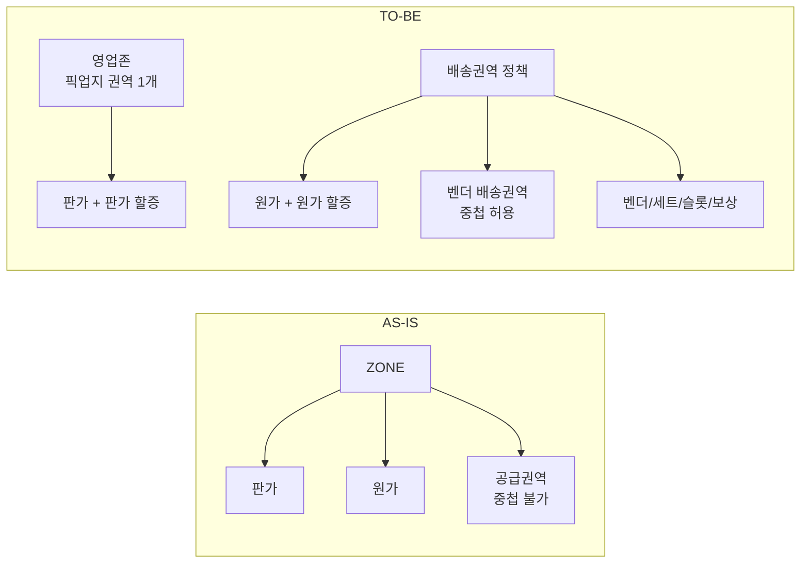

# 존/권역 구조 개편 PRD

> 작성자: @jaehyoung.an
> 작성일: 2026-07-13 / 최종 수정: 2026-07-30
> 문서 상태: Review (PRD 리뷰용)
> 버전: v1.3

---

## 문서 변경 History

| 변경 일자 | 변경한 사람 | 변경 내용 |
|-----------|------------|----------|
| 2026-07-13 | @jaehyoung.an | 초안 작성 (7/3·7/7 회의 결정사항 + 요건 뼈대 반영) |
| 2026-07-13 | @jaehyoung.an | 섹션 순서 변경, 출처 노션 링크 추가 (v0.2) |
| 2026-07-29 | @jaehyoung.an | **v1.0** — 유저 시나리오 반영, 용어 확정, 기능명세·시나리오 문서 분리 |
| 2026-07-29 | @jaehyoung.an | **v1.1** — 영업존:픽업지 권역 1:1로 확정, 상점 판매권역 반경 단일값, 권역 시각화 P0 확정(중첩 표시 제외). 기존 정책 충돌·전제조건·영향도는 참고 문서로 분리 |
| 2026-07-29 | @jaehyoung.an | **v1.2** — 벤더 배송권역은 지점 공급권역 참조 단일 방식(직접 그리기 폐기), 원가 거리 할증 다구간화(상한 필드 폐기), 원가 할증 별도 메뉴 신설(정책 탭 4개), 요금 상품 메뉴 목록 우선 진입, AS-IS ZONE 원가 요금제 메뉴 폐기 명시 |
| 2026-07-30 | @jaehyoung.an | **v1.3** — 기획 문서화 정리: 화면 URL·백엔드 요구사항·필드 타입 등 구현 상세 제거(개발팀이 별도 작성), 기술 용어 일반화(카디널리티·폴백 등), 동작·결과 중심 재서술. 정책 내용 변경 없음 |

---

## 1. 개요

### 1.1 배경 및 문제 정의

현행 ZONE 요금제는 **하나의 ZONE이 판가와 원가를 동시에 소유**하고, ZONE이 **영업 권역(픽업)과 공급 권역(배송)을 한 몸으로 묶어둔** 구조다. 권역 간 중첩도 불가하다. 이 때문에 다음 문제가 상시 발생한다.

| 문제 | 현장에서 나타나는 모습 |
|------|----------------------|
| **권역 경계 물량 로스** | 경계선 근처 오더가 어느 권역 기사에게도 잡히지 않고 미배차·취소로 빠진다 |
| **공급권역 전제가 현실과 불일치** | "권역 내 모든 상점이 동일 공급권역으로 배송한다"는 전제가 B존 운영에서 성립하지 않는다. 실제 운영은 상점별 반경 N km 기준이다 |
| **시간대별 원가를 우회 구현** | 벤더는 시간대별로 다른 원가로 운영 중인데, 시스템은 요일/시간대 할증으로 우회한다. 실제로 동대문 할증 5건이 모두 판가 0원·원가만 부여된 상태로 원가 조정 도구로 쓰이고 있다 |
| **회귀 개념 부재** | 권역 밖으로 나간 기사를 복귀시킬 수단이 없어 고밀도 지역 운영 효율이 떨어진다 |
| **벤더별 단가 차등 불가** | ZONE이 원가를 소유하므로 같은 지역에서 여러 벤더가 서로 다른 단가로 계약할 수 없다 |

**핵심 원인**: 판가(영업 기준)와 원가(공급 기준)가 같은 단위(ZONE)에 묶여 있다. 판가는 "상점이 어디 있느냐"의 함수이고 원가는 "누가 수행하느냐"의 함수인데, 두 축이 하나로 접혀 있어 어느 쪽도 제대로 표현되지 않는다.

### 1.2 해결 방향

**판가 단위와 원가 단위를 분리(디커플링)한다.**

| 축 | 단위 | 중첩 | 소유 |
|----|------|:----:|------|
| **영업(판가)** | 영업존 | 불가 | 판가 요금제, 판가 할증, 프로모션, 상점 판매권역 |
| **공급(원가)** | 배송권역 정책 | 허용 | 벤더 배송권역(폴리곤), 원가 요금제, 원가 할증, 벤더·세트·슬롯·보상 |

### 1.3 목표

- 판가/원가 독립 운영 구조를 구축해 **권역 경계 물량 로스를 해소**한다.
- 권역 중첩 허용 + 오더 3분류(권역 내/외/회귀) + AI 배차 연동으로 **기사 공급 음영을 최소화**한다.
- 벤더 운영 현실(요일·시간대별 원가, 상점 반경 기준 배송, 벤더별 단가 차등)을 시스템이 **직접 지원**한다.
- **목표 타임라인: 10월 말 ~ 11월 초·중순** (송파·강남 등 고밀도 지역 진출 전 완료 필수).

### 1.4 적용 대상

| 구분 | 대상 |
|------|------|
| **오더 유형** | 벤더 오더 (관제지점의 지점 타입이 벤더존인 오더). G4 + G1 (원가 일원화 범위) |
| **시스템** | Vroong Intra, 권역 서버, 벤더 관리(vendorset), AI 배차(dispatch), 라스트마일, 요금제 서버(pricing-policy), 정산, delivery, 플러스앱 |
| **사용자** | RM/BTF/사업기획(설정·운영), 벤더 소속 기사(배차·원가), 프렌즈 기사, G4/G1 상점(판가 — G4는 변동 없음) |

---

## 2. 성공 지표

> 수치 목표는 베이스라인 측정 후 확정한다.

### 핵심 지표 (Core)
- 권역 경계 물량 로스(경계 인접 오더의 미배차·취소율): **감소**
- 권역 외 오더·회귀 오더 수행률: **신규 측정 → 목표 설정**
- 벤더 배송권역 중첩 구간의 배차 성공률: 단일 권역 구간과 **동등 수준**

### 보조 지표 (Usage)
- 회귀 오더 제안 → 수락률
- 요일·시간대별 원가 설정 사용률 (할증 우회 설정 대비 대체율)
- 원가 할증 건수 (분리 후 판가 할증 대비 비중)

### 가드레일 지표 (Guardrail)
- 기존 G1~G3·A존 오더의 배차 성공률·정산 정합성: **영향 없음**
- 벤더 정산 오차(원가 확정 시점 변경에 따른): **증가 없음**
- **프렌즈 오더 수락률**: 하락 없음 — 프렌즈 원가를 최저 벤더 원가 기반으로 바꾸므로 필수 감시 대상
- 권역 판정 연산(지도 기반 위치 계산) 응답 성능: 기존 수준 유지

---

## 3. 범위

### In-Scope (P0)

| # | 항목 | 요약 |
|---|------|------|
| 1 | **영업존 관리 개편** | 지점 + 픽업지 권역 1개로 영업존 구성, 픽업지 권역 중복 연결 차단, 상점 판매권역 소스 변경 |
| 2 | **판가 요금제 개편** | 통합 요금제 폐기 → 판가 요금제가 적용 영업존 직접 보유. 판가 할증 연결 |
| 3 | **배송권역 정책 개편** | `적용 ZONE 선택` → `벤더 배송권역`(중첩 허용) 대체. `원가 요금제` 탭 신설 |
| 4 | **오더 3분류 및 원가 산정** | 권역 내/외/회귀 분류, 배정 시점 원가 확정, 권역 외 할증 |
| 5 | **AI 배차 연동** | 후보별 분류·원가 기반 제안 우선순위, 회귀 오더 제안 |
| 6 | **G1 원가 일원화** | 관제지점이 벤더존인 G1 오더도 동일 원가 정책 적용 |
| 7 | **권역 시각화** | 영업존·벤더 배송권역 폴리곤 지도 메뉴 신설, 호버·클릭 내비게이션 |
| 8 | **플러스앱 표기** | 회귀·권역 외 오더 태그 및 원가 표시 |

### In-Scope (P1)

| # | 항목 | 요약 |
|---|------|------|
| 9 | **CM·CMR 모니터링** | 권역 시각화 폴리곤에 최근 1주 CM·CMR 및 하한선 이탈 경보 (7/14 인스코프 합의). **이번 목업 범위에서는 제외** |

### Out-of-Scope

| 항목 | 사유 |
|------|------|
| 관제지점 분리(존 도입으로 관제지점 제거) | 영향도 과다 (7/7 합의) |
| **우선배차(허니문) 설정** | 서비스개발팀 `VIP 상점 설정`과 기능 중복. 통합 논의 후 재편입 |
| **상점별 개별 배송 반경 설정** | 영업존 단위 반경으로 시작. 개별 설정 요구가 확인되면 후속 |
| **배송권역 중첩 구간 시각적 강조** | 배송권역 목록의 `중첩 정책` 컬럼으로 확인 가능. 지도 강조는 후속 |
| CM 예측 시스템 고도화 | 모니터링 + 하한선 검증 체계로 대체. 예측은 후속 |
| 웹계약 시스템 개편 | 변경사항 싱크만 진행 (판가·존 구조 불변) |
| 지역 폴리곤 할증 개편 | 실사용 0건(폴리곤 마스터 QA 1건) — 별건 정리 |
| **기존 정책 문서 개정 및 타 개발 건과의 병합** | 정책서 v3.0 개정, Zone 요금제 Phase2 롤백 협의 등은 **별건으로 진행**. 본 PRD 리뷰 안건에서 제외 ([R1 §10](./references/R1_기존정책_크로스체크_및_충돌.md) 참고) |

---

## 4. 용어 정의

| 용어 | 정의 | 구 명칭 |
|------|------|---------|
| **영업존** | 영업기준(판가) 관리 단위. **지점 1개 + 픽업지 권역 1개**로 구성 | 존 / 빨간박스 / 세일즈 존 |
| **픽업지 권역** | 지점이 보유한 픽업 폴리곤(`PICK_UP_REGION`). 지점당 여러 개. 하나의 픽업지 권역은 **하나의 영업존에만** 연결된다 | - |
| **지점 세일즈 권역** | 픽업지 권역들의 합집합(`BRANCH_SALES_REGION`). 지점당 1개. 시스템 파생값이며 영업존 구성에는 사용하지 않는다 | 세일즈 권역 |
| **벤더 배송권역** | 벤더 배송(원가) 관리 단위 폴리곤. **다른 배송권역과 중첩 허용** | 공급권역 / 파란박스 / 벤더존 |
| **배송권역 정책** | 인트라 관리 단위. 벤더 배송권역 + 원가 요금제 + 원가 할증 + 슬롯 + 세트 물량 + 보상을 보유 | ZONE 권역정책 |
| **상점 판매권역** | 상점이 배송을 요청할 수 있는 범위(`STORE_SALES_REGION`). 영업존의 픽업지 권역 + 배송 반경으로 생성 | - |
| **권역 내 오더** | 출발지·도착지 모두 해당 벤더 배송권역 안 | - |
| **권역 외 오더** | 출발지만 해당 벤더 배송권역 안 | - |
| **회귀 오더** | 도착지만 해당 벤더 배송권역 안. 권역 밖 기사의 복귀 유도용 | - |
| **권역 외 할증** | 권역 외 오더 수행 시 가산되는 원가 할증. 신설 타입 | - |
| **시간 외 슬롯** | 배송권역 정책의 활성 슬롯(최대 5)에 속하지 않는 나머지 시간대. 원가표에 1열 추가 | - |

### 메뉴 변경

| AS-IS | TO-BE |
|-------|-------|
| 영업 관리 > ZONE 관리 | 영업 관리 > **영업존 관리** |
| G4 요금 상품 관리 > ZONE 판가 요금제 관리 | G4 요금 상품 관리 > **판가 요금제 관리** |
| G4 요금 상품 관리 > ZONE 할증 관리 | G4 요금 상품 관리 > **판가 할증 관리** |
| (없음) | G4 요금 상품 관리 > **원가 할증 관리** (신설) |
| G4 요금 상품 관리 > ZONE 원가 요금제 관리 | **폐기** — 배송권역 정책의 `원가 요금제` 탭으로 이관 |
| 세트 관리 > ZONE 권역정책 관리 | 세트 관리 > **배송권역 정책 관리** |
| (없음) | **권역 시각화** (신설) |

- 요금 상품 3개 메뉴(판가 요금제 / 판가 할증 / 원가 할증)는 모두 **목록 화면부터 진입**하도록 통일한다. AS-IS에서 목록 없이 상세로 직행하던 동선을 정리한다.
- `ZONE 원가 요금제 관리` 메뉴는 원가 요금제 이관·검증이 끝난 뒤 제거한다. 두 경로가 공존하면 "어느 쪽이 정본인가" 혼선이 생긴다.

---

## 5. 요건별 정책

### 5.1 영업존 (판가)

| # | 정책 | 내용 |
|---|------|------|
| 5.1.1 | **구성 단위** | 영업존 = **지점 1개 + 픽업지 권역 1개**. 지점을 선택하면 해당 지점의 픽업지 권역 목록이 나오고 그중 **하나를 선택**한다 |
| 5.1.2 | **연결 규칙** | 하나의 픽업지 권역은 **하나의 영업존에만** 연결된다. 한 지점은 **영업존을 여러 개** 가질 수 있다 (지점이 픽업지 권역을 여러 개 보유하면 각각 별도 영업존을 만들 수 있다) |
| 5.1.3 | **중복 연결 차단** | 이미 다른 영업존에 연결된 픽업지 권역은 **선택 불가**. 하나의 픽업지가 두 개의 판가를 갖는 상황을 원천 차단한다 |
| 5.1.4 | **지리적 중첩** | 서로 다른 지점의 픽업지 권역이 지리적으로 겹치는 경우는 **경고만 표시하고 저장은 허용**한다. 지점 관할 중복 문제이지 판가 충돌이 아니며, 지점 운영을 인트라에서 막을 수 없다 |
| 5.1.5 | **판가 적용** | 영업존에 연결된 픽업지 권역 소속 **G4(직영센터) 상점은 오더 접수 시 해당 판가·판가 할증·프로모션을 자동 적용**받는다. 판정 기준은 **관제지점 소속**이며, 예외 상황용 수동 오버라이드를 유지 |
| 5.1.6 | **상점 판매권역** | 영업존의 픽업지 권역 + **배송 반경(영업존 단일값)** 으로 생성. 벤더 배송권역과 무관 |
| 5.1.7 | **거리별 판가** | 기존 구조 유지 (구간 반복 + 정액제/거리별) |

**왜 픽업지 권역 1개인가**: 지점 세일즈 권역은 픽업지 권역의 합집합이라 부분 선택이 불가능하다. 픽업지 권역 단위로 쪼개면 채널별 픽업지(`YOGIYO_OD`, `YOGIYO_DIRECT` 등)에 서로 다른 판가를 줄 수 있고, 영업존 하나가 픽업지 하나를 갖게 되므로 "이 상점의 판가는 무엇인가"가 한 단계로 결정된다. 7/14 회의의 "향후 멀티 채널 판가 확장 가능성"에 대응하는 구조다.

> ⚠ **검증 단위 주의**: 같은 지점의 채널별 픽업지 권역은 **지리적으로 동일 지역을 덮는 경우가 많다**(성북 지점의 3개 픽업지 모두 36개 지역). 따라서 중첩 검증을 지리적 폴리곤 기준으로 걸면 채널 픽업지끼리 서로 중첩으로 잡혀 저장이 불가능해진다. 차단 기준은 **픽업지 권역 참조의 중복**(5.1.3)이며 지리적 중첩은 경고(5.1.4)다.

### 5.2 판가 요금제 (통합 요금제 폐기)

| # | 정책 | 내용 |
|---|------|------|
| 5.2.1 | **존 매핑** | 판가 요금제가 **적용 영업존을 직접 보유**한다. 통합 요금제 경유 구조를 폐기한다 |
| 5.2.2 | **적용 규칙** | 영업존 하나에는 판가 요금제 1개만 적용된다. 하나의 판가 요금제는 여러 영업존에 적용할 수 있다 (현행 규칙 유지) |
| 5.2.3 | **할증 연결** | 판가 요금제 상세에서 **적용 판가 할증을 선택**한다 (복수 선택 가능) |
| 5.2.4 | **화면 구조** | AS-IS 섹션 구조(기본 정보 / 요금 정보 / 적용 존 / 적용 할증 / 이력)를 유지한다. 탭 분리하지 않는다 |

### 5.3 할증 분리

| # | 정책 | 내용 |
|---|------|------|
| 5.3.1 | **판가 할증** | 기존 `ZONE 할증` 메뉴를 **판가 전용**으로 전환. 원가 금액 필드 제거. 적용 대상 = 영업존 |
| 5.3.2 | **원가 할증** | **`원가 할증 관리` 메뉴를 신설**한다(판가 할증과 같은 층위). 여기서 생성·관리하고, 배송권역 정책의 원가 요금제 탭에서 **적용 할증을 선택**한다. 하나의 할증을 여러 정책에 적용할 수 있고, 한 정책에 여러 할증을 붙일 수 있다 |
| 5.3.3 | **할증 종류** | 판가 할증: 기상 / 요일·시간대 / 특수. 원가 할증: 기상 / 요일·시간대 / 특수 / **권역 외(신설)** |
| 5.3.4 | **확정 시점 예외** | 원가 할증은 원칙적으로 배정 시점 확정. 단 **기상 할증은 완료 시점 확정**(7/14 합의)을 예외로 유지 |
| 5.3.5 | **마이그레이션** | 기존 할증 7건 중 원가 금액이 있는 건은 원가 할증으로 이관한다. 이관 중 원가 공백이 없어야 한다 |

### 5.4 벤더 배송권역

| # | 정책 | 내용 |
|---|------|------|
| 5.4.1 | **생성 방식** | **지점 공급권역 불러오기 단일 방식.** 폴리곤 직접 그리기·편집은 제공하지 않는다. 배송권역은 참조한 공급권역과 **항상 동일하게 유지**된다 |
| 5.4.2 | **중첩 정책** | 다른 벤더 배송권역과 **중첩 허용**. 중복 검증을 걸지 않는다. 단 **같은 정책 안에서 동일 공급권역 중복 참조는 차단**한다 |
| 5.4.3 | **공급권역 처리** | 공급권역의 **영업기준(도착권역) 역할은 폐기**하고 **권역 모양(폴리곤)의 원본으로만 재활용**한다. 상점 배송 가능 범위 판정에서는 분리된다(5.1.6) |
| 5.4.4 | **정책 연결** | 배송권역은 하나의 정책에만 속하고, 한 정책은 배송권역을 여러 개 가질 수 있다 (여러 지점의 공급권역 참조 가능) |
| 5.4.5 | **중첩이 성립하는 경로** | ① 한 정책이 여러 지점의 공급권역을 참조 ② 서로 다른 정책이 같은 공급권역을 참조. 임의 폴리곤 없이도 중첩 허용의 목적(기사 공급 음영 최소화)을 달성한다 |
| 5.4.6 | **남는 제약** | 공급권역의 **일부만** 특정 벤더에게 주는 것은 불가능하다. 필요하면 `권역 관리`에서 공급권역 자체를 분할한다 |
| 5.4.7 | **변경 전파** | 지점 담당자의 공급권역 변경이 벤더 원가 산정 범위를 즉시 바꾼다. **변경 알림과 이력 기록**이 필요하다 |

### 5.5 원가 요금제

**소유 주체: 배송권역 정책** (배송권역이 아님 — 슬롯·벤더·보상과 같은 단위여야 정산이 맞물린다)

| 구성 | 입력 단위 | 내용 |
|------|----------|------|
| **기본 거리** | 정책 단일값 | km. 기본 원가가 적용되는 기준 거리 |
| **라이더비(기본 원가)** | **요일 × 슬롯 표** | 행 = 요일(7), 열 = 활성 슬롯(최대 5) + **시간 외** 1열. 각 칸에 기본 거리 구간의 라이더비 입력 |
| **거리 할증** | **다구간 구간표** | 행마다 `구간 시작`~`구간 끝`(km) + `단위 거리`(km) + `단위당 원가`. 첫 구간 시작 = 기본 거리, **마지막 구간의 끝 = 최대 상한 거리** |
| **관제비 / 관리비 / 픽업비 / 완료비** | 정책 단일값 | 시간대 차등 없이 각 1개 값. 현행 5개 항목 체계 유지 |

| # | 정책 | 내용 |
|---|------|------|
| 5.5.1 | **슬롯 참조** | 원가표의 열은 해당 배송권역 정책의 `요일별 단위물량`에서 **활성화된 슬롯**을 그대로 따른다 |
| 5.5.2 | **시간 외 슬롯** | 활성 슬롯이 24시간을 덮지 않는 경우(예: 성북 09:00~24:00)의 나머지 시간대에 적용 |
| 5.5.3 | **슬롯 변경 시** | 변경되지 않은 슬롯의 원가는 **유지**하고, 신규·변경된 슬롯 셀만 미입력으로 표시하여 저장을 차단한다. 전체 초기화하지 않는다 |
| 5.5.4 | **버전 관리** | 원가 요금제는 배송권역 정책의 **버전 스냅샷에 포함**된다. `예약 저장`으로 슬롯과 원가를 동일 시점에 반영할 수 있다 |
| 5.5.5 | **거리 상한** | 별도 필드를 두지 않는다. **거리 할증 마지막 구간의 끝이 상한**이며, 초과 거리에는 추가 가산하지 않는다. 현행 다구간 구조를 그대로 승계한다 |

### 5.6 오더 분류 및 원가 산정

**5.6.1 오더 3분류** — 벤더 배송권역 기준이며 **후보 벤더별로 상대적**이다.

| 분류 | 조건 (해당 벤더 배송권역 기준) | 처리 |
|------|--------------------------------|------|
| **권역 내** | 출발지·도착지 모두 권역 안 | 일반 제안 대상 |
| **권역 외** | 출발지만 권역 안 | 권역 외 할증 가산 |
| **회귀** | 도착지만 권역 안 | 권역 밖에 위치한 기사에게 복귀 유도용으로 제안 |

- 출발지·도착지 중 한 곳이라도 벤더 배송권역에 들어가면, 그 권역이 속한 배송권역 정책에 연결된 **벤더 소속 기사에게 제안 가능**하다.
- 같은 오더라도 기사 소속 벤더에 따라 **분류와 원가가 달라진다.**

**5.6.2 원가 확정**

| # | 정책 | 내용 |
|---|------|------|
| a | **확정 시점** | 원가는 **기사 배정 시점에 확정**된다(수행 벤더가 정해져야 어느 권역의 원가인지 결정되므로). 오더 생성 시점 확정 방식을 대체한다 |
| b | **계산 시점** | 계산을 언제 하는지(배정 시 즉석 계산 vs 생성 시 벤더별 원가표 사전 생성)는 **개발 구현 판단에 위임**한다 |
| c | **요구사항** | 단, 아래 요구를 만족해야 한다 — ① 대기 오더 목록에서 **각 기사에게 자신의 소속 벤더 기준 원가가 표시**된다 ② 후보군 조회 응답에 후보별 분류·원가가 실린다 |
| d | **재배차** | 새 기사 기준으로 원가를 재확정한다 |
| e | **정산** | 확정된 원가로 정산한다. 벤더 정산 집계 축은 "주문의 존"에서 **수행 벤더의 배송권역 정책**으로 변경된다 |

**5.6.3 프렌즈·일반 이륜 기사 원가**

- 벤더 기사가 아닌 기사가 수행하는 경우, **해당 오더의 후보 배송권역 중 가장 저렴한 벤더 원가를 기준**으로 산정한다.
- 어떤 배송권역에도 속하지 않는 오더는 대체 원가를 적용한다 (TBD-8).
- ⚠ 프렌즈 원가가 하락하므로 **수락률을 가드레일 지표로 감시**한다.

**5.6.4 배차 제안 우선순위 (AI 배차)**

| 단계 | 규칙 |
|------|------|
| **1. 하드 필터** | 출발지·도착지 어느 쪽도 권역에 속하지 않는 후보는 제외 |
| **2. 분류 정렬** | 권역 내 > 회귀 > 권역 외 |
| **3. 동순위 정렬** | 원가 낮은 순 |
| **4. 회귀 조건** | 회귀 오더는 **기사가 해당 권역 외부에 위치할 때만** 제안 대상에 포함 (경계 개념은 쓰지 않는다 — 7/14 단순화 합의) |
| **5. 기존 우선순위와의 관계** | 기존 가중치 대비 삽입 위치를 개발·배차팀과 확정한다 (PRD 리뷰 안건) |

### 5.7 G1 원가 일원화

| # | 정책 | 내용 |
|---|------|------|
| 5.7.1 | **대상** | 관제지점의 지점 타입이 **벤더존**인 오더는 상점 등급(G1/G4) 무관하게 동일 원가 정책 적용 |
| 5.7.2 | **판가** | G1 판가 체계는 **변경하지 않는다** (원가만 일원화) |
| 5.7.3 | **영향** | CM 계산·정산 리포트에 영향 → 재무 영향도 분석 선행 (7/14 액션) |

### 5.8 플러스앱 표기

| # | 정책 | 내용 |
|---|------|------|
| 5.8.1 | **태그** | 대기 오더·추천 오더에 `회귀` / `권역 외` 태그를 표시 |
| 5.8.2 | **금액** | 권역 외 할증 포함 금액을 표시 |
| 5.8.3 | **구버전 대응** | 앱이 기사 배송료와 할증 금액을 합산해 표시하는 현행 구조상 금액은 구버전에서도 정확히 나온다. 다만 태그 노출은 앱 배포에 종속되므로, 구버전은 **금액만 정확히 표시되고 태그는 미노출**을 허용한다 |

### 5.9 권역 시각화 (P0)

| Priority | 기능 | 내용 |
|----------|------|------|
| P0 | 지도 메뉴 신설 | 인트라에 `권역 시각화` 메뉴 신설 (메뉴 그룹 위치는 TBD-6) |
| P0 | 폴리곤 표시 | **영업존 = 붉은 폴리곤**, **벤더 배송권역 = 파란 폴리곤** |
| P0 | 필터 | 영업존만 / 배송권역만 / 전체, 지점별·벤더별 필터 |
| P0 | 호버·클릭 | 영업존 호버 시 영업존명·지점명, 클릭 시 영업존 상세 이동. 배송권역 호버 시 정책명·벤더 수, 클릭 시 배송권역 정책 상세 이동 |
| P1 | CM·CMR | 폴리곤에 최근 1주 CM·CMR 및 하한선 이탈 색상 구분 |

> **중첩 구간은 지도에 별도 표시하지 않는다.** 중첩 여부는 배송권역 정책 상세의 `중첩 정책` 컬럼에서 확인한다. 지도에 중첩 레이어를 얹으면 폴리곤이 늘어날 때 판독성이 급격히 떨어지므로, 필요가 확인된 뒤 후속으로 검토한다.

---

## 6. 미정의(TBD) / 추가 논의 필요

| # | 항목 | 내용 | 관련 |
|---|------|------|------|
| TBD-1 | **정산 집계 축 변경 협의** | vendorset 정산 레코드의 존 축("주문의 존")을 배송권역 정책으로 변경. vendorset 팀 협의 필요 | 5.6.2-e |
| TBD-2 | **기사 후보 조회 방식 변경** | 현행 존 단위 기사 후보 조회 방식을 권역 기준으로 어떻게 바꿀지 | 5.6.1 |
| TBD-3 | **한 벤더가 여러 정책에 속할 수 있는가** | 현행은 벤더가 존 1개에만 속한다. 중첩 허용 시 한 벤더가 복수의 배송권역 정책에 속할 수 있는지 결정 필요 | 5.4.2 |
| TBD-4 | **AI 배차 기존 우선순위 내 삽입 위치** | 분류·원가 정렬키를 기존 가중치 어디에 넣을지 | 5.6.4 |
| TBD-5 | **권역 외 할증 산정식** | 정액 단일 vs 권역 경계 초과 거리 비례. 판가 반영 여부 | 5.3.3 |
| TBD-6 | **지도 메뉴 그룹 위치** | AS-IS에 `권역 관리` 그룹이 없음. 신설 vs 기존 그룹 하위 | 5.9 |
| TBD-7 | **원가 이력 전파 범위** | 오더에 적용된 요금표 식별 정보가 정산·데이터 연계로 전달되지 않음. "이 오더에 어느 원가표가 적용됐는지" 추적 요건이 있으면 신규 개발 필요 | 5.6.2 |
| TBD-8 | **대체 원가 정의** | 어떤 배송권역에도 속하지 않는 오더의 원가 | 5.6.3 |
| TBD-9 | **지점당 복수 영업존의 운영 영향** | 한 지점이 채널별로 여러 영업존을 갖게 되면 지점 단위 리포팅·정산 집계에 영향이 있는지 | 5.1.2 |

---

## 7. 연관 문서

**본 PRD 패키지 (메인)**
- [00_index](./00_index.md) — 패키지 안내
- [02_기능명세](./02_기능명세.md) — 화면·필드 단위 상세
- [03_유저 시나리오](./03_유저_시나리오.md) — 시나리오 및 엣지케이스
- [인트라 목업](../../../../projects/260729_존권역_인트라_목업/index.html)

**참고 문서**
- [R1_기존정책 크로스체크 및 충돌](./references/R1_기존정책_크로스체크_및_충돌.md) — 기존 정책과의 차이, 개정 필요 항목, AS-IS 결함
- [R2_영향도 및 마이그레이션](./references/R2_영향도_및_마이그레이션.md) — 시스템 영향도, 전환 계획, 리스크

**AS-IS 조사**
- `knowledge/1_discovery/product/g4_zone_세트_관리_asis/` — G4 요금 상품 4개 메뉴
- `knowledge/1_discovery/product/zone_권역정책_관리_asis/` — ZONE 권역정책 관리

---

## So What / Next Step

- 본 PRD는 **리뷰 버전(v1.2)** 이다. 이번 개편에서 무엇을 만들 것인지에 집중하고, 기존 정책 문서 개정·타 개발 건과의 병합은 [R1](./references/R1_기존정책_크로스체크_및_충돌.md)에 분리해 **별건으로 진행**한다.
- 영업존을 **픽업지 권역 1개**로 확정하면서 한 지점이 여러 영업존을 가질 수 있게 됐다. 채널별 판가 확장 경로가 열리는 대신 **지점 단위 집계에 영향이 있을 수 있어** TBD-9로 남겼다.
- 리뷰에서 결정할 것은 **TBD-1 ~ TBD-9**이며, 이 중 TBD-1(정산 집계 축)·TBD-2(후보 공급 API)는 vendorset·dispatch 팀이 참석해야 결론이 난다.
- 계산 시점은 구현 판단에 위임했다. 대신 "대기 오더 목록에 기사별 원가 표시"를 요구사항으로 명시했으므로, 실질적으로 사전 원가표 방식이 필요하다는 신호를 준다.
