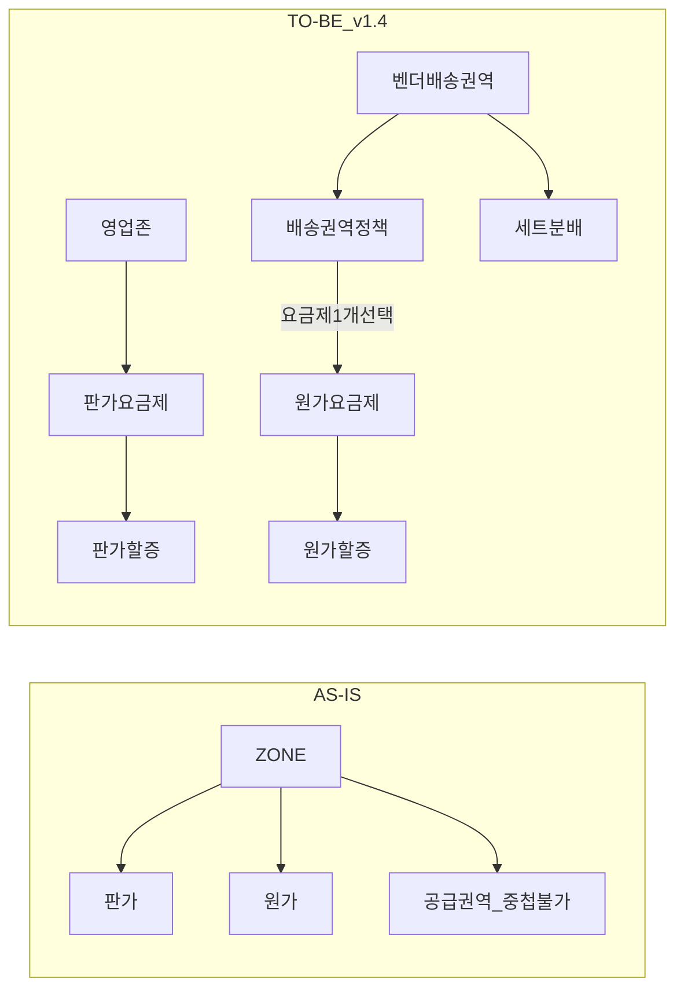

# 존/권역 구조 개편 PRD

> 작성자: @jaehyoung.an
> 작성일: 2026-07-13 / 최종 수정: 2026-08-05
> 문서 상태: Review (PRD 리뷰용)
> 버전: **v1.4** (독립 문서 — v1.3을 읽지 않아도 완결)
> 목표 일정: **2026년 10월 초 ~ 10월 중순**

---

## 문서 변경 History

| 변경 일자 | 변경한 사람 | 변경 내용 |
|-----------|------------|----------|
| 2026-07-13 | @jaehyoung.an | 초안 (7/3·7/7 회의) |
| 2026-07-29 | @jaehyoung.an | v1.0~v1.2 — 시나리오 반영, 픽업지 1:1, 공급권역 참조 단일, 원가 할증 분리 등 |
| 2026-07-30 | @jaehyoung.an | **v1.3** — 기획 문서화 정리, 지리 중첩 저장 차단, 문서 순서 PRD→시나리오→기능명세 |
| 2026-08-04 | @jaehyoung.an | **v1.4** — 메뉴·역할 재편. 원가 요금제·벤더 배송권역 독립. 원가 할증은 요금제에서만. 세트분배 축=벤더 배송권역. 권역 외=정액·판가 미반영. 영업존 배송 반경 제거. 멀티팀 리뷰 트랙 A~D |
| 2026-08-05 | @jaehyoung.an | **v1.4 독립화** — v1.3 승계 문구를 본문 인라인으로 대체. 일정 10월 초~중순 |

---

## 1. 개요

### 1.1 배경 및 문제 정의

현행 ZONE 요금제는 **하나의 ZONE이 판가와 원가를 동시에 소유**하고, ZONE이 **영업 권역(픽업)과 공급 권역(배송)을 한 몸으로 묶어둔** 구조다. 권역 간 중첩도 불가하다.

| 문제 | 현장에서 나타나는 모습 |
|------|----------------------|
| **권역 경계 물량 로스** | 경계선 근처 오더가 미배차·취소로 빠진다 |
| **공급권역 전제 불일치** | B존은 상점별 반경 N km 기준인데 시스템은 권역 단일 전제 |
| **시간대별 원가 우회** | 요일/시간대 할증으로 원가 조정 (동대문 할증 판가 0원·원가만) |
| **회귀 개념 부재** | 권역 밖 기사를 복귀시킬 수단 없음 |
| **벤더별 단가 차등 불가** | ZONE이 원가 소유 → 벤더별 계약 단가 불가 |

**핵심 원인**: 판가(영업)와 원가(공급)가 같은 단위(ZONE)에 묶여 있다.

### 1.2 해결 방향

**판가 단위와 원가 단위를 분리**하고, **영업/공급 역할·메뉴를 나눈다.**

| 축 | 단위 | 중첩 | 소유 |
|----|------|:----:|------|
| **영업(판가)** | 영업존 | 불가 | 판가 요금제, 판가 할증, 프로모션 |
| **공급(원가)** | 배송권역 정책 + 원가 요금제 | 권역 중첩 허용 | 정책=매핑·단위물량·보상 / 요금제=기본원가·원가 할증 |

### 1.3 목표

- 판가/원가 독립 운영 → **권역 경계 물량 로스 해소**
- 권역 중첩 + 오더 3분류 + AI 배차 → **기사 공급 음영 최소화**
- 벤더 운영 현실(요일·시간대 원가, 반경 배송, 벤더별 단가) **직접 지원**
- **목표 타임라인: 10월 초 ~ 10월 중순** (송파·강남 고밀도 지역 진출 전)

### 1.4 적용 대상

| 구분 | 대상 |
|------|------|
| **오더** | 벤더 오더(벤더존). G4 + G1(원가 일원화) |
| **시스템** | Intra, 권역 서버, vendorset, dispatch, 라스트마일, pricing-policy, 정산, delivery, 플러스앱 |
| **사용자** | 영업 담당자(판가), 공급 담당자(원가·정책), 기사, G4/G1 상점 |

---

## 2. 성공 지표

> 수치 목표는 베이스라인 측정 후 확정한다.

### 핵심 지표 (Core)
- 권역 경계 물량 로스(경계 인접 오더의 미배차·취소율): **감소**
- 권역 외 오더·회귀 오더 수행률: **신규 측정 → 목표 설정**
- 벤더 배송권역 중첩 구간의 배차 성공률: 단일 권역 구간과 **동등 수준**

### 보조 지표 (Usage)
- 회귀 오더 제안 → 수락률
- 요일·시간대별 원가 설정 사용률 (할증 우회 대비 대체율)
- 원가 할증 건수 (분리 후 판가 할증 대비 비중)

### 가드레일 지표 (Guardrail)
- 기존 G1~G3·A존 오더의 배차 성공률·정산 정합성: **영향 없음**
- 벤더 정산 오차(원가 확정 시점 변경): **증가 없음**
- **프렌즈 오더 수락률**: 하락 없음
- 권역 판정 연산 응답 성능: 기존 수준 유지

---

## 3. 범위

### In-Scope (P0)

| # | 항목 | 요약 |
|---|------|------|
| 1 | **영업존 관리** | 지점+픽업지 1개, 중복·지리 중첩 차단. **상점 배송 접수 반경=기존 상점 설정**(영업존에 반경 필드 없음) |
| 2 | **판가 요금제·판가 할증** | 영업존 직접 매핑. 목록 우선 진입 |
| 3 | **벤더 배송권역 관리** | **독립 메뉴**. 지점 공급권역 참조, 중첩 허용 |
| 4 | **원가 요금제 관리** | **독립 메뉴**. 시간대별 기본원가·거리할증·원가 할증 선택 |
| 5 | **원가 할증 관리** | 독립 메뉴. **원가 요금제에서만** 적용 선택. 권역 외=정액·판가 미반영 |
| 6 | **배송권역 정책** | 배송권역 매핑 + 슬롯 단위물량 + 원가 요금제 **1개 선택** |
| 7 | **세트분배** | 축=**벤더 배송권역**. 벤더 연결·벤더별 세트 수 |
| 8 | **오더 3분류·원가 산정** | 배정 시점 확정, 권역 외 할증(원가만) |
| 9 | **AI 배차·G1 일원화·플러스앱** | 분류·원가 기반 우선순위, G1 원가 일원화, 앱 태그 |
| 10 | **권역 시각화** | `권역 관리` 하위 |

### In-Scope (P1)

| # | 항목 | 요약 |
|---|------|------|
| 11 | CM·CMR 모니터링 | 시각화 폴리곤. **목업 제외** |

### Out-of-Scope

| 항목 | 사유 |
|------|------|
| 관제지점 분리 | 영향도 과다 (7/7 합의) |
| 우선배차(허니문) | VIP 상점 설정과 중복 |
| 상점별 개별 배송 반경 (영업존에서 관리) | 이번 개편에서 영업존 반경 필드를 두지 않음. 상점 설정 AS-IS |
| 배송권역 중첩 구간 지도 강조 | 목록 `중첩 정책` 컬럼으로 확인. 후속 |
| CM 예측 고도화 | 모니터링으로 대체. 후속 |
| 웹계약 개편 | 싱크만 |
| 지역 폴리곤 할증 개편 | 실사용 0건 — 별건 |
| 정책서 v3.0·Phase2 병합 | **별건**. 본 PRD 리뷰 안건 제외 |

---

## 4. 용어 정의

| 용어 | 정의 | 구 명칭 |
|------|------|---------|
| **영업존** | 판가 관리 단위. **지점 1 + 픽업지 권역 1** | ZONE / 세일즈 존 |
| **픽업지 권역** | 지점 픽업 폴리곤. 영업존과 **1:1** | — |
| **지점 세일즈 권역** | 픽업지 합집합. 시스템 파생값. 영업존 구성에 미사용 | 세일즈 권역 |
| **벤더 배송권역** | 벤더 배송 폴리곤. **중첩 허용**. 독립 메뉴 | 공급권역 / 파란박스 |
| **배송권역 정책** | 배송권역 매핑 + 슬롯 단위물량 + 원가 요금제 1 선택 + 보상 | ZONE 권역정책 |
| **원가 요금제** | 기본거리·고정비·시간대 기본원가·거리할증·원가 할증. **독립 메뉴** | ZONE 원가 요금제 |
| **상점 배송 접수 반경** | 상점이 배송을 요청할 수 있는 범위. **기존 상점 설정을 그대로** 따름 (영업존에서 관리하지 않음) | 상점 판매권역 |
| **권역 내/외/회귀** | 벤더 배송권역 기준 **후보 벤더별 상대** 분류 | — |
| **권역 외 할증** | 출발 권역 내·도착 권역 외 시 **정액** 원가 가산. **판가 미반영** | — |
| **정책 슬롯** | 배송권역 정책의 요일별 단위물량 시간 구간 | — |
| **요금제 시간대** | 원가 요금제의 기본원가 표 열. 정책 슬롯과 **일치 불필요** | — |

### 메뉴 변경

| AS-IS | TO-BE |
|-------|-------|
| 영업 관리 > ZONE 관리 | **권역 관리 > 영업존 관리** |
| (없음 / 정책 탭) | **권역 관리 > 벤더 배송권역 관리** |
| (없음) | **권역 관리 > 권역 시각화** |
| G4 요금 > ZONE 판가 요금제 | **요금 상품 관리 > 판가 요금제 관리** |
| G4 요금 > ZONE 할증 | **요금 상품 관리 > 판가 할증 관리** |
| G4 요금 > ZONE 원가 요금제 | **요금 상품 관리 > 원가 요금제 관리** (재편·유지) |
| (없음) | **요금 상품 관리 > 원가 할증 관리** |
| 세트 관리 > ZONE 권역정책 | **벤더 정책 관리 > 배송권역 정책 관리** |
| 세트 관리 > 세트분배 | **벤더 정책 관리 > 세트 분배 관리** |
| 세트 관리 > 벤더 관리 | **벤더 정책 관리 > 벤더 관리** |

요금 상품 4종은 **목록 우선 진입**.

---

## 5. 요건별 정책

### 5.1 영업존 (판가)

| # | 정책 | 내용 |
|---|------|------|
| 5.1.1 | **구성** | 영업존 = **지점 1 + 픽업지 권역 1**. 지점 선택 후 픽업지 **하나** 선택 |
| 5.1.2 | **연결** | 픽업지 권역 하나 → 영업존 **하나만**. 지점 : 영업존 = **1:N** |
| 5.1.3 | **중복 차단** | 이미 연결된 픽업지는 **선택 불가** |
| 5.1.4 | **지리 중첩** | 다른 영업존 픽업지와 폴리곤이 겹치면 **저장 불가**. 같은 지점 채널 픽업지도 폴리곤이 겹치면 차단 |
| 5.1.5 | **판가 적용** | 픽업지 소속 **G4 상점**은 오더 접수 시 해당 판가·할증·프로모션 **자동 적용** (관제지점 소속 기준) |
| 5.1.6 | **상점 배송 접수 반경** | 영업존에 배송 반경·판매권역 설정을 **두지 않는다**. **기존 상점 설정 AS-IS** |
| 5.1.7 | **거리별 판가** | 기존 구조 유지 (구간 반복 + 정액/거리별) |

> 채널별 판가: 동일 폴리곤 채널 픽업지는 동시에 영업존으로 등록할 수 없다. 채널 분리 시 **폴리곤 분할이 선행**돼야 한다.

### 5.2 판가 요금제

| # | 정책 | 내용 |
|---|------|------|
| 5.2.1 | **존 매핑** | 판가 요금제가 **적용 영업존을 직접 보유**. 통합 요금제 경유 폐기 |
| 5.2.2 | **적용 규칙** | 영업존당 요금제 1개. 요금제 1개 → 영업존 N개 |
| 5.2.3 | **할증** | 상세에서 **적용 판가 할증** 복수 선택 |
| 5.2.4 | **화면** | 기본 정보 / 요금 정보 / 적용 존 / 적용 할증 / 이력 (탭 분리 없음) |

### 5.3 할증 분리

| # | 정책 | 내용 |
|---|------|------|
| 5.3.1 | **판가 할증** | 판가 전용. 원가 금액 필드 제거. 적용=영업존 |
| 5.3.2 | **원가 할증** | `요금 상품 관리 > 원가 할증 관리`에서 생성. **적용·선택은 원가 요금제에서만** |
| 5.3.3 | **종류** | 판가: 기상/요일·시간대/특수. 원가: 기상/요일·시간대/특수/**권역 외** |
| 5.3.4 | **권역 외** | **정액만**. **판가 미반영**(원가만). 회귀 미적용 |
| 5.3.5 | **확정 시점** | 배차 시점. 기상=완료 시점 예외 |
| 5.3.6 | **마이그레이션** | 원가 금액 있는 기존 할증 → 원가 할증 이관. 공백 금지 |

### 5.4 벤더 배송권역

| # | 정책 | 내용 |
|---|------|------|
| 5.4.1 | **메뉴** | `권역 관리 > 벤더 배송권역 관리` **독립** |
| 5.4.2 | **생성** | 지점 공급권역 불러오기만. 직접 그리기 없음. 상시 연동 |
| 5.4.3 | **중첩** | 허용. 같은 정책 안 동일 공급권역 중복 참조 차단 |
| 5.4.4 | **정책 연결** | 배송권역 ∈ 정책 1개. 정책 ⊃ 배송권역 N개. **벤더는 정책 1개에만** 속한다 (TBD-3 해소) |
| 5.4.5 | **세트분배** | 배송권역 생성 **후** 세트분배에서 벤더·세트 수 |
| 5.4.6 | **변경 전파** | 공급권역 변경 시 알림·이력. 참조 중 삭제 차단 |
| 5.4.7 | **제약** | 공급권역 **일부만** 특정 벤더에게 주려면 공급권역 분할 필요 |
| 5.4.8 | **적용 시점** | 배송권역 정책 변경·신규 벤더 추가는 **그 이후 생성되는 오더부터** 적용. 이미 생성된 오더는 변경 전 기준 |

### 5.5 원가 요금제 (독립)

**소유 주체: 원가 요금제 메뉴.** 배송권역 정책은 요금제 **1개를 선택**만 한다.

| 구성 | 입력 |
|------|------|
| 기본 거리 | 요금제 단일값 |
| 기본 원가(라이더비) | 요일 × **요금제 시간대** |
| 거리 할증 | 다구간. 마지막 구간 끝=상한 |
| 고정비 4 | 관제비·관리비·픽업비·완료비 |
| 적용 원가 할증 | 복수 |

| # | 정책 | 내용 |
|---|------|------|
| 5.5.1 | **재사용** | 요금제 1 → 정책 N |
| 5.5.2 | **선택** | 정책당 요금제 **정확히 1개** |
| 5.5.3 | **시간 매핑** | 배정 시각 → 요금제 시간 구간. 정책 슬롯과 **동기화하지 않음** |
| 5.5.4 | **버전** | 요금제 자체 버전 + 정책이 선택한 요금제 스냅샷 |

### 5.5b 배송권역 정책

| # | 정책 | 내용 |
|---|------|------|
| a | **보유** | 배송권역 매핑, 슬롯별 **단위물량**, 원가 요금제 1 선택, 보상 |
| b | **미보유** | 원가 금액 입력, 원가 할증 직접 선택 |
| c | **활성** | 배송권역 ≥1 **+** 원가 요금제 선택 완료 |

### 5.6 오더 분류 및 원가 산정

**원가 경로**: 벤더 배송권역 → 배송권역 정책 → **선택된 원가 요금제(+할증)**.

**5.6.1 오더 3분류** (후보 벤더별 상대)

| 분류 | 조건 | 처리 |
|------|------|------|
| **권역 내** | 출·도착 모두 권역 안 | 일반 제안 |
| **권역 외** | 출발만 권역 안 | 권역 외 할증(정액) 원가 가산 |
| **회귀** | 도착만 권역 안 | 권역 밖 기사 복귀 유도 |

**기사 후보 (TBD-2 해소)**: 후보 = 해당 오더의 **벤더 배송권역**에 연결된 **배송권역 정책**에 속한 **벤더**에 소속된 기사. (존 단위 후보 조회를 이 경로로 대체)

**적용 시점**: 배송권역 정책 변경·신규 벤더 추가는 **그 이후 생성되는 오더부터** 반영. 이미 생성된 오더의 후보·분류·원가는 변경하지 않는다.

**5.6.2 원가 확정**

| # | 정책 | 내용 |
|---|------|------|
| a | **확정 시점** | **기사 배정 시점** |
| b | **계산 시점** | 구현 위임 (배정 즉석 vs 사전 원가표) |
| c | **요구** | ① 대기 목록에 기사별 원가 표시 ② 후보 응답에 분류·원가 |
| d | **재배차** | 새 기사 기준 재확정 |
| e | **정산** | 확정 원가로 정산. 집계 축=수행 벤더의 배송권역 정책 (TBD-1) |

**5.6.3 프렌즈·일반 이륜**
- 후보 배송권역 중 **가장 저렴한 벤더 원가** 기준.
- 어느 권역에도 없으면 대체 원가 (TBD-8).
- 프렌즈 수락률을 가드레일로 감시.

**5.6.4 AI 배차 우선순위**

| 단계 | 규칙 |
|------|------|
| 1. 하드 필터 | 출·도착 어느 쪽도 권역 미소속 → 제외 |
| 2. 분류 정렬 | 권역 내 > 회귀 > 권역 외 |
| 3. 동순위 | 원가 낮은 순 |
| 4. 회귀 조건 | **기사가 해당 권역 밖에 있을 때만** 회귀 제안 |
| 5. 기존 가중치 | 삽입 위치 = TBD-4 |

### 5.7 G1 원가 일원화

| # | 정책 | 내용 |
|---|------|------|
| 5.7.1 | **대상** | 관제지점=벤더존이면 G1/G4 무관 동일 원가 |
| 5.7.2 | **판가** | G1 판가 체계 **변경 없음** |
| 5.7.3 | **영향** | CM·정산 → 재무 영향도 선행 |

### 5.8 플러스앱 표기

| # | 정책 | 내용 |
|---|------|------|
| 5.8.1 | **태그** | `회귀` / `권역 외` |
| 5.8.2 | **금액** | 권역 외 할증(정액) **원가** 포함 금액. 판가 미반영 |
| 5.8.3 | **구버전** | 금액은 정확, 태그는 앱 배포 후 |

### 5.9 권역 시각화

| Priority | 기능 | 내용 |
|----------|------|------|
| P0 | 메뉴 | **`권역 관리 > 권역 시각화`** |
| P0 | 폴리곤 | 영업존=빨강, 벤더 배송권역=파랑 |
| P0 | 필터 | 영업존만 / 배송권역만 / 전체, 지점·벤더 |
| P0 | 호버·클릭 | 영업존→상세, 배송권역→정책 또는 배송권역 상세 |
| P1 | CM·CMR | 최근 1주·하한선 이탈 (목업 제외) |

중첩 구간은 지도에 **별도 강조하지 않는다** (`중첩 정책` 컬럼 사용).

---

## 6. 미정의(TBD)

| # | 항목 | 내용 | 관련 |
|---|------|------|------|
| TBD-1 | 정산 집계 축 | "주문의 존" → 수행 벤더의 배송권역 정책 | 5.6.2-e |
| ~~TBD-2~~ | 기사 후보 조회 | — | **해소**: 벤더 배송권역 → 연결된 배송권역 정책 → 그 정책 소속 벤더의 기사 |
| ~~TBD-3~~ | 벤더 복수 정책 | — | **해소**: 벤더는 **정책 1개에만** 속함 |
| TBD-4 | AI 우선순위 삽입 | 기존 가중치 대비 위치 | 5.6.4 |
| ~~TBD-5~~ | 권역 외 산정식 | — | **해소**: 정액 + 판가 미반영 |
| ~~TBD-6~~ | 시각화 메뉴 | — | **해소**: 권역 관리 하위 |
| TBD-7 | 원가 이력 전파 | 적용 요금표 ID의 정산·스트림 전파 | 5.6.2 |
| TBD-8 | 대체 원가 | 권역 미소속 오더 | 5.6.3 |
| TBD-9 | 복수 영업존 집계 | 지점 단위 리포팅·정산 영향 | 5.1.2 |

---

## 7. v1.3 대비 결정 대체 (부록)

본문은 이미 v1.4 서술이다. 이전 버전과의 대응만 기록한다.

| v1.3 | v1.4 |
|------|------|
| D3 원가=정책 소유 | 독립 메뉴 + 정책이 1개 선택 |
| D18 원가 할증=세트 관리 | 요금 상품 관리. 선택은 요금제에서만 |
| D20 ZONE 원가 메뉴 폐기 | 폐기 철회 → 원가 요금제 관리 재편 |
| D5/D12 영업존 배송 반경 | **폐기**. 상점 설정 AS-IS |
| 세트분배 축=정책 | 벤더 배송권역 |
| 슬롯↔원가 동기화 | **삭제** |

정책서 v3.0·Phase2 병합은 **별건**.

---

## 8. 연관 문서

- 온라인 목업: https://jae-hyoung-an.github.io/ai-staff/zone-region-mockup-v1.4.html
- 패키지 허브: [00_index](./00_index.md) · [02](./02_유저_시나리오.md) · [03](./03_기능명세.md)

> PO 참고(리뷰 안건 아님): `references/R1_…`, `references/R2_…`

---

## So What / Next Step

- v1.4 핵심은 **운영 역할 분리(영업/공급)** 와 **요금·권역 객체 분리**.
- 원가 경로가 “정책 탭 입력” → “요금제 선택”으로 바뀌므로 인트라·요금제 서버·정산 연동을 다시 맞춘다.
- **해소**: TBD-2(후보=권역→정책→벤더 기사), TBD-3(벤더∈정책 1개), 정책·벤더 변경은 **이후 생성 오더부터**.
- 리뷰 필참: TBD-1. E-8~9, E-13~15, E-18·19 답변 확보.
- 팀별 읽기 경로: [00_index 리뷰 가이드](./00_index.md#팀별-리뷰-가이드-멀티팀).