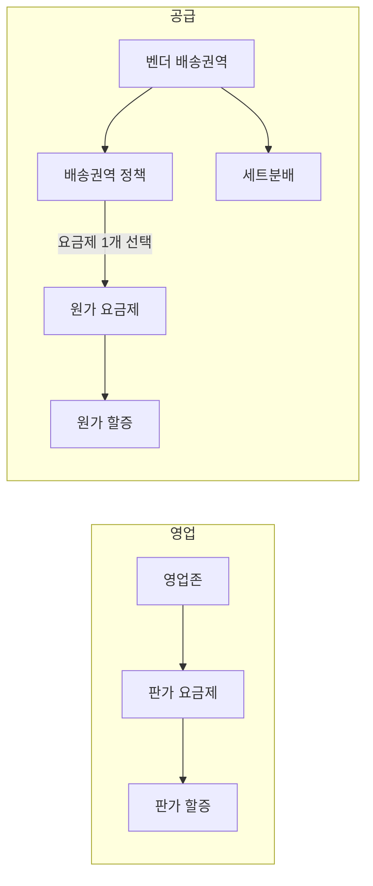

# 존/권역 구조 개편 PRD

> 작성자: @jaehyoung.an
> 작성일: 2026-07-13 / 최종 수정: 2026-08-04
> 문서 상태: Review (PRD 리뷰용)
> 버전: **v1.4**
> 이전: [v1.3](../zone_권역구조_개편/01_PRD.md)

---

## 문서 변경 History

| 변경 일자 | 변경한 사람 | 변경 내용 |
|-----------|------------|----------|
| 2026-07-13 ~ 07-30 | @jaehyoung.an | v0.2 ~ v1.3 (상세는 v1.3 History 참고) |
| 2026-08-04 | @jaehyoung.an | **v1.4** — 메뉴·역할 재편(권역 관리 / 요금 상품 관리 / 벤더 정책 관리). 원가 요금제·벤더 배송권역 독립 메뉴. 원가 할증은 원가 요금제에서만 선택. 세트분배 축=벤더 배송권역. 권역 외 할증=정액·판가 미반영(TBD-5 해소). 권역 시각화=`권역 관리` 하위(TBD-6 해소). D3·D18·D20 대체 |

---

## 1. 개요

### 1.1 배경 및 문제 정의

현행 ZONE 요금제는 **하나의 ZONE이 판가와 원가를 동시에 소유**하고, ZONE이 **영업 권역(픽업)과 공급 권역(배송)을 한 몸으로 묶어둔** 구조다. 권역 간 중첩도 불가하다.

| 문제 | 현장에서 나타나는 모습 |
|------|----------------------|
| **권역 경계 물량 로스** | 경계선 근처 오더가 미배차·취소로 빠진다 |
| **공급권역 전제 불일치** | B존은 상점별 반경 N km 기준인데 시스템은 권역 단일 전제 |
| **시간대별 원가 우회** | 요일/시간대 할증으로 원가 조정 (동대문 할증 판가 0원·원가만) |
| **회귀 개념 부재** | 권역 밖 기사 복귀 수단 없음 |
| **벤더별 단가 차등 불가** | ZONE이 원가 소유 → 벤더별 계약 단가 불가 |

**핵심 원인**: 판가와 원가가 같은 단위(ZONE)에 묶여 있다.

### 1.2 해결 방향

**판가 단위와 원가 단위를 분리**하고, **영업/공급 역할·메뉴를 나눈다.**

| 축 | 단위 | 중첩 | 소유 |
|----|------|:----:|------|
| **영업(판가)** | 영업존 | 불가 | 판가 요금제, 판가 할증, 프로모션 |
| **공급(원가)** | 배송권역 정책 + 원가 요금제 | 권역 중첩 허용 | 정책=매핑·단위물량·보상 / 요금제=기본원가·원가 할증 |

### 1.3 목표

- 판가/원가 독립 운영 → 권역 경계 물량 로스 해소
- 권역 중첩 + 오더 3분류 + AI 배차 → 기사 공급 음영 최소화
- 벤더 운영 현실(요일·시간대 원가, 반경 배송, 벤더별 단가) 직접 지원
- **타임라인: 10월 말 ~ 11월 초·중순**

### 1.4 적용 대상

| 구분 | 대상 |
|------|------|
| **오더** | 벤더 오더 (벤더존). G4 + G1(원가 일원화) |
| **시스템** | Intra, 권역 서버, vendorset, dispatch, 라스트마일, pricing-policy, 정산, delivery, 플러스앱 |
| **사용자** | 영업 담당자(RM/사업기획 판가), 공급 담당자(BTF/RM 원가·정책), 기사, G4/G1 상점 |

---

## 2. 성공 지표

v1.3과 동일. 핵심: 경계 로스 감소, 권역 외·회귀 수행률, 중첩 구간 배차 성공률. 가드레일: G1~G3·A존 영향 없음, 정산 오차 증가 없음, 프렌즈 수락률.

---

## 3. 범위

### In-Scope (P0)

| # | 항목 | 요약 |
|---|------|------|
| 1 | **영업존 관리** | 지점+픽업지 1개, 중복·지리 중첩 차단. **상점 배송 접수 반경은 기존 상점 설정 유지**(영업존에 반경 필드 없음) |
| 2 | **판가 요금제·판가 할증** | 영업존 직접 매핑, 할증 연결. 목록 우선 진입 |
| 3 | **벤더 배송권역 관리** | 독립 메뉴. 지점 공급권역 참조, 중첩 허용 |
| 4 | **원가 요금제 관리** | 독립 메뉴. 시간대별 기본원가·거리할증·원가 할증 선택 |
| 5 | **원가 할증 관리** | 독립 메뉴. 원가 요금제에서만 적용 선택. 권역 외=정액·판가 미반영 |
| 6 | **배송권역 정책** | 배송권역 매핑 + 슬롯 단위물량 + 원가 요금제 1개 선택 |
| 7 | **세트분배** | 축=벤더 배송권역. 벤더 연결·벤더별 세트 수 |
| 8 | **오더 3분류·원가 산정** | 배정 시점 확정, 권역 외 할증(원가만) |
| 9 | **AI 배차·G1 일원화·플러스앱** | v1.3 승계 |
| 10 | **권역 시각화** | `권역 관리` 하위 |

### In-Scope (P1)

| # | 항목 | 요약 |
|---|------|------|
| 11 | CM·CMR 모니터링 | 시각화 폴리곤. **목업 제외** |

### Out-of-Scope

v1.3과 동일 (관제지점 분리, 우선배차, 상점별 반경, 중첩 시각 강조, 정책서·Phase2 병합은 별건 등).

---

## 4. 용어 정의

| 용어 | 정의 | 구 명칭 |
|------|------|---------|
| **영업존** | 지점 1 + 픽업지 권역 1 | ZONE / 세일즈 존 |
| **픽업지 권역** | 지점 픽업 폴리곤. 영업존과 1:1 | — |
| **벤더 배송권역** | 벤더 배송 폴리곤. 중첩 허용. **독립 메뉴** | 공급권역 |
| **배송권역 정책** | 배송권역 매핑 + 슬롯 단위물량 + 원가 요금제 1개 선택 + 보상 | ZONE 권역정책 |
| **원가 요금제** | 기본거리·고정비·시간대별 기본원가·거리할증·원가 할증. **독립 메뉴** | ZONE 원가 요금제 |
| **권역 외 할증** | 정액 원가 할증. 판가 미반영 | — |
| **권역 내/외/회귀** | 벤더 배송권역 기준 상대 분류 | — |

### 메뉴 변경

| AS-IS | TO-BE |
|-------|-------|
| 영업 관리 > ZONE 관리 | **권역 관리 > 영업존 관리** |
| (없음 / 정책 탭) | **권역 관리 > 벤더 배송권역 관리** |
| (없음) | **권역 관리 > 권역 시각화** |
| G4 요금 상품 관리 > ZONE 판가 요금제 | **요금 상품 관리 > 판가 요금제 관리** |
| G4 요금 상품 관리 > ZONE 할증 | **요금 상품 관리 > 판가 할증 관리** |
| G4 요금 상품 관리 > ZONE 원가 요금제 | **요금 상품 관리 > 원가 요금제 관리** (재편·유지) |
| (없음) | **요금 상품 관리 > 원가 할증 관리** |
| 세트 관리 > ZONE 권역정책 | **벤더 정책 관리 > 배송권역 정책 관리** |
| 세트 관리 > 세트분배 | **벤더 정책 관리 > 세트 분배 관리** |
| 세트 관리 > 벤더 관리 | **벤더 정책 관리 > 벤더 관리** |

요금 상품 4종(판가 요금제·판가 할증·원가 요금제·원가 할증)은 **목록 우선 진입**.

---

## 5. 요건별 정책

### 5.1 영업존 (판가)

v1.3 §5.1 중 지점+픽업지 1개, 중복 연결 차단, 지리 중첩 저장 차단, G4 자동 적용, 거리별 판가 유지는 승계.

**상점 배송 접수 반경 (v1.4 변경)**: 영업존에 배송 반경·상점 판매권역 설정을 **두지 않는다**. 상점이 배송을 접수할 수 있는 반경은 **기존 상점 설정을 그대로** 따른다. 이번 개편에서 변경하지 않는다. (v1.3의 5.1.6·D5·D12 대체)

### 5.2 판가 요금제

v1.3 §5.2 승계: 영업존 직접 보유, 존당 요금제 1개, 적용 판가 할증 선택, 섹션 구조 유지.

### 5.3 할증 분리

| # | 정책 | 내용 |
|---|------|------|
| 5.3.1 | **판가 할증** | 판가 전용. 원가 필드 제거. 적용=영업존 |
| 5.3.2 | **원가 할증** | `요금 상품 관리 > 원가 할증 관리`에서 생성. **적용·선택은 원가 요금제에서만** |
| 5.3.3 | **할증 종류** | 판가: 기상/요일·시간대/특수. 원가: 기상/요일·시간대/특수/**권역 외** |
| 5.3.4 | **권역 외 할증** | **정액만**. **판가 미반영**(원가만 가산). 회귀 미적용 |
| 5.3.5 | **확정 시점** | 배차 시점. 기상=완료 시점 예외 |
| 5.3.6 | **마이그레이션** | 원가 금액 있는 기존 할증 → 원가 할증 이관. 공백 금지 |

### 5.4 벤더 배송권역

| # | 정책 | 내용 |
|---|------|------|
| 5.4.1 | **메뉴** | `권역 관리 > 벤더 배송권역 관리` 독립 |
| 5.4.2 | **생성** | 지점 공급권역 불러오기 단일. 직접 그리기 없음. 상시 연동 |
| 5.4.3 | **중첩** | 허용. 같은 정책 안 동일 공급권역 중복 참조 차단 |
| 5.4.4 | **정책 연결** | 배송권역 ∈ 정책 1개. 정책 ⊃ 배송권역 N개 |
| 5.4.5 | **세트분배** | 배송권역 생성 **후** 세트분배에서 벤더·세트 수 연결 |
| 5.4.6 | **변경 전파** | 공급권역 변경 시 알림·이력 |

### 5.5 원가 요금제 (독립)

**소유 주체: 원가 요금제 메뉴** (배송권역 정책이 아님). 정책은 요금제 **1개를 선택**만 한다.

| 구성 | 입력 |
|------|------|
| 기본 거리 | 요금제 단일값 |
| 기본 원가(라이더비) | 요일 × **요금제 시간대** (정책 슬롯과 구성 불일치 허용) |
| 거리 할증 | 다구간. 마지막 구간 끝=상한 |
| 고정비 4항목 | 관제비·관리비·픽업비·완료비 |
| 적용 원가 할증 | 복수 선택 |

| # | 정책 | 내용 |
|---|------|------|
| 5.5.1 | **재사용** | 요금제 1개 → 정책 N개 |
| 5.5.2 | **선택** | 정책당 요금제 **정확히 1개** |
| 5.5.3 | **시간 매핑** | 배정 시각 → 요금제 시간 구간. 정책 슬롯과 동기화하지 않음 |
| 5.5.4 | **버전** | 요금제 자체 버전 + 정책이 선택한 요금제 스냅샷 |

### 5.5b 배송권역 정책

| # | 정책 | 내용 |
|---|------|------|
| a | **보유** | 벤더 배송권역 매핑, 슬롯별 **단위물량**, 원가 요금제 1개 선택, 보상 |
| b | **미보유** | 원가 금액 입력, 원가 할증 직접 선택 (요금제 경유) |
| c | **활성** | 배송권역 ≥1 + 원가 요금제 선택 완료 |

### 5.6 오더 분류 및 원가 산정

3분류·배정 시점 확정·프렌즈(최저 벤더 원가)·AI 우선순위는 v1.3 승계.

원가 경로: **벤더 배송권역 → 배송권역 정책 → 선택된 원가 요금제(+할증)**.

정산 집계 축: 수행 벤더의 배송권역 정책 (TBD-1).

### 5.7 ~ 5.8

G1 원가 일원화, 플러스앱 표기 — v1.3 승계.

### 5.9 권역 시각화

메뉴: **`권역 관리 > 권역 시각화`**. 영업존=빨강, 배송권역=파랑. 중첩 강조 없음. CM·CMR=P1.

---

## 6. 미정의(TBD)

| # | 항목 | 상태 |
|---|------|------|
| TBD-1 | 정산 집계 축 | 미결 |
| TBD-2 | 기사 후보 조회 방식 | 미결 |
| TBD-3 | 벤더 복수 정책 소속 | 미결 |
| TBD-4 | AI 우선순위 삽입 위치 | 미결 |
| TBD-5 | 권역 외 산정식·판가 | **해소**: 정액 + 판가 미반영 |
| TBD-6 | 시각화 메뉴 위치 | **해소**: 권역 관리 하위 |
| TBD-7 | 원가 이력 전파 | 미결 |
| TBD-8 | 대체 원가 | 미결 |
| TBD-9 | 복수 영업존 집계 영향 | 미결 |

---

## 7. v1.3 결정 대체

| v1.3 | v1.4 |
|------|------|
| **D3** 원가 요금제=정책 소유 | **폐기** → 독립 메뉴 + 정책이 1개 선택 |
| **D18** 원가 할증=`세트 관리` | **위치 변경** → `요금 상품 관리`. 선택은 원가 요금제에서만 |
| **D20** ZONE 원가 요금제 메뉴 폐기 | **폐기** → `원가 요금제 관리` 재편·유지 |
| 세트분배 축=배송권역 정책 | **벤더 배송권역** |
| 슬롯↔원가 동기화 | **삭제** (시간 구성 불일치 허용) |

정책서 v3.0·통합 요금제 Phase2 충돌은 **별건** ([R1](./references/R1_기존정책_크로스체크_및_충돌.md)).

---

## 8. 연관 문서

- [00_index](./00_index.md) · [02_유저 시나리오](./02_유저_시나리오.md) · [03_기능명세](./03_기능명세.md)
- [인트라 목업](../../../../projects/260804_존권역_인트라_목업/index.html)
- [R1](./references/R1_기존정책_크로스체크_및_충돌.md) · [R2](./references/R2_영향도_및_마이그레이션.md)

---

## So What / Next Step

- v1.4는 **운영 역할 분리(영업/공급)와 요금·권역 객체 분리**가 핵심이다.
- 원가 경로가 “정책 탭 입력”에서 “요금제 선택”으로 바뀌므로 인트라·요금제 서버·정산 연동 설계를 다시 맞춰야 한다.
- 리뷰: TBD-1·2·3 필참. E-8~10, E-13~15, E-18·19 답변 확보.
