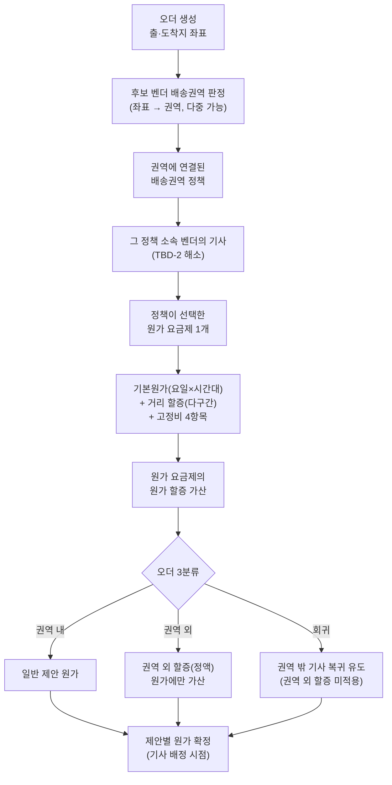

# 존/권역 구조 개편 — 유저 시나리오 & 엣지케이스

> 상위 문서: [01_PRD](./01_PRD.md) / 화면 상세: [03_기능명세](./03_기능명세.md)
> 작성일: 2026-08-04 / 버전 **v1.4**
> v1.3 대비: 메뉴·역할 재편, 원가 요금제·벤더 배송권역 독립, 세트분배 축=벤더 배송권역, 권역 외=정액·판가 미반영
> 리뷰: [팀별 리뷰 가이드](./00_index.md#팀별-리뷰-가이드-멀티팀) — 본문은 **트랙 A~D** 순
> 이 문서는 **단독으로 완결**된다. v1.3 문서를 함께 읽지 않아도 모든 표·검증·에러 메시지를 포함한다.

---

## 메뉴 트리 (TO-BE)

v1.4는 상위 메뉴를 **세 그룹(권역 / 요금 상품 / 벤더 정책)**으로 재편한다. 원가 요금제와 벤더 배송권역은 정책 하위 탭이 아니라 **독립 메뉴**로 승격된다.

```
권역 관리
├ 영업존 관리
├ 벤더 배송권역 관리
└ 권역 시각화

요금 상품 관리
├ 판가 요금제 관리
├ 판가 할증 관리
├ 원가 요금제 관리
└ 원가 할증 관리

벤더 정책 관리
├ 배송권역 정책 관리
│  └ 탭: 기본정보 / 벤더 배송권역 매핑 / 원가 요금제 선택 / 변경 이력
├ 세트 분배 관리
└ 벤더 관리
```

**v1.3 대비 변화**
- `ZONE 원가 요금제 관리`(정책 탭 소유)를 폐기하고 `요금 상품 관리 > 원가 요금제 관리` **독립 메뉴**로 승격.
- `원가 할증 관리`를 `세트 관리` 하위에서 `요금 상품 관리` 하위로 이동.
- `벤더 배송권역 관리`를 `권역 관리` 그룹 하위 독립 메뉴로 신설(구 세트/정책 탭 내부에서 분리).
- `권역 시각화` 메뉴 위치를 `권역 관리` 그룹으로 확정(구 TBD-6 해소).

### 역할 (운영자) ↔ 리뷰 트랙

| 역할 | 주 트랙 | 시나리오 ID |
|------|---------|-------------|
| **영업 담당자** | A(영업존) + B(판가) | 1-1 ~ 1-6 |
| **공급 담당자** | A(벤더 배송권역) + B(원가) + C | 2-1 ~ 2-9 |
| **시스템(배차·원가)** | D | 3-1 ~ 3-8 |

---

## A. 권역 생성/관리

| # | 시나리오 | 트랙 |
|---|---------|:----:|
| 1-1 | 영업 담당자는 영업존을 생성하고 지점과 픽업지 권역 1개를 연결할 수 있다 | A |
| 1-4 | 시스템은 이미 다른 영업존에 연결된 픽업지 권역의 선택을 차단한다 | A |
| 1-5 | G4 상점은 오더 접수 시 소속 영업존의 판가·할증·프로모션을 자동 적용받는다 | A |
| 1-6 | 시스템은 픽업지 권역이 지리적으로 겹치면 저장을 차단한다 | A |
| ~~1-7~~ | ~~영업존에서 배송 반경 설정~~ → **제거**. 상점 배송 접수 반경은 **기존 상점 설정 그대로** | A |
| 2-1 | 공급 담당자는 지점 공급권역을 불러와 벤더 배송권역을 생성·관리할 수 있다 | A |
| 4-1 | 담당자는 지도에서 영업존(빨강)·벤더 배송권역(파랑) 폴리곤을 확인한다 | A |
| 4-2 | 폴리곤 호버·클릭으로 상세 진입 | A |
| 4-3 | CM·CMR 하한선 이탈 (P1) | A |

### 1-1 영업존 생성

영업존은 **지점 1개 + 픽업지 권역 1개**로 구성한다. 메뉴: `권역 관리 > 영업존 관리`. 지점이 픽업지 권역을 여러 개 보유하면 각각을 별도 영업존으로 만들 수 있다(한 지점이 여러 영업존을 가질 수 있다).

| 동작 | 내용 |
|------|------|
| 지점 선택 | 벤더존 운영방식 지점만. 선택 가능한 픽업지 권역이 남아 있지 않은 지점은 비활성 + 이유 표시. 매핑 후 교체 불가 |
| 픽업지 권역 선택 | 지점 보유 픽업지 권역 목록에서 **하나만 선택**. 이미 다른 영업존에 연결된 권역은 선택 불가 |
| 지도 표시 | 선택한 픽업지 권역 폴리곤 1개만 표시. 미선택 시 안내 문구 표시 |
| 지역 목록 | 선택한 권역에 포함된 지역만 (행정동/법정동 전환) |

**채널별 판가 확장**: 픽업지 권역 폴리곤이 **서로 겹치지 않을 때만** 채널별 영업존을 동시에 등록할 수 있다. 성북처럼 `YOGIYO_OD` / `YOGIYO_DIRECT`가 동일 폴리곤이면 지리 중첩으로 저장이 막히므로, 채널별 판가를 쓰려면 권역을 먼저 분할해야 한다.

### 1-4 픽업지 권역 중복 연결 차단

- 하나의 픽업지 권역은 **하나의 영업존에만** 연결된다. 이미 연결된 권역은 선택 목록에서 비활성 처리되고, 연결된 영업존명을 함께 보여준다.
- 하나의 상점(픽업지)이 두 개의 판가를 갖는 상황을 원천 차단하는 장치다.

### 1-5 G4 자동 적용

| 항목 | 내용 |
|------|------|
| 판정 기준 | **관제지점 소속 + 영업구분 직영센터** |
| 적용 대상 | 판가 요금제 + 판가 할증 + G4 프로모션 |
| 예외 | 상점 상세에서 수동 오버라이드 가능. 화면에 판정 근거를 함께 표시 |

> 상점 주소 기준을 쓰지 않는 이유: 지점 관할 밖에 있으나 해당 지점이 관제하는 상점에서 판가와 정산 주체가 어긋난다.

### 1-6 지리 중첩 불가

영업존에 연결된 픽업지 권역의 폴리곤이 다른 영업존의 픽업지 권역과 겹치면 **저장을 차단**한다. 같은 지점의 채널별 픽업지도 예외 없다.

| 동작 | 내용 |
|------|------|
| 검증 시점 | 신규 영업존 등록, 연결된 픽업지 권역 수정 |
| 감지 대상 | **모든** 다른 영업존의 픽업지 권역과의 지리적 중첩 (같은 지점 채널 픽업지 포함) |
| 표시 | 영업존 상세에 오류 배너, 목록에 `중첩` 오류 배지 + 상대 권역명 |
| 저장 | **불가**. 중첩이 해소될 때까지 저장할 수 없다 |
| 사후 감지 | 지점이 픽업지 권역을 확장해 사후 중첩이 생기면 재검증 후 오류 상태 표시 + 담당자 알림. 해당 영업존은 중첩이 해소될 때까지 저장·수정이 제한된다 |

### 1-7 상점 배송 접수 반경 (v1.4 = 제거, 상점 설정 AS-IS)

영업존 화면에 **배송 반경·상점 판매권역 설정을 두지 않는다**. v1.3에서 두었던 "영업존 배송 반경(km) 단일값으로 상점 최대 배송 가능 반경 결정" 로직은 **폐기**한다.

| 항목 | v1.4 처리 |
|------|-----------|
| 영업존 배송 반경 입력 | **없음** (화면에서 제거) |
| 상점 배송 접수 반경 | **기존 상점 설정을 그대로** 따른다. 이번 개편에서 바꾸지 않는다 |
| 벤더 배송권역과의 관계 | 무관. 벤더 배송권역은 원가·정산 축으로만 쓴다 |
| 영업존 픽업지 권역과의 관계 | 무관. 픽업지 권역은 판가·관할 단위로만 쓴다 |

> **왜 제거하나**: 상점의 배송 가능 반경은 이미 상점 설정에 존재하는 통제다. 영업존에 별도 반경값을 두면 두 개의 반경 소스가 생겨 판정이 어긋난다. v1.4는 판매권역 축을 영업존에서 걷어내고, 상점 반경은 AS-IS 그대로 둔다.

### 2-1 벤더 배송권역 생성

메뉴: `권역 관리 > 벤더 배송권역 관리` (**독립 메뉴**). 생성 경로는 **지점 공급권역 불러오기 하나뿐**이다. 폴리곤을 직접 그리거나 편집하는 기능은 제공하지 않는다.

| 항목 | 내용 |
|------|------|
| 생성 방식 | `지점 공급권역 불러오기`에서 지점과 공급권역을 검색해 선택 |
| 폴리곤 관계 | 참조한 공급권역과 **항상 동일**하게 유지된다. 공급권역이 변경되면 배송권역도 함께 변경된다 |
| 폴리곤 수정 | 배송권역 화면에서는 불가. `권역 관리`에서 원본 공급권역을 수정한다 |
| 중복 참조 | 같은 정책 안에서 동일 공급권역을 두 번 참조할 수 없다 |
| 타 정책과 중첩 | 허용. 다른 정책이 쓰는 공급권역도 선택할 수 있다 |

- 지점 공급권역은 **권역 모양(폴리곤)의 원본으로만 재활용**하며, 영업기준(도착권역) 역할은 폐기한다.
- 중첩은 ① 한 정책이 여러 지점의 공급권역을 참조 ② 서로 다른 정책이 같은 공급권역을 참조하는 두 경로로 성립한다. 임의 폴리곤 없이도 기사 공급 음영 최소화 목적을 달성한다.
- 남는 제약: 공급권역의 **일부만** 특정 벤더에게 줄 수는 없다. 필요하면 공급권역 자체를 분할한다.

### 4. 시각화

| # | 시나리오 | 우선순위 |
|---|---------|:--------:|
| 4-1 | 담당자는 지도에서 영업존(빨강)·벤더 배송권역(파랑) 폴리곤을 한눈에 확인할 수 있다 | P0 |
| 4-2 | 담당자는 폴리곤 호버로 이름을 확인하고 클릭으로 상세에 진입할 수 있다 | P0 |
| 4-3 | 담당자는 폴리곤에서 최근 1주 CM·CMR과 하한선 이탈 여부를 확인할 수 있다 | P1 |

메뉴: **`권역 관리 > 권역 시각화`** (v1.3 TBD-6 해소).

#### 4-1 폴리곤 표시

| 항목 | 내용 |
|------|------|
| 표시 | 영업존 = 빨강, 벤더 배송권역 = 파랑 |
| 필터 | 표시 대상(영업존 / 배송권역 / 전체), 지점별, 벤더별 |
| 집계 | 하단에 표시 중인 폴리곤 수 + `엑셀 내려받기` |

- 중첩 구간은 **별도 강조하지 않는다.** 정확한 중첩 관계는 배송권역 정책 상세의 `중첩 정책` 컬럼에서 확인한다.

#### 4-2 호버 · 클릭

| 대상 | 호버 | 클릭 |
|------|------|------|
| 영업존 | 영업존명 + 지점명 + 픽업지 권역명 | 영업존 상세로 이동 |
| 배송권역 | 정책명 + 벤더 수 + 배송권역명 | 배송권역 정책 상세(또는 벤더 배송권역 상세)로 이동 |

#### 4-3 CM · CMR (P1)

| 대상 | 표시 |
|------|------|
| 영업존 | 전체 CM·CMR + 해당 지역 오더를 수행한 **배송권역 정책별 분해** |
| 배송권역 | 소속 벤더가 수행한 오더 기준 CM·CMR |
| 색상 | 그린(하한선 이상) / 옐로(경계) / 레드(미달) |

⚠ **영업기준 관리 졸업과의 관계**: "영업기준 관리 졸업"이 실행되면 기존 핵심 통제(영업기준표 범위 검증)가 사라진다. **졸업 시점과 CM 모니터링 가동 시점 사이의 통제 공백**을 어떻게 메울지 정해야 한다.

---

## B. 요금제

| # | 시나리오 | 트랙 |
|---|---------|:----:|
| 1-2 | 영업 담당자는 판가 요금제에서 적용 영업존·거리별 판가·적용 판가 할증을 설정할 수 있다 | B |
| 1-3 | 영업 담당자는 판가 할증을 생성·관리할 수 있다 | B |
| 2-3 | 공급 담당자는 원가 요금제에서 기본 거리·고정비·시간대별 기본원가·거리 할증을 설정할 수 있다 | B |
| 2-4 | 공급 담당자는 원가 할증을 만들고, 원가 요금제에서 선택해 적용할 수 있다 | B |
| 2-5 | 공급 담당자는 권역 외 할증을 정액으로 등록할 수 있다 (판가 미반영) | B |
| 2-9 | 담당자는 권역·정책·요금제 설정의 변경 이력(버전)을 조회·비교할 수 있다 | B·C |

### 1-2 판가 요금제 설정

메뉴: `요금 상품 관리 > 판가 요금제 관리`.

| 섹션 | 내용 |
|------|------|
| 기본 정보 | 요금제명 / 요금제 설명 |
| 요금 정보 | 기본 판가 + 거리별 요금(구간 반복) + 요약 |
| 적용 영업존 선택 | 검색해서 추가. 영업존당 요금제 1개, 요금제는 복수 영업존 가능 |
| 적용 판가 할증 선택 | 1-3에서 만든 판가 할증 중 복수 선택. 적용 해제 가능 |
| 이력 정보 | 변경 이력 |

- 통합 요금제를 경유하지 않고 판가 요금제가 영업존을 직접 보유한다.
- 화면은 탭으로 나누지 않고 단일 페이지 섹션 구조를 유지한다.

### 1-3 판가 할증

메뉴: `요금 상품 관리 > 판가 할증 관리`.

| 동작 | 내용 |
|------|------|
| 금액 정보 | `판가 할증 금액`만 입력(필수). 원가 금액 필드는 없다 |
| 할증 종류 | 기상 / 요일 및 시간대 / 지역 폴리곤 / 특수 |
| 적용 대상 | 영업존 (복수 선택 가능) |
| 양방향 반영 | 판가 요금제에서 할증을 선택하면 할증 화면의 적용 영업존에도 반영되고, 그 역도 성립 |

### 2-3 원가 요금제 입력

메뉴: `요금 상품 관리 > 원가 요금제 관리` (**독립 메뉴**, 정책 탭이 아님). v1.4에서 원가 요금제는 **정책이 소유하지 않고 독립 객체**로 존재하며, 여러 정책이 선택·재사용한다.

| 구성 | 입력 단위 |
|------|----------|
| 기본 거리 | 요금제 단일값 |
| **기본 원가(라이더비)** | **요일(행) × 시간대(열)** 표. 요금제 자체 슬롯을 쓰며 정책 슬롯과 **시간 구성이 같을 필요 없음** |
| **거리 할증** | **다구간 구간표** (행마다 `구간 시작`~`구간 끝` + `단위 거리` + `단위당 원가`) |
| 관제비 · 관리비 · 픽업비 · 완료비 | 요금제 단일값 (시간대 차등 없음) |
| 적용 원가 할증 선택 | 이 요금제에 붙일 원가 할증 (복수 선택) |

**고정비 4항목을 유지하는 이유**: 현행 원가 요금제는 라이더비 + 고정비 4항목(관제비·관리비·픽업비·완료비)의 5개 항목 체계다. 라이더비만 남기면 항목 구조가 깨진다.

**거리 할증을 다구간으로 유지하는 이유**: 별도의 `적용 상한 거리` 필드는 두지 않는다. 구간을 단계별로 추가하고 **마지막 구간의 끝을 상한으로 해석**한다. 첫 구간의 시작은 기본 거리를 자동 승계하고, 2행 이후는 직전 구간의 끝을 이어받는다.

- 현행 원가·판가가 모두 다구간이라 **구간을 그대로 이관하면 손실이 없다**. 단일 구간으로 압축하면 3구간 이상 데이터가 깨진다.
- 판가의 `거리별 요금` 테이블과 UI가 동일해져 운영자 학습 비용도 줄어든다.
- 하나의 원가 요금제는 **여러 배송권역 정책**에서 선택·재사용 가능하다.
- 배정 시각이 원가 요금제의 해당 시간 구간에 매핑되어 기본원가가 적용된다. **정책 슬롯과의 자동 정합·동기화 규칙은 두지 않는다** (E-18 참조).

### 2-4 원가 할증

| 항목 | 내용 |
|------|------|
| 생성·관리 위치 | `요금 상품 관리 > 원가 할증 관리` |
| 적용·선택 | **원가 요금제 상세에서만** (`적용 원가 할증 선택`). 배송권역 정책에서는 선택하지 않는다 |
| 적용 규칙 | 할증 1개 → 여러 원가 요금제 가능. 요금제 1개 → 여러 할증 가능 |
| 확정 시점 | 배차 시점. 단 **기상 할증은 완료 시점** (목록에 `확정 시점` 컬럼으로 노출) |

**별도 메뉴로 분리한 이유**: 기상 할증처럼 여러 요금제에 공통 적용되는 할증을 요금제 안에서만 만들면 요금제마다 중복 생성해야 한다. 판가 쪽 구조(판가 할증 메뉴에서 생성 → 판가 요금제에서 선택)와 대칭을 맞춘다.

> **v1.3과의 차이**: v1.3은 원가 할증을 **배송권역 정책**에 붙였다. v1.4는 원가 요금제가 독립 객체가 되었으므로, 원가 할증도 **원가 요금제에만** 붙는다. 정책은 원가 요금제를 선택하는 것으로 할증까지 함께 상속한다.

### 2-5 권역 외 할증

- 정의: **출발지가 권역 내 + 도착지가 권역 외**. 회귀 오더(도착지만 권역 내)에는 적용하지 않는다.
- 산정: **정액(금액 1개)만**. v1.3에 있던 "경계 초과 거리 비례" 옵션은 **폐기**한다.
- **판가 미반영** — 원가에만 가산한다. 판가(판매가)에는 반영하지 않는다.

| 산정 방식 | 입력 | v1.4 채택 |
|----------|------|:--------:|
| 정액 | 금액 1개 | ✅ |
| 경계 초과 거리 비례 | ~~`단위 거리(km)` + `단위당 금액` + `상한 금액`~~ | ❌ 폐기 |

> **정액·판가 미반영으로 확정한 이유**: v1.3에서 미결(TBD-5)이던 산정 방식과 "판가에도 붙일지" 논의를 v1.4에서 정리했다. 권역 외 할증은 기사 원가 보전 목적이므로 **원가에만 정액**으로 가산하고, 판매가는 건드리지 않아 CM 계산을 단순하게 유지한다.

### 2-9 버전 관리

- AS-IS 버전 관리(저장 시 버전 적재, `예약 저장`으로 미래 시점 적용, 버전 비교 모달)를 승계한다.
- **원가 요금제·원가 할증·정책(벤더 배송권역 매핑·슬롯 단위물량·선택 원가 요금제)이 버전 스냅샷에 포함**된다. 정산이 과거 시점 원가를 조회하므로 필수다.
- 버전 비교 화면에 원가 블록(고정비 4항목 / 기본원가 표 / 거리 할증 구간표)을 추가한다.
- 정책 쪽 이력은 트랙 C와 공유한다.

---

## C. 벤더 정책

| # | 시나리오 | 트랙 |
|---|---------|:----:|
| 2-2 | 공급 담당자는 배송권역 정책에 벤더 배송권역을 매핑할 수 있다 | C |
| 2-6 | 공급 담당자는 배송권역 정책에서 원가 요금제 1개를 선택할 수 있다 | C |
| 2-7 | 공급 담당자는 배송권역 정책의 슬롯별 단위물량을 정의할 수 있다 | C |
| 2-8 | 공급 담당자는 세트분배 관리에서 벤더 배송권역 기준으로 벤더 연결·벤더별 세트 수를 관리할 수 있다 | C |

### 2-2 배송권역 정책에 배송권역 매핑

메뉴: `벤더 정책 관리 > 배송권역 정책 관리`.

- `적용 ZONE 선택`을 **벤더 배송권역 매핑** 탭으로 대체한다. 정책당 1개 이상 연결한다.
- 배송권역은 하나의 정책에만 속하고, 한 정책은 배송권역을 여러 개 보유할 수 있다.
- 활성/비활성 판정은 **배송권역 1개 이상 + 원가 요금제 1개 선택 완료**로 판단한다.

### 2-6 정책에서 원가 요금제 선택

- 배송권역 정책 상세에서 **원가 요금제 1개만** 선택한다. 미선택 시 활성 불가.
- 원가 요금제는 독립 객체이므로 같은 요금제를 여러 정책이 동시에 선택할 수 있다.
- 선택한 원가 요금제가 삭제·비활성되면 정책이 활성 조건을 잃는다 (E-19 참조).

### 2-7 정책 슬롯 · 단위물량

- 배송권역 정책이 **슬롯별 단위물량**을 정의한다.
- 정책 슬롯의 시간 구성은 원가 요금제의 시간대 구성과 **일치할 필요가 없다.**
- v1.3의 "슬롯 변경 시 원가표 셀 동기화(변경 셀만 미입력 처리 후 저장 차단)" 규칙은 **삭제**한다. 원가는 원가 요금제의 시간 구간만 사용하고, 단위물량은 정책 슬롯만 사용하므로 두 축이 독립이다 (E-18 참조).

> **v1.3과의 차이**: v1.3은 원가 요금제가 정책에 종속되어 "요일 × 활성 슬롯" 표를 정책 슬롯과 강결합했고, 슬롯을 바꾸면 원가 셀을 재입력해야 했다. v1.4는 원가 요금제를 분리하면서 이 동기화 부담을 제거한다.

### 2-8 세트분배

메뉴: `벤더 정책 관리 > 세트 분배 관리`.

- 기능·화면 구조는 기존과 동일하다.
- 기준 축: ZONE → **벤더 배송권역**.
- 벤더 배송권역별로 **어떤 벤더가 연결되는지**, **벤더별 세트 수**를 관리한다.
- 선후: 벤더 배송권역이 먼저 존재해야 세트분배가 가능하다 (AS-IS ZONE 생성 후 세트분배와 동일).
- **벤더 ∈ 정책 1개** (TBD-3 해소): 한 벤더는 **하나의 배송권역 정책**에만 속한다. 다른 정책의 배송권역에 동일 벤더를 추가할 수 없다.
- **적용 시점**: 정책 변경·신규 벤더 추가는 **그 이후 생성되는 오더부터** 반영한다 (E-1·E-10).

> **v1.3 미결 해소**: v1.3에서 "벤더-존 연결 화면 경로가 AS-IS에 없다"는 확인 필요 항목이 있었다. v1.4는 기준 축을 **벤더 배송권역**으로 확정해, 세트 분배 관리에서 벤더 배송권역 ↔ 벤더 연결을 명시적으로 관리한다.

---

## D. 배차·원가 런타임

| # | 시나리오 | 트랙 |
|---|---------|:----:|
| 3-1 | 시스템은 오더 생성 시 출·도착지 좌표로 후보 벤더 배송권역을 판정한다 | D |
| 3-2 | 시스템은 후보 벤더별로 오더를 권역 내/외/회귀로 분류한다 | D |
| 3-3 | 시스템은 기사 소속 벤더의 배송권역 → 정책 → **선택된 원가 요금제** + 할증으로 제안별 원가를 산정한다 | D |
| 3-4 | AI 배차는 분류·원가 기준으로 제안 우선순위를 정한다 | D |
| 3-5 | AI 배차는 기사가 권역 외에 위치할 때만 회귀 오더를 제안한다 | D |
| 3-6 | 기사는 제안 화면에서 산정된 배송료와 태그를 확인할 수 있다 | D |
| 3-7 | 시스템은 G1 벤더 오더에도 동일한 원가 판정을 적용한다 | D |
| 3-8 | 프렌즈 원가는 제안 가능한 가장 저렴한 벤더 원가를 기반으로 한다 | D |

### 런타임 원가 산정 흐름

오더 좌표에서 제안 원가까지의 v1.4 산정 경로다. 핵심은 **벤더 배송권역 → 배송권역 정책 → (정책이 선택한) 원가 요금제**로 원가가 흘러가는 점이다.



- 정책 슬롯(단위물량)은 이 원가 흐름에 개입하지 않는다. 시간대 원가는 **원가 요금제의 시간 구간**만 사용한다 (E-18).
- 배송권역 정책 변경·신규 벤더 추가는 **그 이후 생성되는 오더부터** 적용한다. 이미 생성된 오더는 변경하지 않는다 (E-1·E-10).

### 3-1 권역 판정 · 기사 후보

- **기사 후보 (TBD-2 해소)**: 오더의 **벤더 배송권역**에 연결된 **배송권역 정책**에 속한 **벤더**의 기사가 후보다.
- 출·도착지 중 하나라도 벤더 배송권역에 속하면, 그 권역 → 정책 → 소속 벤더 경로로 제안 대상이 된다.
- 좌표로 벤더 배송권역을 판정하는 기능이 **신설**되어야 한다 (하나의 좌표가 여러 권역에 속할 수 있다).
- 판정 실패 시 처리는 E-8.

### 3-2 오더 3분류

| 분류 | 조건 | 제안 |
|------|------|------|
| 권역 내 | 출발지·도착지 모두 권역 안 | 일반 제안 |
| 권역 외 | 출발지만 권역 안 | 권역 외 할증(정액) 가산 |
| 회귀 | 도착지만 권역 안 | 권역 밖 기사에게 복귀 유도 |

같은 오더라도 기사 소속 벤더에 따라 분류·원가가 다르다.

### 3-3 제안별 원가

| 동작 | 내용 |
|------|------|
| 산정 기준 | 후보 기사 소속 벤더가 연결된 **벤더 배송권역 → 배송권역 정책 → 선택된 원가 요금제 + 그 요금제의 원가 할증** |
| 시간대 원가 | 배정(또는 표시) 시각이 **원가 요금제**의 시간 구간에 매핑 |
| 권역 외 | 해당 원가 요금제에 권역 외 할증(정액)이 있으면 **원가에만** 가산 (판가 미반영) |
| 확정 시점 | **기사 배정 시점** |
| 계산 시점 | 개발 구현 판단. 단 "대기 오더 목록에 기사별 원가 표시"를 만족해야 함 |

**리뷰에서 답할 것**

| # | 질문 |
|---|------|
| a | 원가표를 누가 만드나 — 요금제 서버 vs 라스트마일 |
| b | 후보군 조회 시점 원가와 배정 시점 원가가 다르면 어느 쪽으로 확정하나 → **E-9** |

> **E-10 해소**: 오더 생성 후 정책·벤더·권역이 추가·변경되어도 **이미 생성된 오더의 후보·원가표는 갱신하지 않는다**. 변경은 **그 이후 생성되는 오더부터** 적용.

> **참고**: 현행 AI배차 배정에는 "제안 시점 금액과 기존 원가의 차액을 조정 할증으로 얹는" 방식이 부분 구현돼 있다(상세는 [R2](./references/R2_영향도_및_마이그레이션.md) 참조). "기존 원가 유지 + 배정 시점 조정"의 구현 출발점으로 쓸 수 있으나, 신규 권역 원가와 이중 가산되지 않도록 해야 한다 → **E-13**.

### 3-4 AI 배차 우선순위

| 단계 | 규칙 |
|------|------|
| 1. 하드 필터 | 출·도착지 어느 쪽도 권역에 속하지 않는 후보 제외 |
| 2. 분류 정렬 | 권역 내 > 회귀 > 권역 외 |
| 3. 동순위 정렬 | 원가 낮은 순 |
| 4. 회귀 게이트 | 기사가 해당 권역 외부에 위치할 때만 회귀 오더 포함 |
| 5. 기존 우선순위와의 관계 | 삽입 위치를 배차팀과 확정 — **TBD-4** |

### 3-5 회귀 조건

- 기사가 **권역 외에 위치할 때만** 제안한다. '경계' 개념은 쓰지 않는다.
- ⚠ **확인 필요**: 기사 위치 소스. 라스트마일 후보군 조회는 기사 위치를 보지 않고, 벤더 오더 후보의 위치는 vendorset 응답에 실려온다. 이 소스를 쓸지 새로 만들지 결정이 필요하다.

### 3-6 플러스앱 표기

| 항목 | 내용 |
|------|------|
| 태그 | `회귀`(파랑) / `권역 외`(주황) |
| 금액 | 권역 외 할증 포함 금액 |
| ⚠ 제약 | 태그 노출은 **앱 수정 + 스토어 배포**가 필요하다. 서버 일정(10월 말~11월)과 함께 잡아야 한다 |
| 구버전 대응 | 태그 미노출, 금액은 정확히 표시 |

### 3-7 G1 원가 일원화

- 관제지점의 지점 타입이 벤더존인 오더는 상점 등급 무관하게 소속 벤더의 배송권역 정책 원가로 산정한다.
- 대기 오더 목록에도 **각 기사 소속 벤더 기준 원가**를 표시한다. 즉 오더 1건의 표시 금액이 보는 기사마다 다르다. 전투배차 목록은 조회 빈도가 높아 실시간 계산이 부담이므로 사전 원가표 방식이 유리하다.
- ⚠ **재무 영향**: G1은 판가 체계가 달라 CM 계산·정산 리포트에 영향이 있다. 재무 영향도 분석이 선행되어야 한다.

### 3-8 프렌즈 원가

| 항목 | 내용 |
|------|------|
| 산정 | 해당 오더의 후보 배송권역 정책들 중 **가장 낮은 원가**를 기준으로 산정 |
| 대체 원가 | 어떤 권역에도 속하지 않으면 대체 원가 적용 — **TBD-8**, E-3 |
| 일반 이륜 기사 | 동일 규칙 적용 |
| ⚠ 리스크 | 6/8 마진 분석에서 프렌즈 원가가 매출의 약 2배로 구조적 적자였다. 최저 벤더 원가 기반은 적자를 개선하지만 **프렌즈 수락률 하락** 위험이 있어 가드레일 지표로 감시한다 |

---

## 5. 엣지케이스

| # | 상황 | 왜 중요한가 | 처리 방향 | 트랙 |
|---|------|------------|----------|:----:|
| **E-1** | 배송권역 정책 변경·신규 벤더 추가 시 진행 중(이미 생성) 오더의 분류·원가·후보 처리 | 정산 스냅샷 일관성 | **그 이후 생성되는 오더부터** 적용. 이미 생성된 오더는 **변경 전 기준으로 완료** | D |
| **~~E-2~~** | 한 벤더가 여러 배송권역 정책에 소속된 경우 | — | **해소 (TBD-3)**: 벤더는 **정책 1개에만** 속하므로 복수 소속·원가 선택 규칙 불필요. UI/검증에서 타 정책 배송권역에 동일 벤더 추가 차단 | C |
| **E-3** | 출·도착지 모두 어떤 권역에도 속하지 않는 벤더존 오더 | 대체 원가 정의 필요 | 하드 필터로 벤더 기사 제안 대상에서 제외 + **대체 원가**로 프렌즈·일반 이륜에 제안 (**TBD-8**) | D |
| **E-4** | 시간 외 슬롯 오더 + 시간 구간 경계 시각(정각) 오더의 원가 귀속 | 경계 처리 미정의 | 경계 시각은 **다음 구간 시작으로 귀속**(`시작 ≤ t < 종료`). 기준 시각은 오더 생성 시각 vs 배정 시각 중 확정 필요 → E-9와 연동. 시간 구간은 **원가 요금제 기준** | B |
| **E-5** | 배차 취소 → 재배차 시 원가 재산정 여부 | 배차 시점 확정 원칙의 파생 | **새 기사 기준으로 재확정**. 재확정 이력을 남긴다 | D |
| **E-6** | 우선배차 조건 카운트 기준 | 우선배차 기능 자체가 범위 밖 | **이번 스코프 제외** (Out-of-Scope) | — |
| **E-7** | 배송권역 정책 삭제·비활성화 시 연결 벤더·세트 발주 처리 | 라이프사이클 | 연결 벤더가 있으면 삭제 차단. 비활성화는 **세트 발주 중단 + 진행 오더는 완료까지 유지**. 활성 조건을 잃으면 자동 비활성 | C |
| **E-8** | 권역 판정 또는 원가 계산 실패 시 배차를 막나, 기본 원가로 진행하나 | 개발 미결 (배차 블로킹) | 배차 중단은 물량 손실이 크므로 **대체 원가로 진행 + 경보 적재** 권장 | D |
| **E-9** | 후보군 조회 시점과 배정 시점 사이에 원가 요금제 시간 구간이 바뀌어 원가가 달라짐 | 개발 미결 | **제안 시 보여준 금액을 보장**하고 차액은 조정금으로 처리하는 방향 권장 (기존 배정 시점 조정 할증 선례 — R2 참조) | D |
| **~~E-10~~** | 오더 생성 후 벤더·권역·정책이 추가·삭제됨 | — | **해소**: 변경은 **이후 생성 오더부터**. 이미 생성된 오더의 후보·원가표는 **갱신하지 않음** | D |
| **E-11** | 벤더 배송권역 축소·삭제 시 상점 배송 접수 반경 판정에 미치는 영향 | 1-7 (상점 설정 AS-IS) | 상점 반경은 **기존 상점 설정으로만** 결정하고 영업존·벤더 권역과 분리했으므로 **영향 없음**이 정답. 회귀 테스트로 확인 | A |
| **E-12** | 지점 픽업지 권역 변경으로 다른 영업존과 지리적 중첩이 **사후** 발생 | 1-6 | 재검증 후 오류 상태 표시 + 담당자 알림. 중첩이 해소될 때까지 해당 영업존 저장·수정 제한 | A |
| **E-13** | 기존 배정 시점 조정 할증과 신규 권역 원가 확정의 **이중 가산** | 개발 지적 | 권역 원가 확정 후 기존 조정 할증을 어떻게 계산할지 정의 필요 | D |
| **E-14** | 과적 오더의 분류·원가 | 개발 지적 | 과적 오더는 완료 시 재계산 제외 대상인데 "배정 시점 확정" 원칙과 충돌. 예외 명시 필요 | D |
| **E-15** | 배차포기 수수료 기준 | 개발 지적 | 포기 기사 소속 벤더의 권역 원가를 쓸지, 오더 확정 원가를 쓸지 정의 | D |
| **E-16** | 지점의 픽업지 권역이 삭제되어 연결된 영업존이 고아가 됨 | 1-1 (권역 1개 구성의 파생) | 삭제 차단 또는 영업존 자동 비활성 + 알림. 판가 공백이 생기므로 반드시 정의 필요 | A |
| **E-17** | 지점 담당자가 공급권역을 변경·삭제하여 벤더 배송권역이 함께 바뀜 | 2-1 (상시 연동의 파생) | 상시 연동이므로 **의도된 동작**이나 통보 없이 원가 산정 범위가 바뀐다. 참조 중인 정책·벤더에게 **변경 알림 + 이력 기록**, 삭제는 참조가 있으면 차단 | A |
| **E-18** | 원가 요금제 시간대와 정책 슬롯이 불일치 | 원가 요금제 독립·슬롯 동기화 삭제의 파생 | **정상 동작**. 원가는 원가 요금제의 시간 구간만 사용하고, 단위물량은 정책 슬롯만 사용한다. 두 축은 독립이며 동기화하지 않는다 | B·C |
| **E-19** | 정책이 선택한 원가 요금제가 삭제·비활성됨 | 원가 요금제 독립의 파생 (정책이 외부 요금제 참조) | 정책 **활성 불가 + 담당자 알림**. 대체 원가 요금제를 선택하기 전까지 정책 저장·활성 차단 | C |

---

## So What / Next Step

- v1.4 핵심은 **메뉴·역할·객체 소유 재편**이다. 배차·회귀·3분류 정책은 v1.3을 승계하되, 원가 요금제·벤더 배송권역·원가 할증을 **독립 객체**로 분리했다.
- 시나리오는 영업존·판가(트랙 A·B) 1-1~1-6, 공급·원가·정책(트랙 A·B·C) 2-1~2-9, 배차·원가 런타임(트랙 D) 3-1~3-8, 시각화 4-1~4-3이다. 엣지케이스는 **19건**(E-18·E-19 신규 포함).
- **v1.4에서 확정한 것**: ① 영업존 배송 반경 제거(1-7, 상점 설정 AS-IS) ② 원가 요금제 독립 메뉴 ③ 원가 할증은 원가 요금제에만 ④ 권역 외 할증 정액·판가 미반영 ⑤ 세트분배 축=벤더 배송권역 ⑥ 슬롯↔원가 동기화 삭제(E-18 정상) ⑦ **TBD-2·3·E-2·E-10 해소** (후보=권역→정책→벤더 기사 / 벤더∈정책 1개 / 변경은 이후 생성 오더부터).
- **여전히 개발 블로킹**: E-8~E-9, E-13~E-15는 트랙 D 합동 리뷰에서 답이 필요하다. **E-18·E-19는 원가 요금제 독립에 따른 신규 케이스**로, 정책-요금제 참조 라이프사이클을 확정해야 한다.
- 리뷰 필참: **TBD-1(정산 축)**. TBD-2·3은 해소. 팀별 리뷰 구간은 [00_index 리뷰 가이드](./00_index.md#팀별-리뷰-가이드-멀티팀) 참조.
