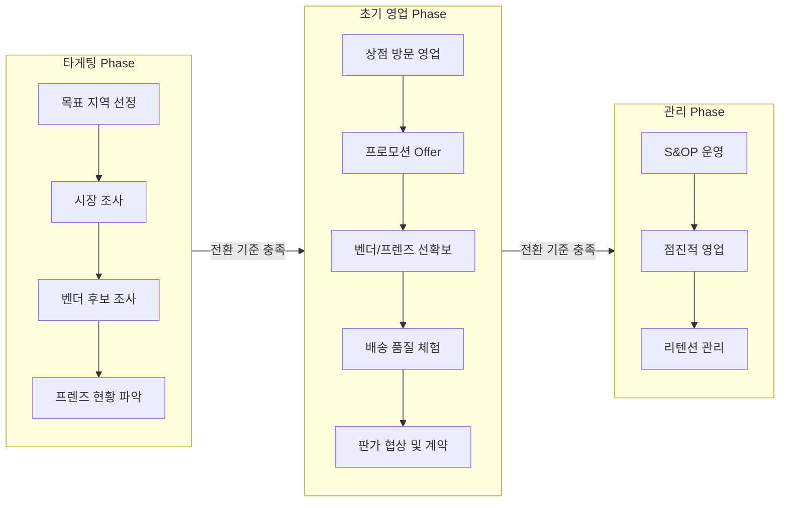
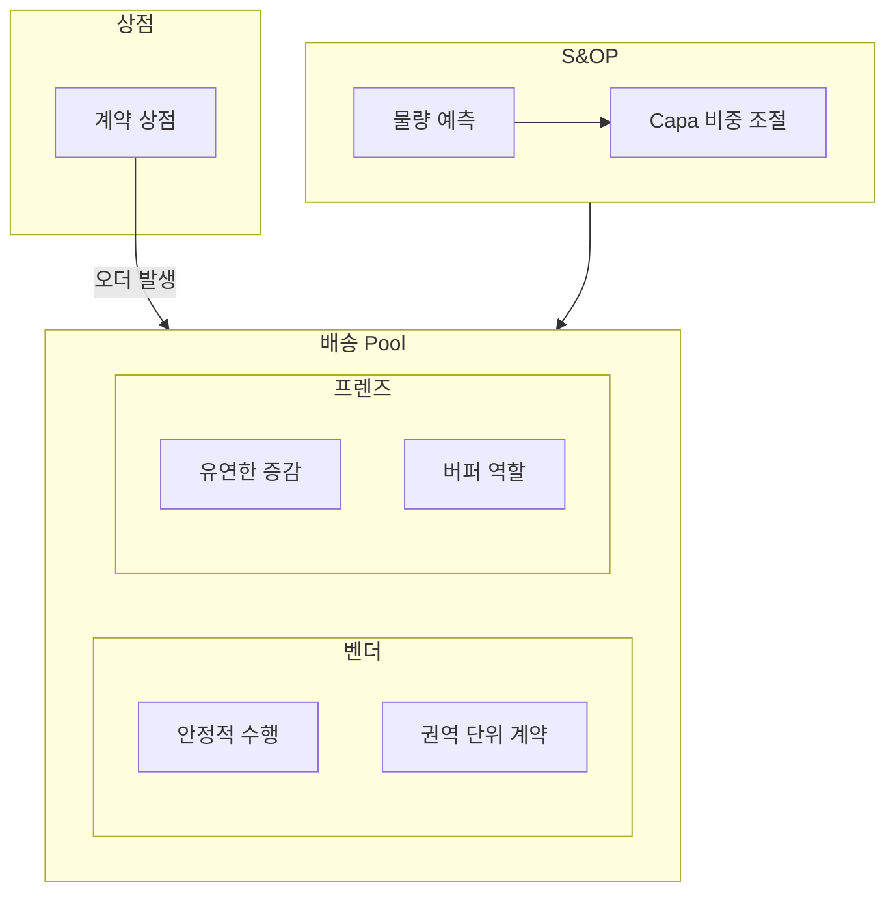
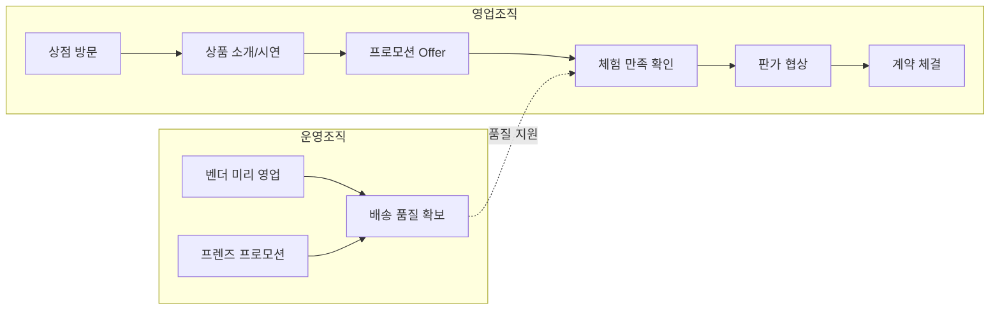

# B존 TF 워크플로우 (초안)

**작성일:** 2026.02.02  
**목적:** 팀 공유용 초안 - 논의 후 디벨롭 예정

---

## 1. 개요

### 1.1 목적

B존 구축을 위한 TF 워크플로우 및 SOP 정립

### 1.2 TF 구성

| 조직 | 역할 |
|------|------|
| **영업조직** | 상점 영업, 계약 체결, 판가 협상 |
| **운영조직** | 배송 pool 확보 (벤더/프렌즈), S&OP 기획 |
| **CX조직** | 상점 리텐션 관리 |

### 1.3 배송 Pool 구조

| 구분 | 정의 | 특징 |
|------|------|------|
| **벤더** | 5명 내외로 구성된 위탁 업체 | 권역 단위 계약, 안정적 수행 pool |
| **프렌즈** | 크라우드소싱 기반 배송 기사 | 유연한 증감 가능, 버퍼 역할 |

---

## 2. Phase 개요

| Phase | 목적 | 핵심 활동 | 주요 조직 |
|-------|------|----------|----------|
| **타게팅** | 진입 지역 선정 및 기반 조사 | 시장조사, 벤더 후보 파악 | 영업, 운영 |
| **초기 영업** | 상점 락인 + 배송 품질 증명 | 프로모션 영업, 배송 pool 선확보 | 영업, 운영 |
| **관리** | 안정적 운영 + 점진적 확장 | S&OP 기반 운영, 리텐션 관리 | 영업, 운영, CX |

---

## 3. Phase별 상세

### 3.1 타게팅 Phase

> **목적:** 영업 목표 지역 선정 및 배송 기반 조사

#### 영업조직 활동

| 활동 | 설명 |
|------|------|
| 영업 목표 지역 선정 | 시장 잠재력 기반 타겟 지역 결정 |
| 시장 조사 및 자료 수집 | 상점 분포, 경쟁 현황, 수요 예측 |
| 영업 목표 설정 | 목표 상점 수, 물량 목표 등 |

#### 운영조직 활동

| 활동 | 설명 |
|------|------|
| 벤더 후보 조사 | 해당 지역에서 계약 가능한 벤더 리스트업 |
| 프렌즈 현황 파악 | 지역 내 활동 중인 프렌즈 숫자 확인 |
| 배송 기반 조사 | 권역 구조, 예상 Capa 등 |

#### 주요 KPI

| KPI | 설명 | 목표 (예시) |
|-----|------|------------|
| 벤더 후보 리스트업 수 | 계약 가능한 벤더 후보 수 | N개 이상 |
| 프렌즈 활동 인원 파악률 | 지역 내 프렌즈 현황 파악 정도 | 100% |
| 시장 조사 완료율 | 목표 지역 내 상점 분포/경쟁 현황 조사 | 100% |
| 예상 Capa 산출 | 권역별 예상 배송 가능 물량 | 산출 완료 |

---

### 3.2 초기 영업 Phase

> **목적:** 상점 락인을 위한 공격적 영업 + 배송 품질 체험 제공

#### 영업조직 활동

| 활동 | 설명 |
|------|------|
| 상점 방문 영업 | 상품 소개, 시연 진행 |
| 프로모션 Offer | 무료 배송 체험 제공을 통한 상품 검증 |
| 판가 협상 및 계약 | 체험 만족 상점과 계약 체결 |

#### 운영조직 활동

| 활동 | 설명 |
|------|------|
| 벤더 선확보 | 실제 수행 물량보다 많은 금액 지급하여 미리 영업 |
| 프렌즈 선확보 | 프로모션/홍보를 통해 충분한 활동 프렌즈 확보 |
| 배송 품질 관리 | 좋은 배송 경험 제공으로 상점 락인 지원 |

#### 주요 KPI

| KPI | 설명 | 목표 (예시) |
|-----|------|------------|
| 방문 상점 수 | 영업팀이 방문한 상점 수 | 주간 N개 |
| 프로모션 참여율 | 방문 상점 중 프로모션 체험 참여 비율 | 60% 이상 |
| 계약 전환율 | 프로모션 참여 상점 중 계약 체결 비율 | 40% 이상 |
| 배송 완료율 | 프로모션 오더 정상 배송 완료 비율 | 95% 이상 |
| 평균 배송 시간 | 픽업~배송완료 평균 소요 시간 | N분 이내 |
| 벤더 계약 완료율 | 목표 벤더 대비 계약 완료 비율 | 100% |
| 프렌즈 확보율 | 목표 프렌즈 인원 대비 확보 비율 | 100% |

#### 벤더-프렌즈 비중 전략

| 구분 | 초기 영업 Phase 권장 비중 | 이유 |
|------|------------------------|------|
| 벤더 | 70% | 안정적 배송 품질로 상점 락인 지원 |
| 프렌즈 | 30% | 물량 변동 대응 버퍼 |

> **핵심 전략:** 초기 영업에서는 **배송 품질이 최우선**. 벤더 비중을 높여 안정적 체험 제공 후, 관리 Phase에서 비중 조절.

#### CX조직 활동 (지원)

| 활동 | 설명 |
|------|------|
| 프로모션 상점 피드백 수집 | 배송 체험 후 상점 만족도/불만 사항 수집 |
| 계약 전환 지원 | 체험 만족 상점 대상 계약 유도 지원 |

> **참고:** 초기 영업 Phase에서 CX는 주도적 역할이 아닌 **지원 역할**로 참여. 상점 피드백을 조기에 수집하여 배송 품질 개선에 활용.

---

### 3.3 관리 Phase

> **목적:** 안정적 운영 및 점진적 확장

#### 영업조직 활동

| 활동 | 설명 |
|------|------|
| 점진적 영업 | 초기 Phase의 공격적 구축이 아닌 안정적 확장 |
| S&OP 참여 | 주간 물량 예측 및 기획 협업 |

#### 운영조직 활동

| 활동 | 설명 |
|------|------|
| S&OP 운영 | 주간 물량 예측 및 벤더/프렌즈 공급 기획 |
| Capa 관리 | 벤더-프렌즈 비중 조절, 필요시 추가 계약/해지 |

#### CX조직 활동

| 활동 | 설명 |
|------|------|
| 상점 리텐션 관리 | 계약 상점의 이탈 방지 및 만족도 관리 |

#### 주요 KPI

| KPI | 설명 | 목표 (예시) |
|-----|------|------------|
| 상점 이탈률 | 월간 계약 해지 상점 비율 | 5% 이하 |
| 월간 물량 성장률 | 전월 대비 오더 물량 증가율 | 10% 이상 |
| 벤더 수행률 | 벤더에게 배정된 오더 수행 완료 비율 | 95% 이상 |
| 프렌즈 가동률 | 활성 프렌즈 중 실제 배송 수행 비율 | 80% 이상 |
| SLA 달성률 | 목표 배송 시간 내 완료 비율 | 90% 이상 |
| S&OP 예측 정확도 | 예측 물량 vs 실제 물량 오차율 | ±10% 이내 |

#### 벤더-프렌즈 비중 전략

| 구분 | 관리 Phase 권장 비중 | 이유 |
|------|-------------------|------|
| 벤더 | 50~60% | 안정적 기반 유지 |
| 프렌즈 | 40~50% | 물량 변동 대응 유연성 확보 |

> **핵심 전략:** 관리 Phase에서는 **비용 효율성**도 고려. 물량 예측이 안정화되면 프렌즈 비중을 높여 비용 최적화.

#### S&OP 프로세스 (주간)

```
주간 물량 예측
    ↓
희망 Capa 비중 설정 (프렌즈 : 벤더)
    ↓
┌─────────────────┬─────────────────┐
│   벤더 기획      │   프렌즈 기획    │
│ - 필요 세트 예측  │ - 필요 인원 예측  │
│ - 계약 조정      │ - 프로모션 기획   │
└─────────────────┴─────────────────┘
```

#### 일간/실시간 운영 체계

| 주기 | 활동 | 담당 |
|------|------|------|
| **주간** | S&OP - 물량 예측 + Capa 기획 | 영업+운영 |
| **일간** | 일일 물량 모니터링 + 이슈 대응 | 운영 |
| **실시간** | SLA 모니터링 → Capa 부족 시 대응 | 운영 |

**실시간 Capa 대응 절차:**

| 단계 | 대응 방법 | 소요 시간 |
|------|----------|----------|
| 1차 대응 | Dynamic Pricing (AI 배차), 벤더 수행 독려 | ~15분 |
| 2차 대응 | 동적 미션 생성, 벤더 추가 투입, 본사 할증 적용 | ~15분 |

---

## 4. Phase 전환 기준

| 전환 | 전환 기준 |
|------|----------|
| **타게팅 → 초기 영업** | - 목표 지역 확정<br>- 벤더 후보 N개 이상 리스트업 완료<br>- 프렌즈 현황 파악 완료 |
| **초기 영업 → 관리** | - 계약 상점 N개 달성<br>- 프로모션 오더 배송 퀄리티 목표 달성 (예: 완료율 95% 이상)<br>- 벤더/프렌즈 pool 안정화 |

---

## 5. 조직 간 협업 체계

### 5.1 정기 협업 미팅

| 시점 | 미팅명 | 참여 조직 | 주요 안건 |
|------|--------|----------|----------|
| 타게팅 완료 시 | Kick-off 미팅 | 영업+운영 | 영업 목표 vs 배송 Capa 정합성 검토, 초기 영업 계획 확정 |
| 초기 영업 주간 | 주간 리뷰 | 영업+운영 | 프로모션 오더 현황, 배송 퀄리티 리뷰, 이슈 공유 |
| 관리 Phase 주간 | S&OP 회의 | 영업+운영+CX | 물량 예측, 공급 기획, 리텐션 현황 |

### 5.2 정보 공유 체계

| 정보 | 제공 조직 | 수신 조직 | 공유 주기 |
|------|----------|----------|----------|
| 영업 파이프라인 (예상 계약 상점) | 영업 | 운영 | 주간 |
| 프로모션 일정 및 예상 물량 | 영업 | 운영 | 영업일 D-3 |
| 배송 Capa 현황 | 운영 | 영업 | 주간 |
| 배송 퀄리티 리포트 | 운영 | 영업+CX | 주간 |
| 상점 VOC/이탈 징후 | CX | 영업+운영 | 실시간/주간 |

### 5.3 의사결정 권한 (RACI)

| 의사결정 | 영업 | 운영 | CX | 비고 |
|----------|------|------|-----|------|
| 목표 지역 선정 | **A** | C | - | 영업 주도, 운영 Capa 검토 |
| 벤더 계약 | C | **A** | - | 운영 주도 |
| 프로모션 설계 | **A** | C | - | 영업 주도, 운영 실행 가능성 검토 |
| 배송 원가 설정 | C | **A** | - | 운영 주도 |
| 상점 계약 조건 | **A** | C | - | 영업 주도 |
| Capa 부족 시 대응 | I | **A** | - | 운영 즉시 대응 |
| 상점 이탈 방지 조치 | C | C | **A** | CX 주도 |

> **범례:** A = Accountable (최종 책임), R = Responsible (실행), C = Consulted (협의), I = Informed (통보)

---

## 6. 리스크 관리

### 6.1 Phase별 주요 리스크

#### 타게팅 Phase 리스크

| 리스크 | 영향 | 대응 방안 |
|--------|------|----------|
| 벤더 후보 부족 | 초기 영업 지연 | 인접 권역 벤더 섭외, 프렌즈 비중 확대 플랜 B 준비 |
| 프렌즈 활동 인원 부족 | Capa 확보 어려움 | 사전 프로모션으로 프렌즈 유입, 타 지역 프렌즈 유치 |
| 시장 조사 오류 | 영업 목표 미달 | 경쟁사 동향 재조사, 목표 하향 조정 |

#### 초기 영업 Phase 리스크

| 리스크 | 영향 | 대응 방안 |
|--------|------|----------|
| 배송 품질 미달 | 계약 전환 실패 | 벤더 추가 투입, 프로모션 기간 연장 |
| 벤더 이탈 | Capa 급감 | 대체 벤더 풀 확보, 프렌즈 긴급 프로모션 |
| 프렌즈 수급 실패 | 피크 타임 대응 불가 | Dynamic Pricing 강화, 인접 권역 지원 |
| 프로모션 비용 초과 | 수익성 악화 | 프로모션 조기 종료, 계약 전환 가속화 |
| 경쟁사 대응 (가격 경쟁) | 계약 전환율 하락 | 차별화 포인트 강조, 추가 혜택 제공 |

#### 관리 Phase 리스크

| 리스크 | 영향 | 대응 방안 |
|--------|------|----------|
| 물량 급증 대응 실패 | SLA 미달, 상점 불만 | 실시간 모니터링 + Dynamic Pricing + 벤더 긴급 투입 |
| 상점 대량 이탈 | 매출 급감 | CX 조기 경보, 이탈 징후 상점 집중 관리 |
| 벤더 퀄리티 저하 | 배송 품질 하락 | 성과 기반 인센티브 조정, 저성과 벤더 교체 |
| S&OP 예측 실패 | Capa 과잉/부족 | 예측 모델 고도화, 버퍼 Capa 확보 |

### 6.2 리스크 모니터링 지표

| 리스크 유형 | 모니터링 지표 | 경고 기준 |
|------------|--------------|----------|
| Capa 부족 | 실시간 배송 대기 건수 | 평균 대비 150% 초과 |
| 벤더 이탈 | 벤더 수행률 하락 | 90% 미만 2주 연속 |
| 상점 이탈 | 주간 오더 감소율 | 전주 대비 30% 이상 감소 |
| 프렌즈 이탈 | 주간 활성 프렌즈 수 | 목표 대비 80% 미만 |

---

## 7. 도표

### 5.1 Phase별 워크플로우 흐름도



### 5.2 조직별 R&R 매트릭스

| Phase | 영업조직 | 운영조직 | CX조직 |
|-------|---------|---------|--------|
| **타게팅** | - 목표 지역 선정<br>- 시장 조사<br>- 영업 목표 설정 | - 벤더 후보 조사<br>- 프렌즈 현황 파악<br>- 배송 기반 조사 | - |
| **초기 영업** | - 상점 방문 영업<br>- 프로모션 Offer<br>- 판가 협상/계약 | - 벤더 선확보<br>- 프렌즈 선확보<br>- 배송 품질 관리 | - |
| **관리** | - 점진적 영업<br>- S&OP 참여 | - S&OP 운영<br>- Capa 관리 | - 상점 리텐션 관리 |

### 5.3 배송 Pool 운영 구조



### 5.4 초기 영업 Phase 상세 흐름



---

## [부록] 주요 용어 정리

| 용어 | 정의 |
|------|------|
| **B존** | 신규 운영 방식(NVP/벤더 기반)으로 구축하는 권역 |
| **벤더** | 5명 내외로 구성된 본사와 물량 수행을 계약한 위탁 업체. 권역 단위 계약을 체결하며 안정적인 수행 pool 역할 |
| **프렌즈** | 크라우드소싱 기반 배송 기사. 프로모션 및 다이나믹 프라이싱을 통해 유연한 증감이 가능하며 버퍼 역할 수행 |
| **세트** | 협력사(벤더)에 물량을 위탁하는 최소 단위. 요일/구간별 물량으로 구성 |
| **권역** | 상점-벤더-기사를 연결하는 지역 단위. 클러스터(픽업지) 단위로 관리 |
| **S&OP** | Sales & Operations Planning. 물량 예측 및 기사 공급 기획을 위한 주간 프로세스 |
| **Capa** | Capacity. 배송 수행 가능 물량/인원 |

---

## 변경 이력

| 버전 | 날짜 | 변경 내용 |
|------|------|----------|
| v0.1 | 2026.02.02 | 초안 작성 |
| v0.2 | 2026.02.02 | Phase 전환 기준 확정, 도표 추가 (흐름도, R&R 매트릭스) |
| v0.3 | 2026.02.02 | 전체 보강: Phase별 KPI, 벤더-프렌즈 비중 전략, 조직 간 협업 체계, 리스크 관리, 실시간 운영 체계 추가 |
