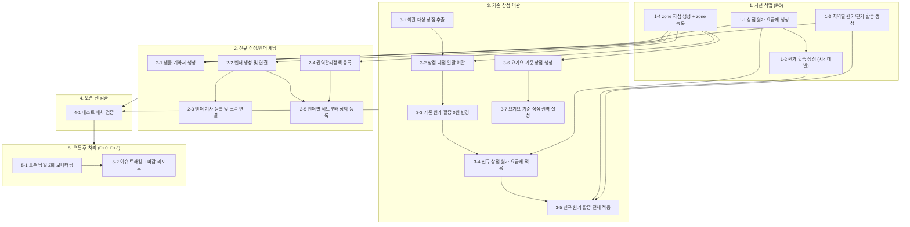

# 일반 지역 → B존 전환 실행 SOP

**작성일:** 2026.07.19
**목적:** 일반 지점으로 운영하던 지역을 B존(벤더존) 체제로 전환할 때 수행하는 실행 업무 표준화

---

## 개요

### 목적

일반 지역을 B존 지역으로 전환하는 실행 작업을 역할별(PO/RM)로 누락 없이 수행하기 위한 운영 SOP.
동대문 1 zone 이관(2026-05-19) 경험을 기반으로 일반화하였다.

### 적용 범위

- **대상:** 일반 지점에서 B존 체제로 전환하는 모든 지역
- **시점:** 영업기준 협의 완료 후 ~ 오픈 후 D+3 안정화까지
- **선행 입력물:** 해당 지역의 영업기준 협의 완료 (Zone 구획, 원/판가, 보상기준 등 — `신사업_운영_sop.md` Step 2~3 산출물에 해당)

### 관련 문서

| 문서 | 범위 | 관계 |
|------|------|------|
| `신사업_운영_sop.md` | 신규 지역 진출 **기획** (L-4주 ~ 런칭) | 선행 — 영업기준/원판가 산출물이 본 SOP의 입력 |
| 본 문서 | 일반 지역 → B존 전환 **실행** | 기획 확정 후 시스템 세팅~오픈 안정화 실행 |

### 주요 용어

| 용어 | 정의 |
|------|------|
| **B존(벤더존)** | 벤더 기반 배송 체제로 운영되는 지역. 지점 operation type이 벤더존으로 설정됨 |
| **zone 지점(관제 지점)** | B존 전환 지역의 상점을 관제하는 지점. zone 등록의 기준이 됨 |
| **벤더 기사 등록 지점** | 벤더 소속 기사의 기본정보를 등록하는 관리용 지점 |
| **상점 원가 요금제** | 상점에 적용되는 배송 원가 요금제. 시간대별 차등은 할증으로 구현하므로 **최저 원가 기준**으로 생성 |
| **기사 원가 요금제** | 권역관리정책 내에서 기사에게 지급하는 원가 (50m당 금액 + 픽업비용 + 배송완료 비용). 상점 원가 요금제와 별개의 시스템 개체 |
| **원가 할증** | 상점 원가 요금제(최저 기준) 대비 시간대/지역별 상승분을 구현하는 할증 |
| **판가** | 상점에 청구하는 배송 단가 |
| **권역관리정책** | 인트라 권역관리에서 세트 물량 구성·보상기준·기사 원가 요금제·연결 Zone 4개 탭을 묶어 관리하는 단위 |
| **세트분배** | Zone에 연결된 벤더별로 세트(위탁 물량 단위)를 분배하는 정책 |
| **요기요 기준 상점** | 요기요 오더 접수를 위해 지점에 생성하는 기준 상점 |

---

## 전체 흐름 및 의존성

### 흐름도

### 작업별 선행조건 요약

| 작업 | 선행조건 |
|------|----------|
| 1-1 상점 원가 요금제 생성 | 영업기준 협의 완료 |
| 1-2 원가 할증 생성 (시간대별) | 1-1 (최저 원가 기준 확정) |
| 1-3 지역별 원가/판가 할증 생성 | 영업기준 협의 완료 |
| 1-4 zone 지점 생성 | 영업기준 협의 완료 (세일즈 권역 확정) |
| 2-1 샘플 계약서 생성 | 1-1, 1-3, 1-4 |
| 2-2 벤더 생성 및 연결 | 1-4, 벤더 협의 완료 |
| 2-3 벤더 기사 등록 및 소속 연결 | 2-2 |
| 2-4 권역관리정책 등록 | 1-4 (zone 등록), 보상기준/기사 원가 협의 완료 |
| 2-5 벤더별 세트분배 정책 등록 | 2-2, 2-4 |
| 3-1 이관 대상 상점 추출 | — |
| 3-2 상점 지점 일괄 이관 | 3-1, 1-4 |
| 3-3 기존 원가 할증 0원 변경 | 3-1 |
| 3-4 신규 상점 원가 요금제 적용 | 3-1, 1-1 |
| 3-5 신규 원가 할증 전체 적용 | 3-3, 1-2, 1-3 |
| 3-6 요기요 기준 상점 생성 | 1-4, 1-1~1-3 |
| 3-7 요기요 기준 상점 권역 설정 | 3-6 |
| 4-1 테스트 배차 검증 | 섹션 1~3 전체 완료 |
| 5-1, 5-2 오픈 후 처리 | 오픈 완료 |

> **⚠️ 원가 공백 주의:** 3-3(기존 할증 0원)과 3-5(신규 할증 적용)는 같은 작업 배치로 연달아 실행한다. 두 작업 사이에 주문이 발생하면 원가가 누락/이중 적용될 수 있다.

---

## 1. 사전 작업

### 1-1. 상점 원가 요금제 생성

- **담당:** PO
- **작업 내용:**
  - 협의된 영업기준에 따른 상점 원가 요금제를 생성하고 기록한다.
  - 시간대별로 다른 요금제는 할증으로 구현해야 하므로, **그중 가장 낮은 원가를 기준**으로 원가 요금제를 생성한다.
- **완료기준:** 요금제 생성 완료 + 요금제 코드 기록

### 1-2. 원가 할증 생성 (시간대별)

- **담당:** PO *(RM 이관 예정)*
- **작업 내용:**
  - 시간대별 변동원가를 맞추기 위한 원가 할증을 생성한다.
  - 요일-시간대별 할증을 이용해 **최저 원가 대비 상승분**에 맞는 할증들을 생성하고 기록한다.
- **완료기준:** 요일-시간대 조합별 할증 생성 완료 + 할증 번호 기록

### 1-3. 지역별 원가/판가 할증 생성

- **담당:** PO *(영업 이관 예정)*
- **작업 내용:**
  - 협의된 영업기준에 따른 지역별 원가/판가를 가진 할증을 생성한다.
  - **권역 외 할증을 포함**하여 생성하고 기록한다.
- **완료기준:** 지역별 할증 생성 완료 + 할증 번호 기록

### 1-4. zone 지점 생성

- **담당:** PO
- **작업 내용:**
  - zone 등록을 위한 지점을 생성하고 기록한다.
  - 지점 operation type은 **벤더존**으로 생성한다.
  - 사전에 협의한 영업기준에 맞춘 세일즈 권역을 가진 지점을 생성한다.
  - 지점 생성 이후 zone 등록까지 완료하고 zone 이름을 기록한다.
- **완료기준:** 지점 생성(벤더존 type) + zone 등록 완료 + 지점코드/지점ID/zone 이름 기록

---

## 2. 신규 상점/벤더 세팅

### 2-1. 신규 상점 영업용 샘플 계약서 생성

- **담당:** PO *(영업 이관 예정)*
- **작업 내용:**
  - 생성한 상점 원가 요금제, 관제 지점(zone 지점), 할증 등의 정보를 포함한 상점 계약서를 생성한다.
  - **배송 반경은 지점 공급권역을 무시하고 n km로 설정 필요**하다는 문구를 포함한다.
- **완료기준:** 계약서 템플릿 완성 + 영업 담당 공유

### 2-2. 벤더 생성 및 연결

- **담당:** RM
- **작업 내용:**
  - 사전에 협의된 벤더들을 인트라에 등록하고 기록한다.
  - 벤더를 **관제 지점(zone 지점)에 연결**한다.
  - 세트분배 관리에서 벤더를 **해당 Zone에 연결**한다.
- **주의:** 다른 Zone에 이미 연결된 벤더는 연결 불가 (중복 검증 존재)
- **완료기준:** 대상 벤더 100% 지점 연결 + Zone 연결, 인트라 조회 시 정상 노출

### 2-3. 벤더 기사 등록 및 소속 연결

- **담당:** RM
- **작업 내용:**
  - 벤더 기사 등록 지점에서 기사 기본정보를 등록한다. (기 등록 기사는 생략)
  - 등록된 기사들을 소속 벤더에 연결한다.
  - 소속 없는 기사 존재 여부를 확인한다.
- **완료기준:** 대상 기사 전원 소속 벤더 연결 완료

### 2-4. 권역관리정책 등록 및 관리

- **담당:** PO *(RM 이관 예정)*
- **작업 내용:**
  - 인트라 권역관리에서 관리정책을 등록한다. 4개 탭을 모두 구성 후 전체 저장한다.
    1. **세트 물량 구성:** 세트 물량·세트 수량 설정 (적정 물량 배분 관리)
    2. **보상기준:** 수락률·성공 슬롯 수 조건 및 보상 금액
    3. **기사 원가 요금제:** 50m당 금액 + 픽업비용 + 배송완료 비용
    4. **연결 Zone:** 해당 zone 연결 (타 관리정책에 연결된 Zone은 연결 불가)
- **완료기준:** 4개 탭 입력 + 관리정책 전체 저장 완료

### 2-5. 벤더별 세트분배 정책 등록

- **담당:** PO *(RM 이관 예정)*
- **작업 내용:**
  - 벤더별 세트분배 기준을 확정하고 시스템에 반영한다.
- **완료기준:** 벤더별 세트분배 정책 반영 완료

---

## 3. 기존 상점 이관

### 3-1. zone별 이관 대상 상점 추출

- **담당:** PO
- **작업 내용:**
  - 이관 필요 지역 기준, 상점 위치로 **지난 6개월 내 오더를 발생시킨 운영중 상점** 목록을 추출한다.
  - 운영실에 해당 상점의 B존 이관 목록을 통보한다. `[통보 채널/담당자 확정 필요]`
- **완료기준:** 대상 상점 목록 확정 + 운영실 통보 완료

### 3-2. 상점 지점 일괄 이관

- **담당:** PO
- **작업 내용:**
  - 이관 대상 상점을 기존 일반 지점에서 신규 zone 지점(관제 지점)으로 일괄 이관한다.
  - 이관 결과 건수를 대조한다 (원본 목록 vs 이관 결과).
- **실행 시점:** `[확정 필요 — 오픈 전일 마감 후 / 오픈 당일 오전 등]`
- **리스크/대응:** 누락 건은 별도 리스트 추출 후 재이관
- **완료기준:** 대상 상점 이관 성공률 100%

### 3-3. 기존 상점 원가 할증 0원 변경

- **담당:** PO
- **작업 내용:**
  - 이관 대상 상점에 기 적용된 할증의 **원가를 0원으로 변경**한다.
  - 신규 적용 할증에 대해서만 원가가 지급되도록 하기 위함. 단, **판가 금액은 그대로 유지**한다.
- **완료기준:** 샘플 상점 5개 수동 검증에서 기존 할증 원가 0원 반영 100%

### 3-4. 기존 상점에 신규 상점 원가 요금제 적용

- **담당:** PO
- **작업 내용:**
  - 이관 대상 상점의 원가 요금제를 신규 생성한 요금제(1-1)로 일괄 변경한다.
  - **대량 상점 정보 변경 기능**을 활용한다.
- **완료기준:** 샘플 상점 5개 수동 검증에서 신규 요금제 적용 100%

### 3-5. 기존 상점에 신규 원가 할증 전체 적용

- **담당:** PO
- **작업 내용:**
  - 이관 대상 상점에 신규 생성한 원가 할증(시간대별 + 지역)을 일괄 적용한다.
  - **대량 상점 정보 변경 기능**을 활용한다.
- **주의:** 3-3(기존 할증 0원)과 같은 배치로 연달아 실행하여 원가 공백/이중 적용 구간을 만들지 않는다.
- **완료기준:** 요일/시간대/지역별 샘플 검증에서 정책 적용 정확도 100%

### 3-6. 요기요 기준 상점 신규 생성 및 소통

- **담당:** PO
- **작업 내용:**
  - 요기요 오더 접수를 위해 신규 zone 지점에 요기요 기준 상점을 생성한다.
  - 원가 요금제와 할증이 타 상점과 동일하게 적용되었는지 확인한다.
- **완료기준:** 기준 상점 생성 + 요금제/할증 적용 일치 확인

### 3-7. 요기요 기준 상점 권역 설정

- **담당:** PO
- **작업 내용:**
  - 요기요 오더가 누락 없이 처리될 수 있도록 기존 권역과 대조하여 누락된 픽업 권역이 없게 등록한다.
  - 법영실 담당자에게 신규 상점 생성 이후 권역 설정 점검을 요청한다. `[요청 채널/담당자 확정 필요]`
- **완료기준:** 기존 권역 대비 픽업 권역 누락 0건 + 법영실 점검 완료

---

## 4. 오픈 전 검증

### 4-1. 테스트 배차 검증

- **담당:** RM + PO
- **선행조건:** 섹션 1~3 전체 완료
- **작업 내용:**
  - 샘플 주문을 생성하여 **주문 생성 → 배차 → 원가 계산**이 의도대로 동작하는지 확인한다.
  - 벤더 소속 기사 최소 1명의 배차 가능 상태를 확인한다.
  - 원가 계산 검증 케이스:
    - 기본 시간대 (최저 원가 요금제만 적용)
    - 할증 시간대 (시간대별 원가 할증 반영)
    - 권역 외 배송 (지역별/권역 외 할증 반영)
- **완료기준:** 테스트 배차 성공 + 케이스별 원가 계산 정확도 100%

---

## 5. 오픈 후 처리 (D+0 ~ D+3)

### 5-1. 오픈 당일 2회 모니터링 (오전/오후)

- **담당:** RM + PO
- **작업 내용:**
  - 주문 생성/배차/완료 흐름 점검
  - 클레임/실패 주문 패턴 확인
- **완료기준:** 블로커 이슈 없음 또는 우회안 확정
- **리스크/대응:** 반복 실패 패턴 발견 시 즉시 원인 분류 및 소유자 지정

### 5-2. 이슈 트래킹 및 당일 마감 리포트

- **담당:** RM + PO
- **작업 내용:**
  - 이슈 로그 업데이트 (원인/영향/조치/담당/ETA)
  - 당일 마감 리포트 공유
- **완료기준:** 이해관계자 공유 완료 + 익일 액션 합의
- **리스크/대응:** 해결 지연 이슈는 우선순위 재조정 후 에스컬레이션

### 5-3. 안정화 종료 판정

- **기준:** D+3까지 블로커 이슈 0건 (또는 전부 우회안 확정) 시 정규 운영으로 전환
- 미해결 이슈가 있으면 모니터링 기간을 연장하고 이슈별 소유자/ETA를 재확인한다.

---

## 담당 이관 로드맵

현재 PO가 수행하는 작업 중 아래 항목은 추후 담당 조직으로 이관 예정이다. 이관 완료 시 본 문서의 담당 표기를 갱신한다.

| 작업 | 현재 담당 | 이관 예정 담당 | 이관 시점/조건 |
|------|----------|---------------|---------------|
| 1-2 원가 할증 생성 (시간대별) | PO | RM | `[확정 필요]` |
| 1-3 지역별 원가/판가 할증 생성 | PO | 영업 | `[확정 필요]` |
| 2-1 샘플 계약서 생성 | PO | 영업 | `[확정 필요]` |
| 2-4 권역관리정책 등록 및 관리 | PO | RM | `[확정 필요]` |
| 2-5 벤더별 세트분배 정책 등록 | PO | RM | `[확정 필요]` |

---

## 미결 사항

| # | 항목 | 내용 |
|---|------|------|
| 1 | 상점 지점 이관 실행 시점 | 오픈 전일 마감 후 vs 오픈 당일 오전 등 표준 타이밍 확정 필요 (3-2) |
| 2 | 운영실 통보 채널 | 담당자/채널/양식 확정 필요 (3-1) |
| 3 | 법영실 점검 요청 채널 | 담당자/채널 확정 필요 (3-7) |
| 4 | 담당 이관 시점 | 담당 이관 로드맵의 이관 시점/조건 확정 필요 |
| 5 | 벤더 기사 등록 지점 | 공용 지점 재사용 여부 확인 (동대문 때 생성한 (Btf) 벤더 기사 등록 지점 p1066A 재사용 가능한지) |

---

## 변경 이력

| 버전 | 날짜 | 변경 내용 |
|------|------|----------|
| v0.1 | 2026.07.19 | 초안 작성 — 동대문 1 zone 이관(2026-05-19) 실행 Todo를 일반화. 상점 지점 이관/기사 등록/오픈 전 검증/이슈 트래킹 보강, 상점 추출 기준 6개월로 변경, 담당 이관 로드맵 분리 |
