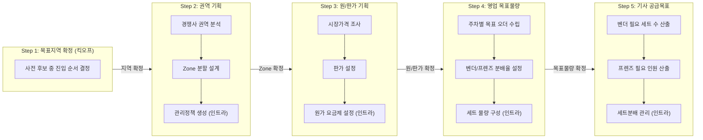
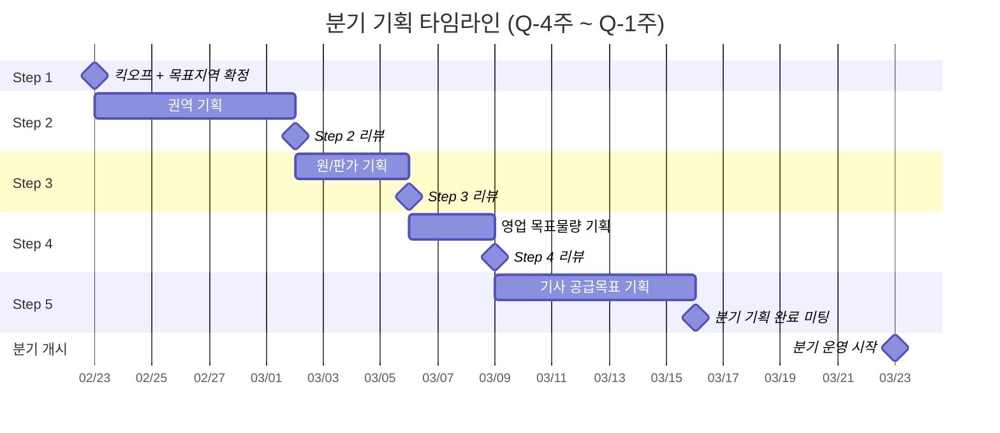

# 신사업 분기 기획 운영 SOP

**작성일:** 2026.03.24  
**목적:** 권역/세트분배 기능을 활용하는 신규 사업의 분기 단위 기획 프로세스 표준화

---

## 1. 개요

### 1.1 목적

신사업 개시를 위한 **분기 단위 기획 사이클**을 표준화하여, 목표지역 선정부터 배송 기사 공급목표 수립까지 일관된 프로세스로 운영한다.

### 1.2 적용 범위

- **시점:** 분기 개시 약 4주 전부터 1주 전까지
- **대상:** 신규 목표지역 진입을 준비하는 모든 분기 기획 사이클
- **종료 후:** 분기 개시 이후에는 B존 TF 워크플로우(초기 영업 → 관리 Phase)로 전환

### 1.3 참여 조직

| 조직 | 역할 | 주요 책임 |
|------|------|----------|
| **기획조직** | 조율 및 플래닝 하달 | 전체 기획 사이클 조율, 데이터 제공, 단계별 산출물 리뷰 및 승인, 분기 목표 확정 |
| **영업조직** | 영업담당 | 권역 기획, 시장조사, 판가 설정, 영업 목표물량 수립, 상점 파이프라인 관리 |
| **운영조직** | 공급담당 | 협력사 확보 가능성 검토, 기사 원가 설정, 벤더/프렌즈 공급 기획, 배송 Capa 산출 |

### 1.4 주요 용어

| 용어 | 정의 |
|------|------|
| **권역(Zone)** | 상점-벤더-기사를 연결하는 지역 단위. 배차 엔진에서 오더 배정 범위로 활용 |
| **세트** | 협력사(벤더)에 물량을 위탁하는 최소 단위. 요일×시간대별 목표 오더 수로 구성 |
| **슬롯** | 요일(월~일) × 시간대(5개 구간)로 정의되는 운영 단위. 7×5 = 35개 슬롯 |
| **벤더** | 5명 내외로 구성된 본사와 물량 수행을 계약한 위탁 업체. 권역 단위 계약, 안정적 수행 pool |
| **프렌즈** | 크라우드소싱 기반 배송 기사. 유연한 증감 가능, 버퍼 역할 |
| **관리정책** | 인트라 권역관리 시스템에서 세트 물량·보상기준·원가 요금제·연결 Zone을 묶어 관리하는 단위 |
| **S&OP** | Sales & Operations Planning. 물량 예측 및 기사 공급 기획을 위한 주간 프로세스 |
| **판가** | 상점에 청구하는 배송 단가 |
| **원가** | 배송 기사에게 지급하는 배송 비용 (50m당 금액 + 픽업비용 + 배송완료 비용) |

---

## 2. 분기 기획 프로세스 전체 흐름

### 2.1 5단계 흐름도



### 2.2 단계별 요약

| 단계 | 기간 | 주관 조직 | 핵심 산출물 | 시스템 연동 |
|------|------|----------|-----------|-----------|
| **Step 1** 목표지역 확정 | Q-4주 (킥오프) | 기획 (주도) | 분기 진입 지역 확정 | - |
| **Step 2** 권역 기획 | Q-4주 ~ Q-3주 | 영업 (주도) + 운영 (검토) | 권역 구획 맵, Zone 목록 | 인트라 > 권역관리 > 관리정책 생성 |
| **Step 3** 원/판가 기획 | Q-3주 ~ Q-2.5주 | 영업 (판가) + 운영 (원가) | 권역별 원/판가표 | 인트라 > 권역관리 > 기사 원가 요금제, 보상기준 |
| **Step 4** 영업 목표물량 | Q-2.5주 ~ Q-2주 | 영업 (주도) + 기획 (승인) | 주차별 영업 목표물량표 | 인트라 > 권역관리 > 세트 물량 구성 |
| **Step 5** 기사 공급목표 | Q-2주 ~ Q-1주 | 운영 (주도) + 기획 (승인) | 주차별 벤더 세트/프렌즈 인원 목표표 | 인트라 > 세트분배 관리 |

---

## 3. Step 1: 목표지역 확정 (Q-4주 킥오프)

> **목적:** 사전 선정된 후보지역 중 해당 분기 진입 지역과 순서를 확정한다

### 3.1 현재 단계 (PoC)

현재 PoC 단계에서는 목표지역 후보가 사업적 이유로 **이미 선정**되어 있다. 이 단계에서는 사전 후보 중 해당 분기에 진입할 지역의 **우선순위만 결정**하며, 분기 기획 킥오프 미팅에서 당일 확정한다.

| 활동 | 담당 | 설명 |
|------|------|------|
| 분기 진입 순서 결정 | 기획 (주도) | 사전 후보지역 중 해당 분기 진입 지역 우선순위 확정 |
| 영업 관점 의견 제시 | 영업 | 상점 영업 파이프라인 상황 고려한 우선순위 의견 |
| 공급 관점 의견 제시 | 운영 | 벤더/프렌즈 수급 가능성 고려한 실현 가능성 의견 |

**예시:** 사전 후보 중 서울시 동대문구를 1분기 진입 지역으로 확정

### 3.2 추후 사업 확대 시

> 사업이 PoC를 넘어 본격 확대 단계에 진입하면, 목표지역 선정에 별도의 시장 잠재력 평가, 경쟁사 커버리지 조사, 상점 파이프라인 초안 수립 등 상세 프로세스를 적용할 수 있다. 해당 프로세스는 사업 확대 시점에 별도 정의한다.

---

## 4. Step 2: 권역 기획 (Q-4주 ~ Q-3주)

> **목적:** 목표지역을 상권/거주지 특성에 맞는 권역(Zone)으로 분할한다

### 4.1 조직별 활동

#### 영업조직 (주도) — Sales First

| 활동 | 설명 |
|------|------|
| 경쟁사 권역 분석 | 경쟁사(쿠팡이츠, 배민 등)의 해당 지역 내 권역 구조 및 배달 커버리지 분석 |
| 경쟁력 있는 권역 제안 | 경쟁사 대비 동등 이상의 배달 커버리지를 확보할 수 있는 Zone 초안 설계 |
| 상점 영업 관점 Zone 설계 | 상점 밀집도, 영업 대상 분포, 상권 특성을 반영한 Zone 경계 설정 |
| 관리정책 초안 | 인트라 권역관리 시스템에 등록할 관리정책 구조 설계 |

#### 운영조직 (검토)

| 활동 | 설명 |
|------|------|
| 협력사 확보 가능성 검토 | 영업조직이 제안한 Zone에 대해 벤더(협력사) 확보가 가능한지 검증 |
| 배송 Capa 실현 가능성 검증 | Zone별 배송 동선 효율성, 지리적 제약, 예상 Capa 산출 |
| Zone 조정 피드백 | 공급 관점에서 실현 불가능한 Zone 경계에 대한 조정 의견 제시 |

#### 기획조직 (조율)

| 활동 | 설명 |
|------|------|
| Zone 설계 기준 가이드 | 권역 크기, 최소/최대 상점 수 등 설계 가이드라인 제시 |
| 최종 Zone 확정 | 영업/운영 의견 종합, Zone 확정 의사결정 |

### 4.2 Zone 설계 기준

| 기준 | 설명 | 권장 범위 |
|------|------|----------|
| 면적 | Zone 1개의 물리적 크기 | 반경 1~3km 내외 |
| 상점 수 | Zone 내 영업 대상 상점 수 | 100~300개 |
| 일 예상 오더 | Zone 내 일 평균 오더 건수 | 100~500건 |
| 지리적 경계 | 자연 경계(하천, 산) 및 간선도로 기준 | 명확한 구분선 확보 |
| 배송 동선 | Zone 내 평균 배송 거리 | 편도 3km 이내 권장 |

### 4.3 시스템 연동: 인트라 권역관리

Zone 확정 후 인트라 시스템에 관리정책을 생성한다.

| 시스템 작업 | 설명 | 참조 |
|-----------|------|------|
| 관리정책 생성 | 관리정책명 입력 후 4개 탭 구성 시작 | 기능명세 2.3 |
| 연결 Zone 탭 | Zone 검색 후 해당 관리정책에 Zone 연결 | 기능명세 2.3 F |
| Zone 중복 검증 | 다른 관리정책에 이미 연결된 Zone은 연결 불가 | 기능명세 2.3 기본정책 |

> **주의:** 관리정책 1개에 4개 탭(세트 물량 구성, 보상기준, 기사 원가 요금제, 연결 Zone)을 묶어 관리. Step 2에서는 관리정책 생성 + 연결 Zone 설정까지만 진행하고, 나머지 탭은 Step 3~4에서 입력한다.

### 4.4 예시: 동대문구 권역 설계

| Zone | 커버 지역 | 특성 | 예상 일 오더 |
|------|----------|------|-------------|
| Zone A | 동대문시장 ~ 청량리역 | 상업 밀집, 점심/저녁 피크 | 약 200건 |
| Zone B | 전농동 ~ 답십리 | 주거 밀집, 저녁 피크 | 약 150건 |
| Zone C | 회기동 ~ 이문동 | 대학가, 야간 수요 | 약 120건 |

### 4.5 산출물

| 산출물 | 내용 | 담당 |
|--------|------|------|
| **권역 구획 맵** | Zone 경계가 표시된 지도 | 영업 작성 → 운영 검토 → 기획 승인 |
| **Zone 목록표** | Zone별 커버 지역, 특성, 예상 오더 | 영업 |
| **인트라 관리정책** | 시스템에 생성 완료된 관리정책 + 연결 Zone | 운영 (시스템 입력) |

### 4.6 단계 완료 기준

| 기준 | 충족 조건 |
|------|----------|
| Zone 구획 확정 | 기획조직 승인 완료 |
| 인트라 관리정책 생성 | Zone 연결까지 시스템 등록 완료 |
| Capa 초기 추정 | Zone별 예상 일 오더 수 산출 완료 |

---

## 5. Step 3: 원/판가 기획 (Q-3주 ~ Q-2.5주)

> **목적:** 권역별 영업이익 목표를 고려하여 상점 판가와 기사 원가를 설정한다

### 5.1 조직별 활동

#### 영업조직 (판가 주도)

| 활동 | 설명 |
|------|------|
| 경쟁사 배달비 조사 | Zone별 경쟁사(쿠팡이츠, 배민 등)의 상점 청구 배달비 수준 파악 |
| 상점 지불의사 조사 | 영업 파이프라인 상점 대상 배달비 수용 범위 탐색 |
| 영업이익 목표 반영 | 분기 영업이익 목표율을 판가에 반영 |
| 권역별 판가 확정 | Zone별 상점 청구 판가 결정 |

#### 운영조직 (원가 주도)

| 활동 | 설명 |
|------|------|
| 기사 원가 산출 | 판가와 영업이익 목표에서 역산하여 기사 지급 원가 설계 |
| 원가 요금제 설계 | 50m당 금액, 픽업비용, 배송완료 비용 3요소 분배 |
| 보상기준 설계 | 벤더 기사 대상 세트 보상 조건(수락률, 성공 슬롯 수) 및 보상 금액 설정 |
| 원가 수익성 검증 | 예상 오더 건수 × 판가/원가로 수익성 시뮬레이션 |

#### 기획조직 (조율)

| 활동 | 설명 |
|------|------|
| 원/판가 정합성 리뷰 | 판가 - 원가 = 영업이익 구조의 적정성 검증 |
| 분기 P&L 시뮬레이션 | 목표 물량 시나리오별 손익 시뮬레이션 조율 |

### 5.2 원/판가 설계 구조

```
상점 판가 (영업조직 설정)
    │
    ├── 영업이익 마진
    │
    └── 기사 원가 (운영조직 설정)
         ├── 50m당 금액 × 배송 거리
         ├── 픽업비용 (건당 고정)
         └── 배송완료 비용 (건당 고정)
```

### 5.3 시스템 연동: 인트라 권역관리

| 시스템 작업 | 설명 | 참조 |
|-----------|------|------|
| 기사 원가 요금제 입력 | 50m당 금액, 픽업비용, 배송완료 비용 입력 | 기능명세 2.3 E |
| 보상기준 입력 | 보상 조건(수락률, 성공 슬롯 수) 및 세트당 보상 금액 입력 | 기능명세 2.3 D |
| 입력 규칙 | 빈칸 불가, 0 허용, 0원 미만 불가 | 기능명세 2.3 기본정책 |

> **주의:** 관리정책은 전체 저장 방식. 기사 원가 요금제와 보상기준을 입력한 후 `관리 정책 저장` 버튼으로 4개 탭 전체를 저장한다.

### 5.4 예시: 동대문구 원/판가

| Zone | 판가 (건당) | 기사 원가 구성 | 예상 마진 |
|------|-----------|--------------|----------|
| Zone A (상업) | 4,200원 | 50m당 50원 + 픽업 1,000원 + 배송완료 500원 | 약 30% |
| Zone B (주거) | 3,800원 | 50m당 45원 + 픽업 900원 + 배송완료 500원 | 약 28% |
| Zone C (대학가) | 3,500원 | 50m당 40원 + 픽업 800원 + 배송완료 500원 | 약 25% |

> **참고 (쿠팡이츠):** 쿠팡이츠 이츠 플러스 모델은 건당 3,000원 후반대 배달비를 벤더 기사에게 지급하며, 5인 팀 단위로 정해진 건수를 의무 수행하도록 설계. 건당 고정 배달비 구조는 원가 예측이 용이한 장점이 있으나, 거리별 차등이 없어 장거리 오더에서 기사 이탈 리스크 존재.

### 5.5 산출물

| 산출물 | 내용 | 담당 |
|--------|------|------|
| **권역별 원/판가표** | Zone별 판가, 원가 구성, 예상 마진 | 영업(판가) + 운영(원가) → 기획 승인 |
| **수익성 시뮬레이션** | 시나리오별(낙관/기본/보수) P&L 추정 | 기획 |
| **인트라 원가/보상 설정** | 시스템에 입력 완료된 기사 원가 요금제 + 보상기준 | 운영 (시스템 입력) |

### 5.6 단계 완료 기준

| 기준 | 충족 조건 |
|------|----------|
| 판가 확정 | 영업조직 설정 + 기획조직 승인 |
| 원가 확정 | 운영조직 설정 + 기획조직 승인 |
| 수익성 검증 | 기본 시나리오에서 영업이익 목표율 달성 확인 |
| 인트라 입력 | 기사 원가 요금제 + 보상기준 시스템 저장 완료 |

---

## 6. Step 4: 영업 목표물량 기획 (Q-2.5주 ~ Q-2주)

> **목적:** 권역별 판가와 시장 조건에 맞춰 주차별 영업 목표(오더 건수)를 수립한다

### 6.1 조직별 활동

#### 영업조직 (주도)

| 활동 | 설명 |
|------|------|
| 주차별 영업 목표 수립 | 분기 목표를 주차 단위로 분해 (Ramp-up 곡선 반영) |
| 요일/시간대별 분배 | 일 목표를 요일(월~일)×시간대(5구간) 35개 슬롯으로 분배 |
| 영업 파이프라인 정합 | 영업 중인 상점 파이프라인과 목표 물량의 정합성 검증 |

#### 운영조직 (검토)

| 활동 | 설명 |
|------|------|
| Capa 충족 가능성 검토 | 목표 물량 대비 배송 Capa 확보 가능 여부 검증 |
| 벤더/프렌즈 분배율 제안 | 목표 물량 기준 벤더·프렌즈 오더 분배 비율 초안 제시 |

#### 기획조직 (조율/승인)

| 활동 | 설명 |
|------|------|
| 목표 물량 정합성 검증 | 영업 목표 ↔ 공급 Capa ↔ 수익성 간 정합성 최종 확인 |
| 분기 목표 확정 | 주차별 목표물량 + 벤더/프렌즈 분배율 확정 하달 |

### 6.2 벤더-프렌즈 분배율 가이드라인

| 시기 | 벤더 비중 | 프렌즈 비중 | 근거 |
|------|----------|-----------|------|
| 분기 1~2주차 (진입 초기) | 70% | 30% | 안정적 배송 품질로 상점 락인 지원 |
| 분기 3~6주차 (성장기) | 60% | 40% | 물량 증가에 따른 유연성 확보 |
| 분기 7주차~ (안정기) | 50% | 50% | 비용 최적화, S&OP 기반 정밀 조절 |

> **참고 (쿠팡이츠):** 쿠팡이츠는 EDP(프리랜서, 크라우드소싱) 비중이 높은 구조에서 이츠 플러스(벤더 위탁) 비중을 확대하는 방향으로 전환. 안정적 배달 수행이 가능한 벤더 물량 비중을 먼저 확보한 뒤 크라우드소싱으로 유연성을 보완하는 전략은 부릉의 접근과 유사.

### 6.3 시스템 연동: 세트 물량 구성

| 시스템 작업 | 설명 | 참조 |
|-----------|------|------|
| 시간대 입력 | 5개 시간대의 시작/종료 시간 입력 (HH:MM) | 기능명세 2.3 C |
| 7×5 매트릭스 입력 | 요일(월~일) × 시간대(5개) = 35칸에 목표 오더 건수 입력 | 기능명세 2.3 C |
| 입력 검증 | 시작 < 종료, 시간대 순서 정렬, 오버랩 금지, 5개 시간대 연속 | 기능명세 2.3 기본정책 |

### 6.4 예시: 동대문구 Zone A 주차별 목표

**분기 1주차 (진입 초기) — 요일×시간대 오더 목표 (건)**

| 요일 | 09-11시 | 11-14시 | 14-17시 | 17-20시 | 20-23시 | 일 합계 |
|------|---------|---------|---------|---------|---------|--------|
| 월 | 5 | 15 | 10 | 25 | 15 | 70 |
| 화 | 5 | 15 | 10 | 25 | 15 | 70 |
| 수 | 5 | 15 | 10 | 25 | 15 | 70 |
| 목 | 5 | 18 | 12 | 28 | 18 | 81 |
| 금 | 8 | 20 | 15 | 35 | 22 | 100 |
| 토 | 10 | 25 | 18 | 40 | 25 | 118 |
| 일 | 8 | 22 | 15 | 35 | 20 | 100 |
| **합계** | **46** | **130** | **90** | **213** | **130** | **주간 609건** |

**주차별 Ramp-up 목표**

| 주차 | 주간 목표 (Zone A) | 벤더 분배 | 프렌즈 분배 | 누적 비고 |
|------|-------------------|----------|-----------|----------|
| 1주차 | 609건 | 427건 (70%) | 182건 (30%) | 진입 초기 |
| 2주차 | 700건 | 490건 (70%) | 210건 (30%) | |
| 3주차 | 850건 | 510건 (60%) | 340건 (40%) | 성장기 전환 |
| 4주차 | 1,000건 | 600건 (60%) | 400건 (40%) | |

### 6.5 산출물

| 산출물 | 내용 | 담당 |
|--------|------|------|
| **주차별 영업 목표물량표** | Zone별 주차×요일×시간대 목표 오더 수 | 영업 작성 → 기획 승인 |
| **벤더/프렌즈 분배율표** | 주차별 벤더·프렌즈 오더 분배 비율 | 운영 제안 → 기획 확정 |
| **인트라 세트 물량 구성** | 시스템에 입력 완료된 7×5 매트릭스 | 운영 (시스템 입력) |

### 6.6 단계 완료 기준

| 기준 | 충족 조건 |
|------|----------|
| 주차별 목표 확정 | 기획조직 최종 승인 |
| 분배율 확정 | 벤더/프렌즈 비율 기획조직 확정 하달 |
| Capa 정합성 | 운영조직의 공급 가능 확인서 수령 |
| 인트라 입력 | 세트 물량 구성 7×5 매트릭스 시스템 저장 완료 |

---

## 7. Step 5: 배송 기사 공급목표 기획 (Q-2주 ~ Q-1주)

> **목적:** 영업 목표물량에 맞춰 벤더 세트 수와 프렌즈 인원을 주차별로 산출한다

### 7.1 조직별 활동

#### 운영조직 (주도)

| 활동 | 설명 |
|------|------|
| 벤더 필요 세트 수 산출 | 벤더 분배 물량 ÷ 세트당 슬롯 목표 오더 = 필요 세트 수 |
| 벤더별 세트 분배 | Zone에 연결된 벤더들에게 세트 수를 분배 |
| 프렌즈 필요 인원 산출 | 프렌즈 분배 물량 ÷ 인당 생산성 = 필요 프렌즈 수 |
| 벤더 계약 조율 | 필요 세트 수에 맞춰 벤더와 계약/조정 |
| 프렌즈 확보 계획 | 프로모션, 홍보를 통한 프렌즈 모집 계획 수립 |

#### 영업조직 (지원)

| 활동 | 설명 |
|------|------|
| 물량 리스크 확인 | 영업 파이프라인 진행 상황 대비 공급 계획의 적절성 재확인 |

#### 기획조직 (승인)

| 활동 | 설명 |
|------|------|
| 공급 계획 최종 승인 | 벤더 세트 + 프렌즈 인원 목표의 적정성 리뷰 및 확정 |
| 분기 기획 완료 선언 | 5단계 전체 산출물 취합, 분기 기획 완료 공식 확정 |

### 7.2 산출 공식

#### 벤더 필요 세트 수

```
주간 벤더 분배 물량 = 주간 목표 오더 × 벤더 분배율

슬롯별 벤더 목표 오더 = 해당 슬롯 목표 오더 × 벤더 분배율

필요 세트 수 = 벤더 분배 물량을 세트당 슬롯 목표로 나누어 산출
  (세트 1개 = 7×5 매트릭스의 모든 슬롯을 1인이 커버)
```

#### 프렌즈 필요 인원

```
인당 생산성 = 시간대별 평균 5~7건/4시간 (숙련도에 따라 차이)

슬롯별 필요 프렌즈 = 슬롯 프렌즈 분배 물량 ÷ 인당 생산성

피크 시간대 기준 동시 필요 프렌즈 = 최대 슬롯의 필요 인원
활성 프렌즈 목표 = 피크 필요 인원 × 1.3 (가동률 70~80% 가정)
```

### 7.3 시스템 연동: 세트분배 관리

| 시스템 작업 | 설명 | 참조 |
|-----------|------|------|
| Zone별 벤더 연결 | Zone 상세 > 연결 벤더 탭에서 벤더 검색/추가 후 저장 | 기능명세 2.7 B |
| 벤더별 세트 수 입력 | 벤더별 세트 분배 탭에서 세트 수 입력 후 저장 | 기능명세 2.7 C |
| 벤더 중복 검증 | 다른 Zone에 이미 연결된 벤더는 연결 불가 | 기능명세 2.7 기본정책 |
| 배차 엔진 연동 | 벤더 소속 기사에게 연결 Zone 오더만 배정, 관리정책의 원가로 제안 | 기능명세 2.8 |

> **배차 엔진 동작:** 벤더에게 분배된 세트/슬롯별 잔여 물량이 많을수록 해당 벤더 기사의 배차 우선도 상향. 물량 초과 후에도 동일 원가로 배차 지속 (차단 없음).

### 7.4 예시: 동대문구 1주차 공급목표

**벤더 세트 산출**

| Zone | 주간 벤더 분배 | 연결 벤더 | 벤더당 세트 수 | 비고 |
|------|--------------|----------|-------------|------|
| Zone A | 427건 (70%) | 벤더X: 2세트, 벤더Y: 1세트 | 총 3세트 | 상업지구 고밀도 |
| Zone B | 315건 (70%) | 벤더Z: 2세트 | 총 2세트 | 주거지구 |
| Zone C | 252건 (70%) | 벤더X: 1세트, 벤더W: 1세트 | 총 2세트 | 대학가 |

**프렌즈 인원 산출**

| Zone | 주간 프렌즈 분배 | 피크 슬롯 필요 | 활성 프렌즈 목표 | 비고 |
|------|----------------|--------------|----------------|------|
| Zone A | 182건 (30%) | 8명 (금·토 저녁) | 10명 | 가동률 80% 가정 |
| Zone B | 135건 (30%) | 6명 (토 저녁) | 8명 | |
| Zone C | 108건 (30%) | 5명 (금 야간) | 7명 | |
| **합계** | **425건** | **최대 19명** | **25명** | |

### 7.5 산출물

| 산출물 | 내용 | 담당 |
|--------|------|------|
| **주차별 벤더 세트 목표표** | Zone별·벤더별 세트 수, 주차별 변동 계획 | 운영 작성 → 기획 승인 |
| **주차별 프렌즈 인원 목표표** | Zone별 필요 프렌즈 수, 활성 목표 인원 | 운영 작성 → 기획 승인 |
| **벤더 계약 계획** | 벤더별 계약 조건, 세트 수, 계약 일정 | 운영 |
| **프렌즈 확보 계획** | 프로모션/홍보 계획, 목표 모집 인원 | 운영 |
| **인트라 세트분배 설정** | 시스템에 입력 완료된 Zone-벤더 연결 + 벤더별 세트 수 | 운영 (시스템 입력) |

### 7.6 단계 완료 기준

| 기준 | 충족 조건 |
|------|----------|
| 벤더 세트 확정 | Zone별 벤더 연결 + 세트 수 기획조직 승인 |
| 프렌즈 목표 확정 | 활성 프렌즈 목표 인원 기획조직 승인 |
| 벤더 계약 착수 | 주요 벤더 계약 협의 개시 |
| 인트라 입력 | 세트분배 관리 시스템 저장 완료 |
| **분기 기획 완료** | 5단계 전체 산출물 취합, 기획조직 최종 확정 |

---

## 8. 조직간 협업 체계

### 8.1 RACI 매트릭스

| 의사결정 | 기획 | 영업 | 운영 | 비고 |
|----------|------|------|------|------|
| 목표지역 순서 확정 | **A** | C | C | 킥오프에서 기획 주도 확정 |
| Zone 분할 설계 | **A** | R | C | 영업 주도 (Sales First), 운영 검토 |
| 판가 설정 | **A** | R | C | 영업 주도 |
| 기사 원가 설정 | **A** | C | R | 운영 주도 |
| 영업 목표물량 수립 | **A** | R | C | 운영 Capa 검토 |
| 벤더/프렌즈 분배율 | **A** | C | R | 운영 제안, 기획 확정 |
| 벤더 세트 분배 | C | I | **A** | 운영 전권 |
| 프렌즈 인원 목표 | C | I | **A** | 운영 전권 |
| 분기 기획 최종 확정 | **A** | I | I | 기획 단독 |

> **범례:** A = Accountable (최종 책임), R = Responsible (실행), C = Consulted (협의), I = Informed (통보)

### 8.2 정기 미팅 체계

| 시점 | 미팅명 | 참여 | 주요 안건 |
|------|--------|------|----------|
| Q-4주 | **분기 기획 킥오프** | 기획+영업+운영 | 전 분기 회고, 진입 지역 순서 확정 (Step 1), 권역 기획 착수 |
| 매주 | **주간 진행 점검** | 기획+영업+운영 | 현재 단계 진행 상황, 이슈 공유, 다음 주 액션 |
| 단계 전환 시 | **단계별 리뷰** | 기획+영업+운영 | 해당 단계 산출물 리뷰, 완료 기준 충족 확인, 다음 단계 착수 승인 |
| Q-1주 | **분기 기획 완료 미팅** | 기획+영업+운영 | 전체 산출물 최종 확인, 분기 개시 준비 상태 점검 |

### 8.3 정보 공유 체계

| 정보 | 제공 조직 | 수신 조직 | 공유 주기 | 형태 |
|------|----------|----------|----------|------|
| 진입 지역 확정 | 기획 | 영업, 운영 | 킥오프 시 | 미팅 결과 공유 |
| Zone 구획 맵 | 영업 | 기획, 운영 | Step 2 완료 시 | 지도 + 표 |
| 원/판가표 | 영업+운영 | 기획 | Step 3 완료 시 | 스프레드시트 |
| 주차별 목표물량 | 영업 | 기획, 운영 | Step 4 완료 시 | 스프레드시트 |
| 벤더/프렌즈 공급계획 | 운영 | 기획, 영업 | Step 5 완료 시 | 보고서 |
| 단계별 이슈 | 발생 조직 | 전 조직 | 실시간 | 메신저/이메일 |

---

## 9. 분기 기획 타임라인

### 9.1 4주 기획 일정



### 9.2 마일스톤 요약

| 마일스톤 | 시점 | 의사결정 내용 |
|----------|------|-------------|
| 킥오프 미팅 | Q-4주 | 분기 기획 시작, 진입 지역 순서 확정 (Step 1 당일 완료) |
| Step 2 리뷰 | Q-3주 | Zone 구획 확정, 인트라 관리정책 생성 |
| Step 3 리뷰 | Q-2.5주 | 원/판가 확정, 인트라 원가/보상 설정 |
| Step 4 리뷰 | Q-2주 | 주차별 목표물량 확정, 분배율 확정 |
| 분기 기획 완료 | Q-1주 | 전체 산출물 확정, 분기 개시 준비 완료 |

---

## 10. 리스크 관리

### 10.1 단계별 주요 리스크

#### Step 1: 목표지역 확정

> PoC 단계에서는 사전 후보 중 순서만 확정하므로 리스크 낮음. 사업 확대 시 별도 리스크 관리 프로세스 정의 필요.

#### Step 2: 권역 기획

| 리스크 | 영향 | 대응 방안 |
|--------|------|----------|
| Zone 경계 부적절 | 배송 효율 저하, 기사 동선 비효율 | 분기 중 Zone 재조정 프로세스 사전 정의 |
| 예상 Capa 과대 추정 | 실제 운영 시 공급 부족 | 보수적 추정(80% 기준), 버퍼 Capa 확보 |

#### Step 3: 원/판가 기획

| 리스크 | 영향 | 대응 방안 |
|--------|------|----------|
| 판가 경쟁력 부족 | 상점 계약 전환율 하락 | 프로모션 판가 별도 책정, 경쟁사 대비 차별화 포인트 강조 |
| 원가 과소 설정 | 기사 이탈, 수행률 저하 | 경쟁사 기사 보상 수준 모니터링, 분기 중 원가 조정 여지 확보 |

#### Step 4: 영업 목표물량

| 리스크 | 영향 | 대응 방안 |
|--------|------|----------|
| 목표 과대 설정 | 공급 Capa 초과 → SLA 미달 | 보수적 Ramp-up 곡선 적용, 주차별 목표 재조정 프로토콜 |
| 물량 예측 실패 | 과잉/과소 공급 | S&OP 주간 리뷰에서 조기 감지 및 대응 |

#### Step 5: 기사 공급목표

| 리스크 | 영향 | 대응 방안 |
|--------|------|----------|
| 벤더 계약 지연/실패 | 분기 개시 시 Capa 부족 | 대체 벤더 풀 사전 확보, 프렌즈 비중 일시 확대 |
| 프렌즈 수급 실패 | 피크 타임 대응 불가 | Dynamic Pricing 강화, 인접 권역 프렌즈 유치 프로모션 |
| 벤더 퀄리티 미검증 | 배송 품질 하락 → 상점 이탈 | 분기 개시 전 테스트 배송 수행, 성과 기반 벤더 선별 |

### 10.2 리스크 모니터링 지표

| 리스크 유형 | 모니터링 지표 | 경고 기준 |
|------------|--------------|----------|
| 일정 지연 | 단계별 완료일 대비 실제 진행률 | 예정 대비 3일 이상 지연 |
| Capa 부족 | 목표 대비 벤더 계약/프렌즈 확보율 | 목표 대비 70% 미만 (Q-1주 기준) |
| 비용 초과 | 원가 시뮬레이션 대비 실제 계약 단가 | 예상 원가 대비 15% 이상 초과 |
| 시장 변동 | 경쟁사 가격/서비스 변경 | 경쟁사 배달비 10% 이상 인하 |

---

## 11. 부록

### 11.1 쿠팡이츠 EDP/이츠 플러스 벤치마크

쿠팡이츠딜리버리서비스(쿠팡이츠서비스)의 배달 위탁 구조를 벤치마크하여 본 SOP 설계에 반영하였다.

| 항목 | 쿠팡이츠 모델 | 부릉 대응 구조 |
|------|-------------|--------------|
| **크라우드소싱 기사** | EDP (Eats Delivery Partner): 프리랜서, 강제배차, 수락률/완료율/평점 기반 등급 | 프렌즈: 크라우드소싱 기사, AI 배차, 유연한 증감 |
| **벤더 위탁** | 이츠 플러스: 5인 팀 구성, 건당 3,000원 후반, 의무 수행 건수 | 벤더: 5명 내외 위탁 업체, 권역 단위 계약, 세트 기반 물량 분배 |
| **배달비 구조** | 건당 고정 (이츠 플러스: 3,000원 후반) | 거리 비례 (50m당) + 픽업 + 배송완료 고정비 |
| **기사 등급** | 4단계 등급 (수행 건수 + 수락률 기반), 골드: 400건/2주 이상 | 수락률 + 성공 슬롯 수 기반 보상 조건 |
| **배차 방식** | 서버 강제 매칭 (수락률/위치/평점 고려) | AI 배차 엔진 (잔여 물량 기반 벤더 기사 우선도 조정) |
| **운영 전환 방향** | 크라우드(플렉스) → 벤더(플러스) 비중 확대 | 초기 벤더 70% → 안정기 50:50 비중 조절 |

**시사점:**
- 쿠팡이츠가 EDP(크라우드) → 이츠 플러스(벤더) 비중을 확대한 것은 **배달 품질 안정화**를 위한 전략. 부릉도 신규 지역 진입 시 벤더 비중을 높여 시작하는 것이 적절
- 쿠팡이츠의 건당 고정 배달비 대비, 부릉의 거리 비례 원가 구조는 **장거리 오더에서 기사 보상 적정성이 높아** 기사 이탈 리스크가 상대적으로 낮음
- 이츠 플러스의 5인 팀 의무 수행 모델은 세트 기반 물량 분배와 유사한 개념으로, **세트 단위 목표 관리**가 벤더 운영의 핵심

### 11.2 시스템 기능 참조 맵

본 SOP 각 단계에서 활용하는 인트라 시스템 기능과 기능명세 참조:

| SOP 단계 | 인트라 메뉴 | 기능 | 기능명세 참조 |
|----------|-----------|------|-------------|
| Step 2 | 권역관리 | 관리정책 생성 + 연결 Zone | 2.3 A, B, F |
| Step 3 | 권역관리 | 기사 원가 요금제 + 보상기준 입력 | 2.3 D, E |
| Step 4 | 권역관리 | 세트 물량 구성 (7×5 매트릭스) | 2.3 C |
| Step 2~4 | 권역관리 | 관리 정책 전체 저장 | 2.3 B |
| Step 5 | 세트분배 관리 | Zone별 벤더 연결 + 벤더별 세트 분배 | 2.7 B, C |
| Step 5 (배차) | AI 배차 엔진 | 벤더 기사 오더 배정 + 원가 계산 + 우선도 조정 | 2.8 A, B, C, D |

### 11.3 데이터 참조 흐름

```
기사(벤더 소속)
  └─ 벤더
       ├─ Zone 연결 (세트분배 관리 2.7)
       │    └─ 벤더별 세트 수 (분배 물량)
       └─ 관리정책 연결 (권역관리 2.3)
            ├─ 세트 물량 구성 (7×5 매트릭스 → 슬롯별 목표 오더 수)
            ├─ 보상기준 (수락률, 성공 슬롯 수, 보상 금액)
            └─ 기사 원가 요금제 (50m당, 픽업, 배송완료)
```

---

## 변경 이력

| 버전 | 날짜 | 변경 내용 |
|------|------|----------|
| v0.1 | 2026.03.24 | 초안 작성 — 5단계 분기 기획 SOP 전체 구조 |
| v0.2 | 2026.03.24 | 간소화 — Step 1 PoC 단계 축소, Step 2 Sales First 주도 변경, 리드타임 8주→4주 압축 |
