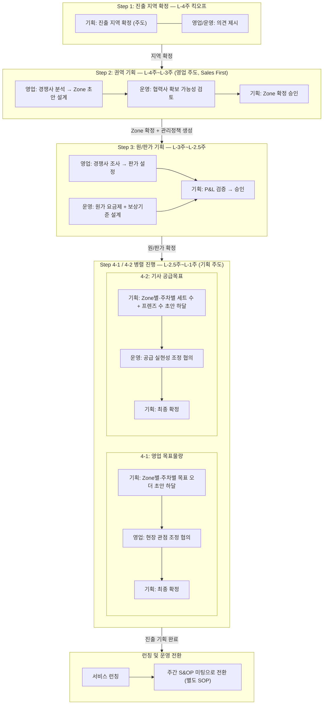
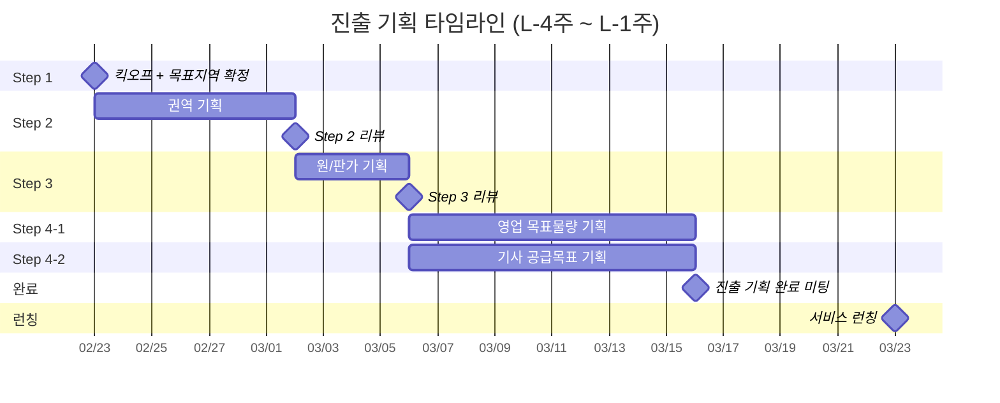

# 신규 지역 진출 기획 SOP

**작성일:** 2026.03.24  
**목적:** 권역/세트분배 기능을 활용하는 신규 지역 진출 기획 프로세스 표준화

---

## 1. 개요

### 1.1 목적

신규 지역 진출을 위한 **기획 프로세스**를 표준화하여, 진출 지역 확정부터 배송 기사 공급목표 수립까지 일관된 프로세스로 운영한다.

### 1.2 적용 범위

- **시점:** 서비스 런칭 약 4주 전부터 1주 전까지
- **대상:** 신규 지역 진출을 준비하는 모든 기획 사이클
- **종료 후:** 런칭 이후에는 B존 TF 워크플로우(초기 영업 → 관리 Phase)로 전환
- **런칭 후 운영:** 런칭 이후 초기 기획이 계획대로 운영되고 있는지 확인하고 필요 시 조정하는 **주간 S&OP 미팅**을 별도로 진행한다. 주간 S&OP 미팅의 SOP는 별도 문서로 작성한다.

### 1.3 참여 조직

| 조직 | 역할 | 주요 책임 |
|------|------|----------|
| **기획조직** | 조율 및 플래닝 하달 | 전체 기획 사이클 조율, 데이터 제공, 단계별 산출물 리뷰 및 승인, 진출 목표 확정 |
| **영업조직** | 영업담당 | 권역 기획, 시장조사, 판가 설정, 영업 목표물량 수립, 상점 파이프라인 관리 |
| **운영조직** | 공급담당 | 협력사 확보 가능성 검토, 기사 원가 설정, 벤더/프렌즈 공급 기획, 배송 Capa 산출 |

### 1.4 주요 용어

| 용어 | 정의 |
|------|------|
| **권역(Zone)** | 상점-벤더-기사를 연결하는 지역 단위. 배차 엔진에서 오더 배정 범위로 활용 |
| **세트** | 협력사(벤더)에 물량을 위탁하는 최소 단위. 요일×시간대별 목표 오더 수로 구성 |
| **슬롯** | 요일(월~일) × 시간대(5개 구간)로 정의되는 운영 단위. 7×5 = 35개 슬롯 |
| **벤더** | 5명 내외로 구성된 본사와 물량 수행을 계약한 위탁 업체. 권역 단위 계약, 안정적 수행 pool |
| **프렌즈** | 크라우드소싱 기반 배송 기사. 유연한 증감 가능, 버퍼 역할 |
| **관리정책** | 인트라 권역관리 시스템에서 세트 물량·보상기준·원가 요금제·연결 Zone을 묶어 관리하는 단위 |
| **S&OP** | Sales & Operations Planning. 물량 예측 및 기사 공급 기획을 위한 주간 프로세스 |
| **판가** | 상점에 청구하는 배송 단가 |
| **원가** | 배송 기사에게 지급하는 배송 비용 (50m당 금액 + 픽업비용 + 배송완료 비용) |

---

## 2. 진출 기획 프로세스 전체 흐름

### 2.1 흐름도



### 2.2 단계별 요약

| 단계 | 기간 | 주관 조직 | 핵심 산출물 | 시스템 연동 |
|------|------|----------|-----------|-----------|
| **Step 1** 진출 지역 확정 | L-4주 (킥오프) | 기획 (주도) | 진출 대상 지역 확정 | - |
| **Step 2** 권역 기획 | L-4주 ~ L-3주 | 영업 (주도) + 운영 (검토) | 권역 구획 맵, Zone 목록 | 인트라 > 권역관리 > 관리정책 생성 |
| **Step 3** 원/판가 기획 | L-3주 ~ L-2.5주 | 영업 (판가) + 운영 (원가) | 권역별 원/판가표 | 인트라 > 권역관리 > 기사 원가 요금제, 보상기준 |
| **Step 4-1** 영업 목표물량 | L-2.5주 ~ L-1주 | 기획 (주도/초안) + 영업 (협의/확정) | Zone별·주차별 영업 목표 | - |
| **Step 4-2** 기사 공급목표 | L-2.5주 ~ L-1주 | 기획 (주도/초안) + 운영 (협의/확정) | Zone별·주차별 세트 수/활성 프렌즈 목표 | 인트라 > 세트분배 관리 |

> **Step 4-1과 4-2는 병렬 진행.** 기획조직이 사업계획 기반으로 두 초안을 동시에 하달하고, 영업/운영이 각각 기획과 협의하여 확정한다.

---

## 3. Step 1: 진출 지역 확정 (L-4주 킥오프)

> **목적:** 진출 대상 지역을 확정하고 기획을 착수한다

### 3.1 현재 단계 (PoC)

현재 PoC 단계에서는 목표지역 후보가 사업적 이유로 **이미 선정**되어 있다. 이 단계에서는 사전 후보 중 **진출 대상 지역을 확정**하며, 진출 기획 킥오프 미팅에서 확정한다.

| 활동 | 담당 | 설명 |
|------|------|------|
| 진출 지역 확정 | 기획 (주도) | 사전 후보지역 중 진출 대상 지역 확정 |
| 영업 관점 의견 제시 | 영업 | 상점 영업 파이프라인 상황 고려한 의견 |
| 공급 관점 의견 제시 | 운영 | 벤더/프렌즈 수급 가능성 고려한 실현 가능성 의견 |

**예시:** 사전 후보 중 서울시 동대문구를 진출 지역으로 확정

### 3.2 추후 사업 확대 시

> 사업이 PoC를 넘어 본격 확대 단계에 진입하면, 목표지역 선정에 별도의 시장 잠재력 평가, 경쟁사 커버리지 조사, 상점 파이프라인 초안 수립 등 상세 프로세스를 적용할 수 있다. 해당 프로세스는 사업 확대 시점에 별도 정의한다.

---

## 4. Step 2: 권역 기획 (L-4주 ~ L-3주)

> **목적:** 목표지역을 상권/거주지 특성에 맞는 권역(Zone)으로 분할한다

### 4.1 조직별 활동

#### 영업조직 (주도) — Sales First

| 활동 | 설명 |
|------|------|
| 경쟁사 권역 분석 | 경쟁사(쿠팡이츠, 배민 등)의 해당 지역 내 권역 구조 및 배달 커버리지 분석 |
| 경쟁력 있는 권역 제안 | 경쟁사 대비 동등 이상의 배달 커버리지를 확보할 수 있는 Zone 초안 설계 |
| 상점 영업 관점 Zone 설계 | 상점 밀집도, 영업 대상 분포, 상권 특성을 반영한 Zone 경계 설정 |
| 관리정책 초안 | 인트라 권역관리 시스템에 등록할 관리정책 구조 설계 |

#### 운영조직 (검토)

| 활동 | 설명 |
|------|------|
| 협력사 확보 가능성 검토 | 영업조직이 제안한 Zone에 대해 벤더(협력사) 확보가 가능한지 검증 |
| 배송 Capa 실현 가능성 검증 | Zone별 배송 동선 효율성, 지리적 제약, 예상 Capa 산출 |
| Zone 조정 피드백 | 공급 관점에서 실현 불가능한 Zone 경계에 대한 조정 의견 제시 |

#### 기획조직 (조율)

| 활동 | 설명 |
|------|------|
| Zone 설계 기준 가이드 | 권역 크기, 최소/최대 상점 수 등 설계 가이드라인 제시 |
| 최종 Zone 확정 | 영업/운영 의견 종합, Zone 확정 의사결정 |

### 4.2 Zone 설계 시 고려사항

Zone 설계는 지역 특성에 따라 유연하게 조정할 수 있다. 아래는 설계 시 고려해야 할 주요 항목이다.

| 고려 항목 | 설명 | 참고 |
|----------|------|------|
| 면적 | Zone의 물리적 크기. 너무 넓으면 배송 효율이 떨어지고, 너무 좁으면 물량 확보가 어려움 | 지역 밀집도에 따라 유동적 |
| 상점 분포 | Zone 내 영업 대상 상점이 충분한지, 특정 상권에 편중되지 않는지 | 상권/주거지 혼재 여부 고려 |
| 예상 물량 | Zone 내 예상 오더 건수가 벤더 세트 운영에 적합한 규모인지 | 피크/비피크 시간대별 편차 고려 |
| 지리적 경계 | 하천, 산, 간선도로 등 자연스러운 경계가 있는지 | 경계가 모호하면 기사 동선 비효율 발생 |
| 배송 동선 | Zone 내 평균 배송 거리가 적정한지, 장거리 이동이 빈번하지 않은지 | 경쟁사 권역 대비 동선 경쟁력 확인 |
| 경쟁사 커버리지 | 경쟁사의 권역 범위와 비교하여 경쟁력 있는 커버리지가 되는지 | Sales First 관점에서 중요 |

### 4.3 시스템 연동: 인트라 권역관리

Zone 확정 후 인트라 시스템에 관리정책을 생성한다.

| 시스템 작업 | 설명 | 참조 |
|-----------|------|------|
| 관리정책 생성 | 관리정책명 입력 후 4개 탭 구성 시작 | 기능명세 2.3 |
| 연결 Zone 탭 | Zone 검색 후 해당 관리정책에 Zone 연결 | 기능명세 2.3 F |
| Zone 중복 검증 | 다른 관리정책에 이미 연결된 Zone은 연결 불가 | 기능명세 2.3 기본정책 |

> **주의:** 관리정책 1개에 4개 탭(세트 물량 구성, 보상기준, 기사 원가 요금제, 연결 Zone)을 묶어 관리. Step 2에서는 관리정책 생성 + 연결 Zone 설정까지만 진행하고, 나머지 탭은 Step 3~4에서 입력한다.

### 4.4 예시: 동대문구 권역 설계

| Zone | 커버 지역 | 특성 | 예상 일 오더 |
|------|----------|------|-------------|
| Zone A | 동대문시장 ~ 청량리역 | 상업 밀집, 점심/저녁 피크 | 약 200건 |
| Zone B | 전농동 ~ 답십리 | 주거 밀집, 저녁 피크 | 약 150건 |
| Zone C | 회기동 ~ 이문동 | 대학가, 야간 수요 | 약 120건 |

### 4.5 산출물

| 산출물 | 내용 | 담당 |
|--------|------|------|
| **권역 구획 맵** | Zone 경계가 표시된 지도 | 영업 작성 → 운영 검토 → 기획 승인 |
| **Zone 목록표** | Zone별 커버 지역, 특성, 예상 오더 | 영업 |
| **인트라 관리정책** | 시스템에 생성 완료된 관리정책 + 연결 Zone | 운영 (시스템 입력) |

### 4.6 단계 완료 기준

| 기준 | 충족 조건 |
|------|----------|
| Zone 구획 확정 | 기획조직 승인 완료 |
| 인트라 관리정책 생성 | Zone 연결까지 시스템 등록 완료 |
| Capa 초기 추정 | Zone별 예상 일 오더 수 산출 완료 |

---

## 5. Step 3: 원/판가 기획 (L-3주 ~ L-2.5주)

> **목적:** 권역별 영업이익 목표를 고려하여 상점 판가와 기사 원가를 설정한다

### 5.1 조직별 활동

#### 영업조직 (판가 주도)

| 활동 | 설명 |
|------|------|
| 경쟁사 배달비 조사 | Zone별 경쟁사(쿠팡이츠, 배민 등)의 상점 청구 배달비 수준 파악 |
| 상점 지불의사 조사 | 영업 파이프라인 상점 대상 배달비 수용 범위 탐색 |
| 영업이익 목표 반영 | 영업이익 목표율을 판가에 반영 |
| 권역별 판가 확정 | Zone별 상점 청구 판가 결정 |

#### 운영조직 (원가 주도)

| 활동 | 설명 |
|------|------|
| 기사 원가 산출 | 판가와 영업이익 목표에서 역산하여 기사 지급 원가 설계 |
| 원가 요금제 설계 | 50m당 금액, 픽업비용, 배송완료 비용 3요소 분배 |
| 보상기준 설계 | 벤더 기사 대상 세트 보상 조건(수락률, 성공 슬롯 수) 및 보상 금액 설정 |
| 원가 수익성 검증 | 예상 오더 건수 × 판가/원가로 수익성 시뮬레이션 |

#### 기획조직 (조율)

| 활동 | 설명 |
|------|------|
| 원/판가 정합성 리뷰 | 판가 - 원가 = 영업이익 구조의 적정성 검증 |
| P&L 시뮬레이션 | 목표 물량 시나리오별 손익 시뮬레이션 조율 |

### 5.2 원/판가 설계 구조

```
상점 판가 (영업조직 설정)
    │
    ├── 영업이익 마진
    │
    └── 기사 원가 (운영조직 설정)
         ├── 50m당 금액 × 배송 거리
         ├── 픽업비용 (건당 고정)
         └── 배송완료 비용 (건당 고정)
```

### 5.3 시스템 연동: 인트라 권역관리

| 시스템 작업 | 설명 | 참조 |
|-----------|------|------|
| 기사 원가 요금제 입력 | 50m당 금액, 픽업비용, 배송완료 비용 입력 | 기능명세 2.3 E |
| 보상기준 입력 | 보상 조건(수락률, 성공 슬롯 수) 및 세트당 보상 금액 입력 | 기능명세 2.3 D |
| 입력 규칙 | 빈칸 불가, 0 허용, 0원 미만 불가 | 기능명세 2.3 기본정책 |

> **주의:** 관리정책은 전체 저장 방식. 기사 원가 요금제와 보상기준을 입력한 후 `관리 정책 저장` 버튼으로 4개 탭 전체를 저장한다.

### 5.4 예시: 동대문구 원/판가

| Zone | 판가 (건당) | 기사 원가 구성 | 예상 마진 |
|------|-----------|--------------|----------|
| Zone A (상업) | 4,200원 | 50m당 50원 + 픽업 1,000원 + 배송완료 500원 | 약 30% |
| Zone B (주거) | 3,800원 | 50m당 45원 + 픽업 900원 + 배송완료 500원 | 약 28% |
| Zone C (대학가) | 3,500원 | 50m당 40원 + 픽업 800원 + 배송완료 500원 | 약 25% |

> **참고 (쿠팡이츠):** 쿠팡이츠 이츠 플러스 모델은 건당 3,000원 후반대 배달비를 벤더 기사에게 지급하며, 5인 팀 단위로 정해진 건수를 의무 수행하도록 설계. 건당 고정 배달비 구조는 원가 예측이 용이한 장점이 있으나, 거리별 차등이 없어 장거리 오더에서 기사 이탈 리스크 존재.

### 5.5 산출물

| 산출물 | 내용 | 담당 |
|--------|------|------|
| **권역별 원/판가표** | Zone별 판가, 원가 구성, 예상 마진 | 영업(판가) + 운영(원가) → 기획 승인 |
| **수익성 시뮬레이션** | 시나리오별(낙관/기본/보수) P&L 추정 | 기획 |
| **인트라 원가/보상 설정** | 시스템에 입력 완료된 기사 원가 요금제 + 보상기준 | 운영 (시스템 입력) |

### 5.6 단계 완료 기준

| 기준 | 충족 조건 |
|------|----------|
| 판가 확정 | 영업조직 설정 + 기획조직 승인 |
| 원가 확정 | 운영조직 설정 + 기획조직 승인 |
| 수익성 검증 | 기본 시나리오에서 영업이익 목표율 달성 확인 |
| 인트라 입력 | 기사 원가 요금제 + 보상기준 시스템 저장 완료 |

---

## 6. Step 4-1: 영업 목표물량 기획 (L-2.5주 ~ L-1주)

> **목적:** 사업계획에 기반하여 권역별·주차별 영업 목표(오더 건수)를 확정한다
> **Step 4-2(기사 공급목표)와 병렬 진행**

### 6.1 프로세스

기획조직이 사업계획에 맞춰 **권역별·주차별 목표 오더 수 초안을 하달**하고, 영업조직이 현장 관점에서 기획조직과 협의하여 최종 확정한다.

```
기획: 사업계획 기반 목표 오더 초안 하달 (권역별, 주차별)
  ↓
영업: 상점 파이프라인/시장 상황 기반 조정 의견
  ↓
기획 ↔ 영업: 협의를 통한 조정
  ↓
기획: 최종 확정
```

### 6.2 조직별 활동

#### 기획조직 (주도)

| 활동 | 설명 |
|------|------|
| 목표 오더 초안 하달 | 사업계획에 기반하여 Zone별·주차별 목표 오더 수 초안 작성 및 하달 |
| 협의 후 최종 확정 | 영업조직 의견 반영하여 목표물량 최종 확정 |

#### 영업조직 (협의)

| 활동 | 설명 |
|------|------|
| 현장 관점 조정 의견 | 상점 영업 파이프라인 상황, 시장 조건에 기반한 Zone별·주차별 목표 조정 의견 제시 |

#### 운영조직 (참고)

| 활동 | 설명 |
|------|------|
| Capa 의견 제시 | 목표 물량 대비 배송 Capa 충족 가능 여부에 대한 의견 (Step 4-2와 연동) |

### 6.3 예시: 동대문구 Zone별·주차별 목표 오더

**주차별 Ramp-up 목표 (기획 초안 → 영업 협의 후 확정)**

| 주차 | Zone A | Zone B | Zone C | 합계 |
|------|--------|--------|--------|------|
| 1주차 | 609건 | 450건 | 360건 | 1,419건 |
| 2주차 | 700건 | 520건 | 415건 | 1,635건 |
| 3주차 | 850건 | 630건 | 505건 | 1,985건 |
| 4주차 | 1,000건 | 740건 | 595건 | 2,335건 |

### 6.4 산출물

| 산출물 | 내용 | 담당 |
|--------|------|------|
| **Zone별·주차별 영업 목표** | Zone별 주차별 목표 오더 수 | 기획 초안 → 영업 협의 → 기획 확정 |

### 6.5 단계 완료 기준

| 기준 | 충족 조건 |
|------|----------|
| Zone별·주차별 목표 확정 | 기획-영업 협의 완료, 기획조직 최종 확정 |

---

## 7. Step 4-2: 기사 공급목표 기획 (L-2.5주 ~ L-1주)

> **목적:** 사업계획에 기반하여 권역별·주차별 벤더 세트 수와 프렌즈 인원을 확정한다
> **Step 4-1(영업 목표물량)과 병렬 진행**

### 7.1 프로세스

기획조직이 사업계획에 맞춰 **Zone별·주차별 수행 가능 세트 수 및 활성 프렌즈 수 초안을 하달**하고, 운영조직이 공급 실현성 관점에서 기획조직과 협의하여 최종 확정한다.

```
기획: 사업계획 기반 Zone별·주차별 수행 가능 세트 수 + 활성 프렌즈 수 초안 하달
  ↓
운영: 벤더 확보 가능성 / 프렌즈 수급 상황 기반 조정 의견
  ↓
기획 ↔ 운영: 협의를 통한 조정
  ↓
기획: 최종 확정 → 진출 기획 완료 선언
```

### 7.2 조직별 활동

#### 기획조직 (주도)

| 활동 | 설명 |
|------|------|
| 공급 목표 초안 하달 | 사업계획에 기반하여 Zone별·주차별 수행 가능 세트 수 및 활성 프렌즈 수 초안 작성 및 하달 |
| 협의 후 최종 확정 | 운영조직 의견 반영하여 공급 목표 최종 확정 |
| 진출 기획 완료 선언 | Step 4-1/4-2 모두 확정 후 전체 산출물 취합, 진출 기획 완료 공식 확정 |

#### 운영조직 (협의)

| 활동 | 설명 |
|------|------|
| 벤더 확보 가능성 검토 | 기획 초안의 세트 수 대비 실제 벤더 확보가 가능한지 검증 |
| 프렌즈 수급 가능성 검토 | 필요 프렌즈 인원 대비 실제 수급 가능 여부 검증 |
| 조정 의견 제시 | 공급 실현성 관점에서 세트 수/인원 조정 의견 제시 |
| 벤더 계약 조율 | 확정된 세트 수에 맞춰 벤더와 계약/조정 |
| 프렌즈 확보 계획 | 프로모션, 홍보를 통한 프렌즈 모집 계획 수립 |

#### 영업조직 (참고)

| 활동 | 설명 |
|------|------|
| 물량 리스크 확인 | 영업 파이프라인 진행 상황 대비 공급 계획의 적절성 의견 (Step 4-1과 연동) |

### 7.3 시스템 연동: 세트분배 관리

| 시스템 작업 | 설명 | 참조 |
|-----------|------|------|
| Zone별 벤더 연결 | Zone 상세 > 연결 벤더 탭에서 벤더 검색/추가 후 저장 | 기능명세 2.7 B |
| 벤더별 세트 수 입력 | 벤더별 세트 분배 탭에서 세트 수 입력 후 저장 | 기능명세 2.7 C |
| 벤더 중복 검증 | 다른 Zone에 이미 연결된 벤더는 연결 불가 | 기능명세 2.7 기본정책 |
| 배차 엔진 연동 | 벤더 소속 기사에게 연결 Zone 오더만 배정, 관리정책의 원가로 제안 | 기능명세 2.8 |

> **배차 엔진 동작:** 벤더에게 분배된 세트/슬롯별 잔여 물량이 많을수록 해당 벤더 기사의 배차 우선도 상향. 물량 초과 후에도 동일 원가로 배차 지속 (차단 없음).

### 7.4 예시: 동대문구 공급목표 (기획 초안 → 운영 협의 후 확정)

**Zone별·주차별 수행 가능 세트 수**

| 주차 | Zone A | Zone B | Zone C | 합계 |
|------|--------|--------|--------|------|
| 1주차 | 3세트 | 2세트 | 2세트 | 7세트 |
| 2주차 | 3세트 | 2세트 | 2세트 | 7세트 |
| 3주차 | 4세트 | 3세트 | 2세트 | 9세트 |
| 4주차 | 4세트 | 3세트 | 3세트 | 10세트 |

**Zone별·주차별 활성 프렌즈 목표**

| 주차 | Zone A | Zone B | Zone C | 합계 |
|------|--------|--------|--------|------|
| 1주차 | 10명 | 8명 | 7명 | 25명 |
| 2주차 | 12명 | 9명 | 8명 | 29명 |
| 3주차 | 15명 | 11명 | 9명 | 35명 |
| 4주차 | 18명 | 13명 | 10명 | 41명 |

### 7.5 산출물

| 산출물 | 내용 | 담당 |
|--------|------|------|
| **Zone별·주차별 세트 수 목표** | Zone별 주차별 수행 가능 세트 수 | 기획 초안 → 운영 협의 → 기획 확정 |
| **Zone별·주차별 활성 프렌즈 목표** | Zone별 주차별 활성 프렌즈 목표 인원 | 기획 초안 → 운영 협의 → 기획 확정 |
| **벤더 계약 계획** | 벤더별 계약 조건, 세트 수, 계약 일정 | 운영 |
| **프렌즈 확보 계획** | 프로모션/홍보 계획, 목표 모집 인원 | 운영 |
| **인트라 세트분배 설정** | 시스템에 입력 완료된 Zone-벤더 연결 + 벤더별 세트 수 | 운영 (시스템 입력) |

### 7.6 단계 완료 기준

| 기준 | 충족 조건 |
|------|----------|
| 벤더 세트 확정 | 기획-운영 협의 완료, 기획조직 최종 확정 |
| 프렌즈 목표 확정 | 기획-운영 협의 완료, 기획조직 최종 확정 |
| 벤더 계약 착수 | 주요 벤더 계약 협의 개시 |
| 인트라 입력 | 세트분배 관리 시스템 저장 완료 |
| **진출 기획 완료** | Step 4-1/4-2 모두 확정, 전체 산출물 취합, 기획조직 최종 확정 |

---

## 8. 조직간 협업 체계

### 8.1 RACI 매트릭스

| 의사결정 | 기획 | 영업 | 운영 | 비고 |
|----------|------|------|------|------|
| 진출 지역 확정 | **A** | C | C | 킥오프에서 기획 주도 확정 |
| Zone 분할 설계 | **A** | R | C | 영업 주도 (Sales First), 운영 검토 |
| 판가 설정 | **A** | R | C | 영업 주도 |
| 기사 원가 설정 | **A** | C | R | 운영 주도 |
| 영업 목표물량 (Step 4-1) | **A/R** | C | I | 기획 초안 하달, 영업 협의 후 기획 확정 |
| 기사 공급목표 (Step 4-2) | **A/R** | I | C | 기획 초안 하달, 운영 협의 후 기획 확정 |
| 진출 기획 최종 확정 | **A** | I | I | 기획 단독 |

> **범례:** A = Accountable (최종 책임), R = Responsible (실행), C = Consulted (협의), I = Informed (통보)

### 8.2 정기 미팅 체계

| 시점 | 미팅명 | 참여 | 주요 안건 |
|------|--------|------|----------|
| L-4주 | **진출 기획 킥오프** | 기획+영업+운영 | 이전 진출 사례 회고, 진출 지역 확정 (Step 1), 권역 기획 착수 |
| 매주 | **주간 진행 점검** | 기획+영업+운영 | 현재 단계 진행 상황, 이슈 공유, 다음 주 액션 |
| 단계 전환 시 | **단계별 리뷰** | 기획+영업+운영 | 해당 단계 산출물 리뷰, 완료 기준 충족 확인, 다음 단계 착수 승인 |
| L-1주 | **진출 기획 완료 미팅** | 기획+영업+운영 | 전체 산출물 최종 확인, 런칭 준비 상태 점검 |

### 8.3 정보 공유 체계

| 정보 | 제공 조직 | 수신 조직 | 공유 주기 | 형태 |
|------|----------|----------|----------|------|
| 진입 지역 확정 | 기획 | 영업, 운영 | 킥오프 시 | 미팅 결과 공유 |
| Zone 구획 맵 | 영업 | 기획, 운영 | Step 2 완료 시 | 지도 + 표 |
| 원/판가표 | 영업+운영 | 기획 | Step 3 완료 시 | 스프레드시트 |
| 목표물량 초안 + 세트 수 초안 | 기획 | 영업, 운영 | Step 4-1/4-2 착수 시 | 스프레드시트 |
| 확정 목표물량/공급계획 | 기획 | 영업, 운영 | Step 4-1/4-2 완료 시 | 스프레드시트 |
| 단계별 이슈 | 발생 조직 | 전 조직 | 실시간 | 메신저/이메일 |

---

## 9. 진출 기획 타임라인

### 9.1 4주 기획 일정



### 9.2 마일스톤 요약

| 마일스톤 | 시점 | 의사결정 내용 |
|----------|------|-------------|
| 킥오프 미팅 | L-4주 | 진출 기획 시작, 진출 지역 확정 (Step 1 당일 완료) |
| Step 2 리뷰 | L-3주 | Zone 구획 확정, 인트라 관리정책 생성 |
| Step 3 리뷰 | L-2.5주 | 원/판가 확정, 인트라 원가/보상 설정 |
| 진출 기획 완료 | L-1주 | Step 4-1/4-2 모두 확정, 전체 산출물 확정, 런칭 준비 완료 |

---

## 10. 리스크 관리

### 10.1 단계별 주요 리스크

#### Step 1: 목표지역 확정

> PoC 단계에서는 사전 후보 중 순서만 확정하므로 리스크 낮음. 사업 확대 시 별도 리스크 관리 프로세스 정의 필요.

#### Step 2: 권역 기획

| 리스크 | 영향 | 대응 방안 |
|--------|------|----------|
| Zone 경계 부적절 | 배송 효율 저하, 기사 동선 비효율 | 운영 중 Zone 재조정 프로세스 사전 정의 |
| 예상 Capa 과대 추정 | 실제 운영 시 공급 부족 | 보수적 추정(80% 기준), 버퍼 Capa 확보 |

#### Step 3: 원/판가 기획

| 리스크 | 영향 | 대응 방안 |
|--------|------|----------|
| 판가 경쟁력 부족 | 상점 계약 전환율 하락 | 프로모션 판가 별도 책정, 경쟁사 대비 차별화 포인트 강조 |
| 원가 과소 설정 | 기사 이탈, 수행률 저하 | 경쟁사 기사 보상 수준 모니터링, 운영 중 원가 조정 여지 확보 |

#### Step 4-1/4-2: 목표물량 및 공급목표 (병렬)

| 리스크 | 영향 | 대응 방안 |
|--------|------|----------|
| 목표 과대 설정 | 공급 Capa 초과 → SLA 미달 | 보수적 Ramp-up 곡선 적용, 주차별 목표 재조정 프로토콜 |
| 물량 예측 실패 | 과잉/과소 공급 | S&OP 주간 리뷰에서 조기 감지 및 대응 |
| 벤더 계약 지연/실패 | 런칭 시 Capa 부족 | 대체 벤더 풀 사전 확보, 프렌즈 비중 일시 확대 |
| 프렌즈 수급 실패 | 피크 타임 대응 불가 | Dynamic Pricing 강화, 인접 권역 프렌즈 유치 프로모션 |
| 벤더 퀄리티 미검증 | 배송 품질 하락 → 상점 이탈 | 런칭 전 테스트 배송 수행, 성과 기반 벤더 선별 |
| 4-1/4-2 간 정합성 불일치 | 영업 목표 vs 공급 목표 괴리 | 기획조직이 양측 초안을 동시에 하달하고 병렬 협의 과정에서 교차 검증 |

### 10.2 리스크 모니터링 지표

| 리스크 유형 | 모니터링 지표 | 경고 기준 |
|------------|--------------|----------|
| 일정 지연 | 단계별 완료일 대비 실제 진행률 | 예정 대비 3일 이상 지연 |
| Capa 부족 | 목표 대비 벤더 계약/프렌즈 확보율 | 목표 대비 70% 미만 (L-1주 기준) |
| 비용 초과 | 원가 시뮬레이션 대비 실제 계약 단가 | 예상 원가 대비 15% 이상 초과 |
| 시장 변동 | 경쟁사 가격/서비스 변경 | 경쟁사 배달비 10% 이상 인하 |

---

## 11. 부록

### 11.1 쿠팡이츠 EDP/이츠 플러스 벤치마크

쿠팡이츠딜리버리서비스(쿠팡이츠서비스)의 배달 위탁 구조를 벤치마크하여 본 SOP 설계에 반영하였다.

| 항목 | 쿠팡이츠 모델 | 부릉 대응 구조 |
|------|-------------|--------------|
| **크라우드소싱 기사** | EDP (Eats Delivery Partner): 프리랜서, 강제배차, 수락률/완료율/평점 기반 등급 | 프렌즈: 크라우드소싱 기사, AI 배차, 유연한 증감 |
| **벤더 위탁** | 이츠 플러스: 5인 팀 구성, 건당 3,000원 후반, 의무 수행 건수 | 벤더: 5명 내외 위탁 업체, 권역 단위 계약, 세트 기반 물량 분배 |
| **배달비 구조** | 건당 고정 (이츠 플러스: 3,000원 후반) | 거리 비례 (50m당) + 픽업 + 배송완료 고정비 |
| **기사 등급** | 4단계 등급 (수행 건수 + 수락률 기반), 골드: 400건/2주 이상 | 수락률 + 성공 슬롯 수 기반 보상 조건 |
| **배차 방식** | 서버 강제 매칭 (수락률/위치/평점 고려) | AI 배차 엔진 (잔여 물량 기반 벤더 기사 우선도 조정) |
| **운영 전환 방향** | 크라우드(플렉스) → 벤더(플러스) 비중 확대 | 초기 벤더 70% → 안정기 50:50 비중 조절 |

**시사점:**
- 쿠팡이츠가 EDP(크라우드) → 이츠 플러스(벤더) 비중을 확대한 것은 **배달 품질 안정화**를 위한 전략. 부릉도 신규 지역 진입 시 벤더 비중을 높여 시작하는 것이 적절
- 쿠팡이츠의 건당 고정 배달비 대비, 부릉의 거리 비례 원가 구조는 **장거리 오더에서 기사 보상 적정성이 높아** 기사 이탈 리스크가 상대적으로 낮음
- 이츠 플러스의 5인 팀 의무 수행 모델은 세트 기반 물량 분배와 유사한 개념으로, **세트 단위 목표 관리**가 벤더 운영의 핵심

### 11.2 시스템 기능 참조 맵

본 SOP 각 단계에서 활용하는 인트라 시스템 기능과 기능명세 참조:

| SOP 단계 | 인트라 메뉴 | 기능 | 기능명세 참조 |
|----------|-----------|------|-------------|
| Step 2 | 권역관리 | 관리정책 생성 + 연결 Zone | 2.3 A, B, F |
| Step 3 | 권역관리 | 기사 원가 요금제 + 보상기준 입력 | 2.3 D, E |
| Step 2~3 | 권역관리 | 관리 정책 전체 저장 | 2.3 B |
| Step 4-1 | 권역관리 | 세트 물량 구성 (7×5 매트릭스) | 2.3 C |
| Step 4-2 | 세트분배 관리 | Zone별 벤더 연결 + 벤더별 세트 분배 | 2.7 B, C |
| Step 4-2 (배차) | AI 배차 엔진 | 벤더 기사 오더 배정 + 원가 계산 + 우선도 조정 | 2.8 A, B, C, D |

### 11.3 데이터 참조 흐름

```
기사(벤더 소속)
  └─ 벤더
       ├─ Zone 연결 (세트분배 관리 2.7)
       │    └─ 벤더별 세트 수 (분배 물량)
       └─ 관리정책 연결 (권역관리 2.3)
            ├─ 세트 물량 구성 (7×5 매트릭스 → 슬롯별 목표 오더 수)
            ├─ 보상기준 (수락률, 성공 슬롯 수, 보상 금액)
            └─ 기사 원가 요금제 (50m당, 픽업, 배송완료)
```

---

## 변경 이력

| 버전 | 날짜 | 변경 내용 |
|------|------|----------|
| v0.1 | 2026.03.24 | 초안 작성 — 5단계 분기 기획 SOP 전체 구조 |
| v0.2 | 2026.03.24 | 간소화 — Step 1 PoC 단계 축소, Step 2 Sales First 주도 변경, 리드타임 8주→4주 압축 |
| v0.3 | 2026.03.25 | Step 4/5 → Step 4-1/4-2 병렬 구조 전환, 기획조직 주도(초안 하달→협의→확정), Zone 설계 기준을 고려사항으로 유연화 |
| v0.4 | 2026.03.25 | 목적 변경 — 분기 운영 SOP에서 신규 지역 진출 SOP로 전환, 타이밍 표기 Q→L(Launch), 분기 종속 표현 전면 교체 |
| v0.5 | 2026.03.25 | 런칭 후 주간 S&OP 미팅 별도 운영 명시 (별도 SOP 작성 예정), 머메이드 흐름도 디테일 강화 (조직 역할, 활동, 런칭 후 전환 포함) |
