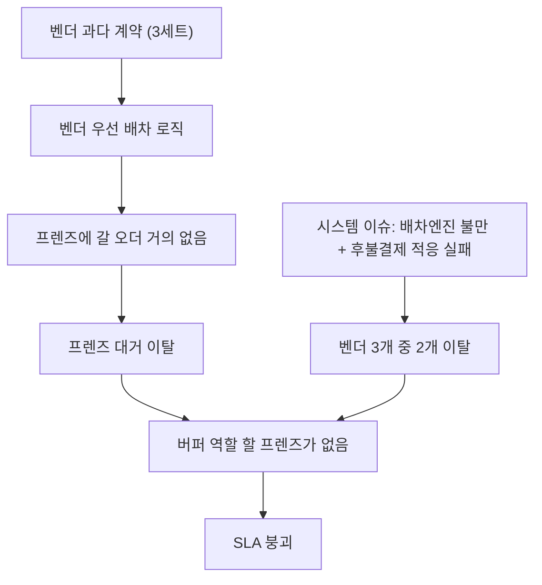

# 벤더 구조 동대문 테스트 — 중간 회고

> 대상: 운영 · 영업 · 기획 · 프로덕트 전 인원
> 일시: 2026-06-05 (회의)
> 성격: 제가 맡은 발표 파트 — 본질 리마인드 → 겪은 문제 → 개선 제안을 공유합니다.

---

## 0. 들어가며 — 숫자 이전에 짚고 싶은 것

오늘 회의에서는 자연스럽게 **상점 물량**과 **벤더 SLA** 이야기가 많이 나올 겁니다.
제 파트에서는 그 숫자 이전에, 한 가지만 먼저 짚고 싶습니다. 그 숫자들은 **목적이 아니라 수단**이라는 점입니다.

| 자주 보는 것 (수단) | 진짜 목적 (본질) |
|---------------------|------------------|
| 상점 물량, 벤더 SLA, 당장의 처리율 | 본사가 **물량·배차·공급을 통제**할 수 있는 운영 체계의 정착 |

> 본격적인 숫자 논의에 들어가기 전에, "**왜 이 구조를 시작했는가**"를 짧게 리마인드하고 가겠습니다.

---

## 1. 본질 리마인드 — 이 구조로 이루려는 것

### 한 장 요약 — "사람 의존"에서 "구조 의존"으로

> 이 프로젝트의 본질은 한 문장입니다. **개인기·선의에 기대던 운영을, 시스템으로 작동하는 운영으로 바꾸는 것.**

| 구분 | 사람에 의존 (위탁지점) | 구조로 작동 (벤더 체계) |
|------|------------------------|--------------------------|
| 영업·물량 | 지점이 알아서 | **본사가 통제** |
| 배차 | 전투배차(개인 선택) | **AI 배차(최적)** |
| 공급(기사) | 지점장 개인기·선의 | **예측 → 발주 → 벤더 평가** |
| 품질·SLA | 개인 역량에 좌우 | **성과·보상으로 통제** |
| 교체·확장 | 독점 → 경직 | **소단위 → 유연** |

### 왜 위탁지점을 벗어나려 했나 (AS-IS의 한계)

| # | 기존 위탁지점의 문제 |
|---|----------------------|
| 1 | 완료 **건당 fee** 구조 → SLA(적시 배송)를 지킬 동인이 없음 |
| 2 | 지점이 본사 **법인물량**보다 본인 수익원인 **로컬물량**을 우선 처리 |
| 3 | **전투배차**(기사 자율 선택) → '꿀콜'만 수행, 나머지 오더 방치 |
| 4 | 경쟁적 선택 → **전체 최적 배차** 불가 |
| 5 | **1지역 1지점 독점** → 문제 지점 교체 곤란 |
| 6 | 개인사업자가 기사 관리 → 퀄리티보다 기사 수익보전 우선 → 필요 공급 안 됨 |
| 7 | 영업까지 지점에 위임 → 물량 증대·컨트롤 불가 |

> **결국 위 모든 문제의 뿌리는 하나입니다.** 모든 실적이 **운영 담당자와 지점장 개인의 역량(개인기)과 선의**에 달려 있었다는 것 — 즉 **구조가 아니라 사람에 의존**하는 운영이었다는 점입니다.

### 그래서 만든 구조 (TO-BE)

| # | 해결 방식 |
|---|-----------|
| 1 | **AI 배차(Dispatch Service)** 기본 사용 → 최적 배차 |
| 2 | **본사가 권역 직접 설계** |
| 3 | 예측 물량을 요일·시간 단위 **세트**로 쪼개 **다수 벤더에 발주** |
| 4 | 벤더 실적을 **주간 평가 → 보상 차등** (공급 컨트롤러빌리티 확보) |
| 5 | 소단위 분배 → 미충족 벤더를 **부담 없이 빠르게 교체** |

### 궁극 구조

```
본사  : 영업(물량) · AI배차 · 공급예측  →  전부 통제
벤더  : 발주받은 물량을 거절 없이 수행 + 필요한 기사 확보
```

> **동대문은 끝이 아니라 시작점**입니다. 궁극 목표는 전 지역 전환이고, 동대문은 그 **첫 테스트**입니다.
> 그래서 지금 중요한 건 "이번 2주의 점수"가 아니라 **"이 구조가 작동하게 만드는 법을 배우는 것"** 입니다.

---

## 2. 지난 2주, 우리가 겪은 문제

### 2-1. 초기 진출계획이 시작하자마자 틀어짐
- 영업·운영이 합의했던 권역이 테스트 직후부터 삐걱 → 계속 수정·조정
- 원인: 양측 모두 너무 야심차게, "서로 좋은 사람"이 되려고 **다 된다고만** 함 (낙관 편향)

### 2-2. 첫 S&OP의 실패 — 핵심 학습 지점
- 물량 예측: 기존 물량 기반 예측은 OK. 단, **신규 영업 상점 물량을 과다 예측**
- 의도: 첫 테스트라 **프렌즈 버퍼를 크게**(벤더:프렌즈 = 5:5) 두고 싶었음
- 플래닝: 50%를 벤더로 처리 → **1세트 = 벤더 1개**면 충분
- 실제: **계획-실행 커뮤니케이션 단절**로 운영이 **벤더 3개 / 3세트**를 투입 (과다)

**그 결과, 아래 연쇄가 발생했습니다:**



> 핵심: **벤더 발주량 + 벤더 우선 배차**가 **프렌즈 버퍼를 잠식**합니다.
> → 발주량을 통제하지 못하면, 안전망(프렌즈)이 먼저 사라집니다.

- 프로모션도 기획 oversight 없이 운영이 직접 진행 → 비효율

### 2-3. CX SOP의 부재
- 벤더 기사: 플랫폼 오더만 해봐서 배달대행 특유 오더(**후불결제** 등)에 적응 못함
- 배달대행만 쓰던 상점: 이슈 시 본사 콜센터가 아닌 **영업사원·기사에게 직접 항의**
- 전투배차에 익숙한 상점: **픽업 임박에 배차하는 AI배차**에 불만
- 결국 "시스템 운영"이 목표였지만 **초기엔 사람 손이 너무 많이** 들어감

### 2-4. 기타
- 미리 준비됐어야 할 프로세스 누락 (예: **주간 정산서 작성**) → 시간 소모
- **후불결제는 프렌즈 불가**(앱 모듈 미구현) → 벤더 기사가 처리해야 하나 미숙 → 문제 빈발

---

## 3. 다음 사이클, 이렇게 개선하자

### 3-1. 초기 진출계획 — 더 촘촘하게
- 권역 기준을 **영업/운영이 명확히 상호 약속**하고 설계
- **야심찬 한 방 대신**, 상황을 보며 **점진적으로 확대**
- 판/원가·운영시간·권역 외 **사전 고려 추가**: 우천 시 축소할 **1·2차 예비 권역**, **배상정책**, **재이동·반납 요율**

### 3-2. 초기 S&OP — 보수적이고 체계적으로
- 오픈 **첫 주는 최소 세트**로 운영 → 1주간 **이슈 탐지·해결 집중** → **점진적 상점 오픈**
- **주간 S&OP를 실제로 실행** (이번엔 각자 이슈 대응만 하다 간극이 벌어짐)
- 본질(시스템 기반 운영) 회귀 위해 **물량 예측 + 영업 목표/현황 공유 강화**
- 벤더에 **성과/보상 기준을 강하게 적용**, **시간대별 슬롯을 더 촘촘히**

### 3-3. CX SOP — 본격 구축
- **개인기가 아닌 시스템 기반 공통 프로세스**로 전환
- 상점 / 벤더(기사) / 프렌즈 / 본사 간 **새로운 관계성에 맞춘 대응 SOP** 수립

### 3-4. 벤더 평가 — 선행지표로 '주중' 개입
- **주간 평가만으로는 늦습니다.** 이번에도 벤더 2곳이 주중에 사실상 이탈했지만 손쓸 타이밍을 놓쳤습니다.
- **일·슬롯 단위 선행지표**(거절률·노쇼·적시율 + **배차엔진 체감지표**)를 보고 **주중에 개입**(코칭/발주 조정/교체 준비)
- 이탈 사유가 '배차엔진 만족도'였던 만큼, 벤더가 체감하는 지표(평균 대기·콜 품질)도 함께 추적

### 문제 → 개선 매핑 (한눈에)

| 겪은 문제 | 개선 방향 | 다음 액션 (담당) |
|-----------|-----------|------------------|
| 초기 진출계획 틀어짐 | 권역기준 상호 약속 + 점진 확대 + 예비권역·배상·요율 사전 설계 | *(논의)* |
| 첫 S&OP 실패 (공급 과다 → 버퍼 잠식 → SLA 붕괴) | 첫 주 최소세트 + **주간 S&OP 복원** + **발주량 통제** | *(논의)* |
| CX SOP 부재 | 시스템 기반 공통 CX SOP 수립 | *(논의)* |
| 지원 프로세스 누락 (정산서·후불결제) | 정산서 등 선제 준비 + 후불결제(KICC) 개선 | *(논의)* |

> 매핑은 토론의 출발점입니다. 오늘 **각 개선의 담당과 첫 액션**을 정하는 것을 목표로 합니다.

---

## 4. 프로덕트 개선 백로그

| 항목 | 내용 |
|------|------|
| **후불결제 개선** | KICC 솔루션 도입 → 프렌즈 앱 후불결제 모듈 부재 해소 |
| **회귀오더 기능 추가** | 권역 외 오더를 수행한 벤더 기사에게, **본인 소속 벤더 담당 구역으로 돌아오는 오더를 우선 배차** → 권역 외 이탈 오더에 대한 거부감 감소 |
| **배차엔진 성능 개선** | 벤더 이탈 사유였던 배차엔진 만족도 개선 |

---

## 한 줄 마무리

> 지금 점수가 아니라 **구조를 작동시키는 법**을 배우는 단계라고 생각합니다.
> 본질(본사 통제 + 안정·버퍼 공급)에 다시 정렬하고, **첫 주 보수적 운영 + 주간 S&OP 복원**부터 시작하길 제안드립니다.
