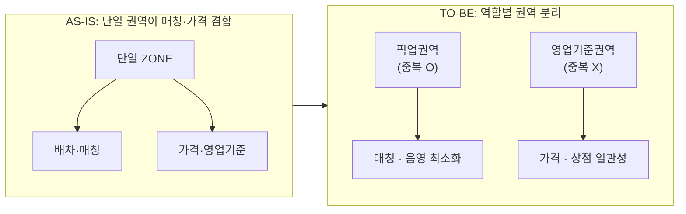

# ZONE 요금제 개선 방향 (개괄 공유)

> 목적: 어떤 개선이 / 왜 필요한지 **개괄 공유 및 공감대 형성**. (상세 기획·스펙은 후속 진행)
> 대상: 개발팀 / 작성일: 2026-06-29 / 참조: 현행 정책 v2.0

---

## 1. 개선 항목 한눈에 보기

| # | 개선 항목 | 현재 (한계) | 왜 필요한가 | 개선 방향 |
|---|-----------|-------------|-------------|-----------|
| 1 | 시간대(슬롯)별 원가 요금제 | ZONE당 원가 1개. 시간대 차등을 할증으로 우회 | 벤더는 실제 슬롯별 원가 운영. 우회는 복잡·정산 추적 곤란 | 슬롯별 원가 요금제 직접 설정 (판가 제외) |
| 2 | 공급권역 개념 삭제 | "권역 내 모든 상점 동일 공급권역" 전제 | B존 현장 적용 불가. 실제는 상점별 반경 N km 기준 | 공급권역 폐기, 상점 반경 기준으로 정리 |
| 3 | 권역 외 할증 신설 | 픽업권역 이탈 오더 할증 없음 | 권역 이탈은 거리·복귀 공차↑·기사 기피 | 도착지가 픽업권역 벗어나면 가산 |
| 4 | 픽업권역 중복 허용 + 영업기준권역 분리 | 권역 1개가 매칭·가격 겸함, 중복 불가 → 공급 음영 | 음영 최소화와 상점 가격 일관성을 동시 충족해야 함 | 픽업권역(중복O, 매칭) / 영업기준권역(중복X, 가격) 분리 |
| 5 | G1 포함 원가 일원화 | ZONE 요금제 원가는 G4만 적용 | 같은 권역·같은 기사인데 상점 등급별 원가 상이 | 픽업권역 내 G1도 G4와 동일 원가 (판가는 G1 유지) |

---

## 2. 큰 그림 — 요금제 유연화 세 축

- **시간 축**: 슬롯별 원가 요금제 (1)
- **권역 축**: 공급권역 폐기 → 픽업권역/영업기준권역 분리 → 권역 외 할증 (2 → 4 → 3)
- **대상 축**: G1까지 원가 일원화 (5)

---

## 3. 현행 정책(v2.0) 대비 바뀌는 전제

| 현행 (v2.0) | 개선 후 |
|------------------|---------|
| ZONE:통합요금제 N:1, 상점 주소 단일 매핑 | 권역 이원화로 재설계 |
| 통합요금제 원가 1개 | 슬롯별 원가 다수 |
| ZONE 요금제 G4 전용 | 원가는 G1까지 확장 |
| 할증 4종 | '권역 외 할증' 추가 |
| 권역 균일 공급권역 전제 | 상점 반경 기준으로 대체 |

---

## 4. Next Step

- 본 자료는 방향성·필요성 공감대용. 상세 정책/스펙은 후속 기획에서 개별 진행.
- 항목 4(권역 이원화)가 2·3·5의 전제 → **구조 정의 우선** 검토.
- 미정 포인트: 픽업권역 중복(4) 상황에서 G1 원가(5)를 **어느 권역 기준으로 적용할지** 정의 필요.

---

## 후속 문서

- [협의사항 Recap & Todo (2026-07-07)](20260707_협의사항_recap_및_todo.md) — 1·2차 논의 협의사항 recap 및 구현 방향·담당 지정 안건 ([노션](https://app.notion.com/p/396cf5759dc081ab8097f7468d7717b9))
