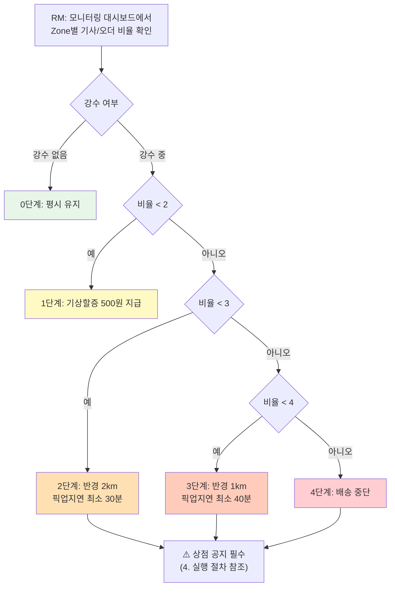
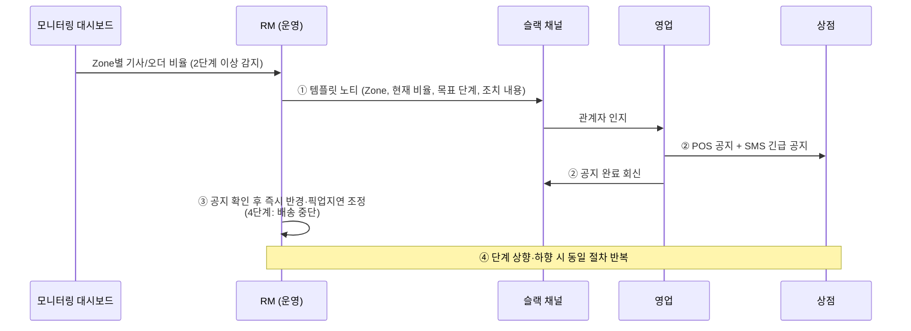

# 기상악화 수요·공급 조정 SOP

**작성일:** 2026.07.06
**버전:** v0.3 (적용 대상·액션 플랜 추가)
**목적:** 신규 운영 지역에서 기상악화 등으로 수요·공급 밸런스가 무너졌을 때, 담당자가 취해야 할 단계적 조치와 실행 절차를 표준화한다.

> 본 문서는 신규 운영 지역 SOP 시리즈 중 하나로, **수요·공급 긴급 조정** 상황을 다룬다.

---

## 1. 개요

### 1.1 배경 및 원칙

기상악화(강수, 강설 등) 시 오더는 급증하고 기사 공급은 감소하여 수급 밸런스가 무너질 수 있다. 다만 **강수량 자체는 판단 기준이 될 수 없다.** 비가 많이 와도 공급이 충분히 받쳐주면 별도 조치가 필요 없기 때문이다.

따라서 본 SOP는 다음 원칙을 따른다.

| 원칙 | 설명 |
|------|------|
| **결과 지표로 판단** | 날씨가 아닌 **기사/오더 비율**(수급 밸런스의 결과)로 조치 단계를 판단 |
| **단계적 대응** | 비율 구간에 따라 0~4단계로 나누어 점진적으로 개입 강도를 높임 |
| **공지 후 조치** | 상점 영향이 있는 조치(2단계 이상)는 반드시 상점 공지 확인 후 실행 |
| **상향·하향 동일 절차** | 단계를 올릴 때뿐 아니라 내릴 때도 동일한 노티 → 공지 → 조정 절차를 따름 |

### 1.2 적용 범위

- **대상 지역:** 신규 운영 지역 전체 (Zone 단위로 판단·조치)
- **대상 오더:** 직접 영업한 **G4 상점** 오더 (적용 협의 완료). OD 오더·법인화주사 오더는 추가 협의 후 확대 예정 → **7. 적용 대상 및 액션 플랜** 참조
- **발동 상황:** 기상악화 등으로 특정 Zone의 수급 밸런스가 악화되는 경우
- **적용 시점:** 서비스 운영 시간 전체

### 1.3 참여 조직 및 R&R

| 역할 | 담당 | 주요 책임 |
|------|------|----------|
| **RM (운영 담당자)** | 운영조직 | 대시보드 모니터링, 단계 판단, 슬랙 노티 발송, 반경·픽업지연·할증·중단 조정 실행 |
| **영업** | 영업조직 | POS 공지 및 SMS 긴급 공지 발송, 공지 완료 회신 |
| **관계자** | 슬랙 채널 참여자 | 상황 인지, 필요 시 지원 (CS 대응 등) |

### 1.4 주요 용어

| 용어 | 정의 |
|------|------|
| **온듀티 기사** | 현재 근무 중(배차 수신 가능) 상태인 기사 |
| **백로그 오더** | 접수되었으나 아직 기사가 배정되지 않은 오더 |
| **기사/오더 비율** | 온듀티 기사 수 대비 백로그 오더 수의 비율. 예) 온듀티 10명, 백로그 20건 → 비율 2.0 |
| **기상할증** | 악천후 시 기사에게 지급하는 추가 배송료 |
| **접수 반경** | 상점별 오더 접수 가능 배송 반경. 축소 시 원거리 오더 유입 차단 |
| **픽업지연** | 오더 접수 시점부터 픽업 예정 시각까지의 최소 지연값. 상향 시 시간당 처리 부하 분산 |
| **배송 중단** | 해당 Zone의 신규 오더 접수 자체를 차단하는 최후 조치 |

---

## 2. 판단 기준: 기사/오더 비율

### 2.1 산식

```
기사/오더 비율 = 백로그 오더 수 ÷ 온듀티 기사 수
```

- 예시: 온듀티 기사 10명, 백로그 오더 20건 → 비율 **2.0**
- 비율이 높을수록 기사 1명이 감당해야 할 미배정 오더가 많다는 의미 → 수급 악화

### 2.2 왜 이 지표인가

| 후보 지표 | 한계 | 채택 여부 |
|-----------|------|----------|
| 강수량 | 공급이 충분하면 조치 불필요. 날씨만으로 수급 판단 불가 | ❌ |
| 배송 소요시간 | 후행 지표. 이미 악화된 뒤에 감지됨 | ❌ |
| **기사/오더 비율** | 수요(백로그)와 공급(온듀티)을 동시에 반영하는 선행 지표. 대시보드에서 실시간 확인 가능 | ✅ |

---

## 3. 단계별 조치 기준

### 3.1 기준표

| 단계 | 기사/오더 비율 | 접수 반경 | 픽업지연 | 기상할증 | 상점 공지 |
|:----:|:--------------|:---------:|:--------:|:--------:|:---------:|
| **0** | (평시) | 3km | 조정 없음 | 없음 | 불필요 |
| **1** | 2 미만 (강수 중) | 3km | 조정 없음 | **500원** | 불필요 |
| **2** | 2 이상 ~ 3 미만 | **2km** | **최소 30분** | 500원 | **필수** |
| **3** | 3 이상 ~ 4 미만 | **1km** | **최소 40분** | 500원 | **필수** |
| **4** | 4 이상 | **배송 중단** (신규 접수 차단) | | | **필수** |

- 기상할증은 **1단계 이상에서 500원 고정**이다. (단계·지역별 차등 없음)
- 본 SOP의 판단·조치는 모두 **Zone 단위**로 이루어진다. 비율 집계, 반경·픽업지연 조정, 배송 중단 모두 해당 Zone에만 적용된다.

### 3.2 단계별 설명

**0단계 (평시)**
- 별도 조치 없음. 평시 설정(반경 3km) 유지.

**1단계 (강수 + 비율 2 미만)**
- 비가 내리고 있으나 오더가 원활히 소화되고 있는 상태.
- 기사 이탈 방지 및 공급 유지를 위해 **기상할증(500원)만 지급**한다.
- 반경·픽업지연은 조정하지 않으며, 상점 공지도 불필요하다.

**2단계 (비율 2 이상 ~ 3 미만)**
- 수급 불균형이 시작된 상태. 이 단계부터 **상점 공지가 필요한 특수 상황**으로 간주한다.
- 접수 반경을 **2km로 축소**하여 원거리 오더 유입을 줄이고, 픽업지연을 **최소 30분**으로 상향하여 처리 부하를 분산한다.

**3단계 (비율 3 이상 ~ 4 미만)**
- 수급 불균형이 심화된 상태.
- 접수 반경을 **1km로 축소**하고, 픽업지연을 **최소 40분**으로 상향한다.

**4단계 (비율 4 이상)**
- 기사 1명당 미배정 오더 4건 이상. 추가 접수 시 기접수 오더까지 연쇄 지연되는 임계 상태.
- 추가 악화를 막기 위해 해당 Zone의 **신규 배송 접수를 차단(배송 중단)**한다.
- 배송 중단 역시 **공지 후 조치 원칙**을 동일하게 따른다. (공지 완료 확인 → 중단 실행)

### 3.3 단계 판단 흐름



---

## 4. 실행 절차

### 4.1 1단계 발동 (할증만 지급)

상점 영향이 없으므로 RM이 즉시 실행한다.

1. RM이 대시보드에서 강수 + 비율 2 미만 확인
2. RM이 기상할증(500원) ON 처리
3. 슬랙 채널에 발동 사실 공유 (사후 공유로 충분)

### 4.2 2단계 이상 발동 (상점 공지 필수)

2단계부터는 상점 주문 접수에 직접 영향이 있으므로, 반드시 아래 순서를 따른다.
**공지 확인 전에 반경·픽업지연 조정 또는 배송 중단을 먼저 실행하지 않는다.** (4단계 포함)

| 순서 | 담당 | 액션 |
|:----:|------|------|
| 1 | **RM** | 대시보드 모니터링 중 특정 Zone이 2단계 이상 조건 충족 감지 → **지정 템플릿**으로 사전 지정된 슬랙 채널에 노티 (영업 부서 포함 관계자 대상) |
| 2 | **영업** | POS 공지 + SMS로 해당 Zone 상점에 **긴급 공지** 발송 → 완료 시 슬랙에 회신 |
| 3 | **RM** | 공지 완료 확인 후 **즉시** 접수 반경 및 픽업지연 조정 (4단계는 배송 중단 처리) |
| 4 | 전체 | **단계 상향·하향 시에도 1~3을 동일하게 반복** |



### 4.3 단계 하향 및 해제

- 비율이 하위 구간으로 회복되면 **상향과 동일한 절차**(노티 → 공지 → 조정)로 단계를 내린다.
- 0단계 복귀(평시 전환) 시 기상할증 OFF 및 반경·픽업지연 원복 처리를 하고, 슬랙 채널에 종료를 공유한다.

> ⚠️ 비율은 실시간으로 출렁일 수 있으므로, 순간 수치만으로 단계를 전환하지 않는다. 상·하향 전환의 완충 판단(추세 유지 여부 등)은 **RM이 현장 상황을 종합해 자체 판단**한다. 운영 경험이 쌓이면 정량 기준(예: N분 유지)으로 구체화한다.

---

## 5. 커뮤니케이션 템플릿

### 5.1 RM 슬랙 노티 템플릿 (초안)

```
🚨 [기상 수급조정] {Zone명} {N}단계 발동 요청

- 일시: YYYY-MM-DD HH:mm
- 대상 Zone: {Zone명}
- 현재 기사/오더 비율: {X.X} (온듀티 {n}명 / 백로그 {m}건)
- 조치 단계: {현재 단계} → {목표 단계}
- 조치 내용: 접수 반경 {N}km, 픽업지연 최소 {N}분 {/ 배송 중단}
- 요청: 영업팀 POS·SMS 긴급 공지 후 본 스레드에 완료 회신 부탁드립니다.
  공지 확인 즉시 조정 실행하겠습니다.
```

### 5.2 상점 긴급 공지 템플릿 (POS/SMS, 초안)

```
[부릉] 기상악화로 인한 배송 조건 임시 변경 안내

기상악화로 배송 수요가 급증하여 {Zone/지역명}의
배송 조건이 일시 변경됩니다.

- 적용 시각: HH:mm부터
- 접수 가능 반경: {N}km로 축소
- 픽업 소요: 최소 {N}분 이상 지연
{- 신규 배송 접수 일시 중단}

수급이 회복되는 대로 정상화 후 재안내 드리겠습니다.
불편을 드려 죄송합니다.
```

---

## 6. 사전 준비 사항 (발동 전 셋업)

본 SOP가 작동하려면 아래 항목이 사전에 준비되어야 한다.

| # | 항목 | 내용 | 담당 | 상태 |
|:-:|------|------|------|:----:|
| 1 | **소통 채널** | 영업 포함 관계자가 참여하는 슬랙 채널 개설 및 멤버 지정 | 운영 | ⬜ |
| 2 | **RM 노티 템플릿** | 5.1 템플릿 확정 및 채널 고정(핀) | 운영 | ⬜ |
| 3 | **상점 공지 템플릿** | 5.2 POS/SMS 템플릿 확정 (영업 검수) | 영업 | ⬜ |
| 4 | **개발 진행** | 모니터링 대시보드(Zone별 기사/오더 비율), 반경·픽업지연·배송 중단 Zone 단위 조정 기능 | 개발 | ⬜ |

---

## 7. 적용 대상 및 액션 플랜

### 7.1 오더 유형별 적용 현황

본 SOP는 오더 유형에 따라 적용 상태가 다르다. 현재는 **직접 영업한 G4 상점 오더에만 적용**된다.

| 오더 유형 | 적용 상태 | 내용 |
|-----------|:--------:|------|
| **G4 상점 오더** (직접 영업) | ✅ 적용 확정 | 관계 부서 협의 완료. 본 SOP 즉시 적용 |
| **OD 오더** | ⚠️ 협의 필요 | 소통(공지 채널·주체) 및 조치 방식에 대한 추가 협의 필요. 협의 전까지 본 SOP 적용 대상 아님 |
| **법인화주사 오더** | ⚠️ 협의 필요 | 화주사별 계약 조건이 달라 소통·조치 방식에 대한 추가 협의 필요. 협의 전까지 본 SOP 적용 대상 아님 |

### 7.2 액션 플랜

| # | 액션 | 목적 |
|:-:|------|------|
| 1 | OD 오더 대상 소통·조치 방식 협의 | 기상악화 시 OD 오더도 반경·픽업지연·중단 조치에 포함할 수 있도록 공지 채널과 실행 절차 확정 |
| 2 | 법인화주사 오더 대상 소통·조치 방식 협의 | 화주사 계약 조건을 고려한 사전 안내·조치 기준 확정 |
| 3 | 협의 완료 시 본 SOP 적용 범위 확대 개정 | 오더 유형 전체를 커버하는 단일 SOP로 통합 |

> ⚠️ 협의 완료 전 기상악화 발생 시, OD·법인화주사 오더는 본 SOP의 조치 대상에서 제외되므로 해당 물량은 별도 대응이 필요하다.

---

## 8. 확정 사항 및 남은 논의

> 📌 본 장과 하단의 버전 이력은 **로컬 관리용**으로, 노션 게시본에서는 제외한다.

### 8.1 확정 사항 (2026-07-06 1차 검수)

| # | 항목 | 확정 내용 |
|:-:|------|----------|
| 1 | 3단계 픽업지연 | **최소 40분** (기준표 이미지 기준) |
| 2 | 상·하향 완충 판단 | 정량 기준 없이 **RM 자체 판단** (추후 정량화 검토) |
| 3 | 4단계 절차 | 배송 중단도 **공지 후 조치 원칙 동일 적용** |
| 4 | 기상할증 금액 | 1단계 이상 **500원 고정** |
| 5 | 판단 단위 | **Zone 단위**로 집계·조치 |

### 8.2 남은 논의

| # | 항목 | 내용 |
|:-:|------|------|
| 1 | **모니터링 주기** | RM의 대시보드 확인 주기 또는 자동 알림(임계값 초과 시 슬랙 봇 알림) 여부 |

---

## 버전 이력

| 버전 | 날짜 | 변경 내용 |
|------|------|----------|
| v0.1 | 2026-07-06 | 초안 작성 (단계 기준, 실행 절차, 템플릿, 사전 준비 사항) |
| v0.2 | 2026-07-06 | 1차 검수 반영: 3단계 픽업지연 40분 확정, 상·하향 완충 판단 RM 재량 명시, 4단계 공지 후 조치 원칙 명시, 할증 500원 고정·Zone 단위 관리 명시 |
| v0.3 | 2026-07-06 | 적용 대상 및 액션 플랜 추가 (G4 적용 확정, OD·법인화주사 협의 필요), 노션 게시 시 8장·버전 이력 제외 방침 명시 |
